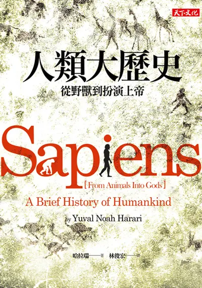

+++
title = "《人類大歷史 Sapiens》閱讀筆記：七萬年前就活在 Metaverse 裡"
date = 2022-06-27
description = "探索《人類大歷史》的深度洞見：從認知革命到虛構故事，哈拉瑞揭示人類七萬年來如何在共同的信仰中進化與合作，讓你重新認識何謂『現代生活』。"

[taxonomies]
categories = [ "閱讀筆記",]
tags = []

[extra]
rating = 10
image = "sapiens.webp"

+++

# 書籍

# 前言
對歷史的印象，大概就是在中學時期的歷史課，要反覆記憶朝代的順序、年份與發生的事件，除了知道過往發生的事，對於生活在現代的我感覺不到任何的連結，對當時的我，是一個完全沒有收穫也沒有興趣的科目。

很常看到推薦哈拉瑞 (Yuval Noah Harari) 人類三部曲 (人類大歷史、人類大命運、21 世紀的 21 堂課) 的文章。記得在多年前就嘗試去圖書館借人類大歷史來看，但當時的我只看了前面一兩章就放棄了，並沒有激起很多興趣。在去年九月的時候，對於在使用 Roam Research 當作筆記軟體的我來說，對由台灣人開發的 Heptabase 蠻有興趣，也想從創辦人詹雨安的角度來了解為什麼他會開發這個工具，聽了「星箭廣播 ep127-他想打造新的 Internet，第一步是打造全新的筆記軟體（ft. 詹雨安）」。詹雨安的人生履歷十分的特別，在訪談中他也提到人類大歷史是其中一本改變他看待事物、對他很重要的書，就再度燃起我想閱讀人類大歷史的動力。這次就藉由這個動力把整本書看完了，真的是越讀越入迷，也讓我建立了新的看待世界的方式。

# 觀點摘要
## 能藉由歷史預測未來嗎？
我在看這本書之前，對歷史的認知在於我們可以以史為鑒，透過過往發生的事件，運用於預測當下事件的發展。但在閱讀完這本書之後，覺得這幾乎是做不到的事情。從歷史中，我們可以觀察到更多的事件是「**覺得必然會發生的事情，最後卻沒有發生。或是歷史上前所未見、非預期的事件就這樣在歷史上第一次發生。**」

我們想藉由歷史的重複來做任何的預測都是很有風險的，第一個原因是你看到可能是單一的特別事件，要在當時特殊時空背景下才會發生。第二是在所有的事件中，運氣與隨機性往往佔據影響結果很大的一部份，若沒考慮到這點，可能會有很大的偏差。最後是世界其實是一個深奧系統，難以看出每個行為與結果間的關聯性，更甚之是一個二階混沌系統，代表的是系統內事件的發生會因為做了預測後而改變。例如越來越多的投資者都明白了市場的某種模式後，大家都會透過預測想要在更早的時間點做出動作獲取更大的利益，但因為大家都改變了行為模式，舊有的模式就不全然能夠被複製。

那如果歷史無益於做預測，那對於生活在現代的我們，歷史到底有什麼意義呢？

## 歷史學的奇異點：認知革命
在這本書中，哈拉瑞帶領我們走過歷史的發展。在智人 (現代人類) 的認知革命之前，歷史學可以說是生物學的一部份，地球的生物走過漫長時間的演化，一代一代地替換生態界的霸主，也演化出豐富而因應當前環境的各種生物。但從七萬年前的認知革命之後，人類透過共同相信虛構的故事，能夠做出更大規模的合作，成為生態系的新霸主。甚至開始突破自然演化，在生物能力沒有透過演化的強化下，智人可以藉由合作與創作，使得智人這個物種越來越強大。

## 一切都發生在想像之中
認知革命最重要的關鍵就是人們開始建構出虛構的故事，並在相信同一個虛構故事下彼此合作，達成更大的目標。虛構的故事以非常多元的樣子存在，比較常見的如泛靈信仰、宗教、國家、民族，甚至比較不直覺的如文化、階級、法律、公司、金錢、價值觀，這些其實都是只存在在人類腦中的虛構概念，無實際的物體存在。但透過這些概念，人們可以合作，可以以更簡單的方式思考、交流，產生共同的目標與信念。

在每個不同的虛構故事中，會有得到好處的人，也有被虛構故事囚禁的人。我想到斯多葛哲學家 Seneca 的名言，「財富是智者的奴隸，卻是愚者的主人。」能在虛構故事得利的人，會將其虛構故事藉由教育根深蒂固地刻在大家的腦裡，甚至想辦法讓信仰者產生單純的慾望，像是宗教狂熱者就願意為聖戰從容赴義，因為他們相信為了大義而亡靈魂會得到救贖。就算是你是少數擁有覺知的人，發現在虛構故事之中有很多不合理的地方，你也很難藉由一己之力利用邏輯與道理推翻，因為在相信同樣虛構故事的群體裡，大家的共同信念會互為主體性，對於虛構故事會產生非常強大的支撐力。唯一要突破虛構故事的方法就是產生一個新的虛構故事，並且你要有強大的組織力去推動新的故事。當然如同生物界的演化一般，虛構故事在時間的洪流中也會不斷的演化，過時而無法與時俱進的信仰會漸漸失去信眾而被淘汰。

## 無限成長的生產力
在一萬兩千年前，透過農業革命，智人開始擁有更穩定生產食物的方法，在文字與硬幣的發明下，也使得智人更能跨越部族的限制，有更大規模的合作。而在五百年前開始的科學革命，人類開始承認自己的無知，花更多的力量去探索並建立知識，而這樣的知識使得人類開始藉由科學擁有更強大的能力。而在西方世界誕生、建立在以「成長」為基礎核心的資本主義，與帝國主義和科學形成強力的支持關係。資本投入可以增進科學的發展，科學的發展可以帶來帝國的強盛與更多的成長，更多的成長就可以產生更多的資本，也說明為何近代史幾乎是由西方世界的國家在領導世界。

## 快樂並沒有無限的成長
在無限成長的資本主義下，人類真的更快樂了嗎？人類以炸裂性的速度在增進產出，但消耗也同步地成長，最終人類把更多的消費當作生活的必須，而繼續被捆綁在資本主義與消費主義的牢籠裡。在自由人文主義與消費主義下，提倡「你應該要對自己好一點，要隨心所欲購買你想要的東西，過你想要的生活。」但若你無法靜下來審視自己的內心，你的隨「心」所欲到底是真實來自於你的內心，抑或是重複播放的洗腦廣告，還是相互比較的焦慮呢？

## 好好生活在虛構故事裡

> 在事物帶來快樂或痛苦的時候，重點是要看清事物的本質，而不是著重在它帶來的感受。
>
> —— 釋迦牟尼

虛構的故事永遠不會消失，它也真實地帶來了人類文明的發展。善用虛構故事的人，可以獲得莫大的利益；被虛構故事奴役的人，只能不斷地痛苦的自怨自艾而無法脫離。不管你喜不喜歡當前流行的虛構故事，你都應該去了解其中的核心。了解自己的慾望來自何處，了解自己的快樂與痛苦，找尋自己的目的，找尋自己的生存方式。

> 只要有活下去的理由，幾乎什麼都能忍受。
>
> —— 尼采
