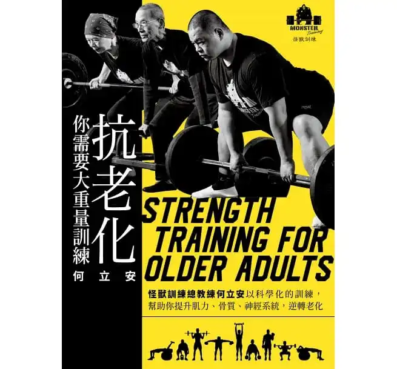

+++
title = "《抗老化，你需要大重量訓練》閱讀筆記：除了財富自由，你應該也要考慮肌力自由"
date = 2021-03-11

[taxonomies]
categories = ["閱讀筆記"]
tags = []

[extra]
rating = 4.5
image = "strengh-training-for-older-adults.webp"
+++

# 書籍
## 評分
4.5/5.0

# 前言
在朋友的推薦下，這次看了「抗老化，你需要大重量訓練。」這本書，是怪獸訓練中心的技術總教官何立安出的書。記得在前幾年就有考慮去上上看怪獸訓練中心的重訓新手課程，不過幾次時間沒對上之後，在某次注意力轉移之後就掉出我的腦袋了。

健身房近幾年很熱門，身為一個男子，偶爾去推個幾下也是免不掉的。不過大多是去運動一下，沒有特定的目標，也沒有什麼健身計畫，一陣子去的勤好像稍微可以推重一點，但有時候一忙，或雨季偷懶個幾週可能又回到原點了。重訓在我的生活中大概就是一個雞肋的角色 (？)

# 摘要
## 大肌力訓練是提升身體素質的關鍵
從這本書學到比較重要的概念是，最大肌力提升的重要性和什麼樣的運動可以增加最大肌力，甚至重訓過程中，其實包含了肌肉、骨骼、神經系統的強化。簡而言之，**至少要做到最大肌力 65% 重量以上，最好可以到 85% 重量的訓練**，才比較有助於肌肉、骨骼、神經系統的提升。一組做 5 下 85% 重量，比一組做 12 下 60% 重量，對提升身體素質有效很多。

## 閱讀練肌力
這本書一方面也提到了蠻多重訓動作方面的「姿勢」與「知識」。其實之前不管在公司健身社團，或是參加兆佑的課程，都有提到類似的觀念。不過對我來說，透過閱讀再吸收一次，知識會更深刻的寫入腦中。特別在書裡看到兆佑第一堂教我的東西，**「核心呼吸法」：「吸氣閉氣、壓胸夾背、扭地夾臀」**，才深深地回想起這件事，得到一個「啊哈」點。另外重訓複雜的地方就是，每個人的身體條件、狀況都不一樣，適時的找到正確的「退階動作」，做對的訓練比亂作一通很累有用多了，這也就是健身教練可以幫助你的地方。

## 如果可以，我想要自由不要長照。
最後，這本書的書名是抗老化。還記得某天在電梯裡頭跟同事閒聊重訓的重要度，結論就是「人如果不要活這麼久，就不會有老年的這些問題了」XD。但醫學越來越發達，除了老年無力地享受良好的「長照系統」，如果在年輕時多累積一點「肌力」的財富，在財富自由後，也有肌力自由，才能持續地做你想要做的事。

## 典範轉移是一段長路
「我老了不適合，還是散散步」、「練太重好像很累會受傷」，何立安提到大重量訓練雖然很重要、很值得投資，但或許還有一段難走的典範轉移之路。希望大家有興趣可以讀讀這本書，重新認識一下大重量訓練。我決定再買一本實體書放在宜蘭的家裡。

