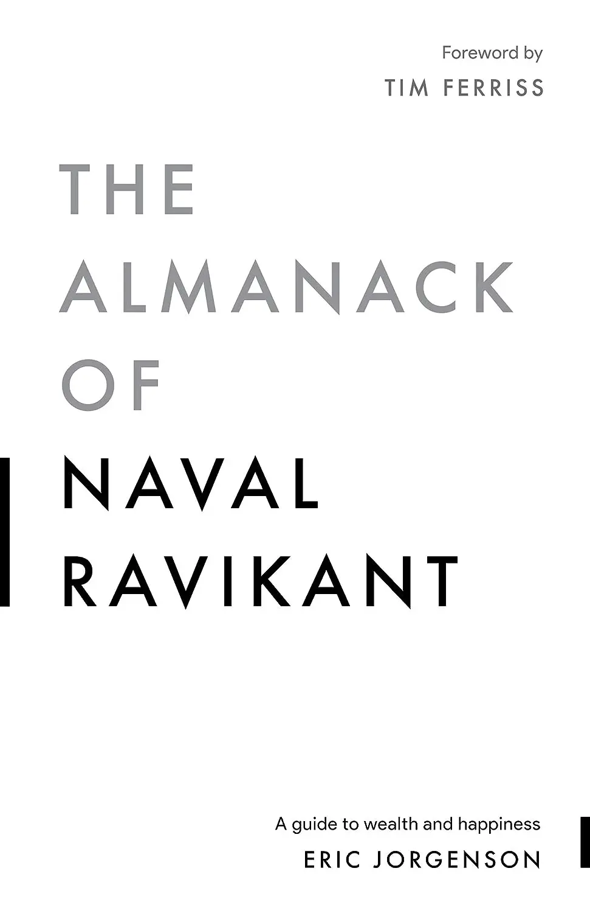

+++
title = "《快樂實現自主富有 The Almanack of Naval Ravikant》閱讀筆記：實踐個人槓桿"
date = 2023-10-18
updated = 2023-10-31

[taxonomies]
categories = ["閱讀筆記"]
tags = []

[extra]
rating = 5
image = "og-image.webp"
+++

一二三言以蔽之
=======

本書是 Eric Jorgenson 集結矽谷傳奇投資人 Naval Ravikant 歷年來的金句選集，我們可以從中窺探他的智慧與思維。

書籍
==

為什麼我會讀這本書
=========

最早認識 Naval Ravikant 是從 [Joe Rogan Experience #1309](https://youtu.be/3qHkcs3kG44)，當時從節目的對談就覺得 Naval 是一個很有智慧的人。2022 年六月朋友推薦了這本書給我，最後把這本書推薦到學弟的讀書會和大家在 2023 年年初一起閱讀了這本書。

摘錄觀點
====

本書的英文書名是《The Almanack of Naval Ravikant》，像是致敬班傑明富蘭克林 Benjamin Franklin 的《Poor Richard's Almanack》和查理蒙格 Charles T. Munger 的《Poor Charlie's Almanack》，內容包含其作者大量不同領域的思想。這類型的書籍，或許是英雄所見略同，會有蠻多重複的理念和想法，我只挑選我比較喜歡的摘錄。在最後附上 [Naval 的人生公式](#life-formula)與[人生原則](#life-principles)。如果最後看了人生公式和人生原則有感興趣的地方，建議可以直接閱讀此書。

新型態的槓桿
------

> 給我一根夠長的槓桿和一個支點，我就能移動地球。
>
> -- 阿基米德 Archimedes

通常我們想到槓桿時，多半都會想到資本的槓桿，可以用相對少量的資金，提高槓桿來增加獲利。其次是人力槓桿，可以用金錢轉換成人力，加速工作的執行。

而 Naval 在書中額外提到，在科技不斷發展下，個人更容易透過軟體或新媒體創造個人品牌、產品或服務。而且相較於資金和人力的槓桿，幾乎可以說是無需前置成本就可以得到的槓桿。

只要使用適當的槓桿，就可以增加個人累積財富的速度、提升影響力。讓你能透過「判斷力」取得比用「時間」與「努力」而言更多的報酬。

> 你要慎選每一個決策的方向，這比你付出多少心力還重要。在還沒弄清自己應該努力的事情之前，你不應該把許多笨工苦勞當作磨練。
>
> -- Naval Ravikant

透過廣泛學習建立心智模型
------------

透過學校的求學過程，最終只會學習到少數的專業領域知識。只擁有少數領域的知識會使我們的心智模型有偏差，缺乏對事物解析的不同面向，最終會影響到決策品質，也難以理解一項選擇的長期後果。

> 對於只有錘子的人而言，他看到的一切都像釘子。
>
> -- 馬斯洛 Abraham Harold Maslow

這一切都會影響著我們的「判斷力」，而判斷力是槓桿能否成功的要素。

[Naval 列出了應該要學習的知識與心智模型](@/wisdom/list/naval-ravikant-a-latticework-of-mental-models.md)

勇於承擔風險與責任
---------

要取得較大的成功，就必須擁有「所有權」，意味著你必須勇於承擔風險與責任。有了所有權，你也相對會有努力的動機，Naval 鼓勵我們利用自己的名義來展現自己的判斷力，這些累積的信用與名聲都能在更長期為你帶來回饋。

慎選目標
----

我們通常覺得隨著年紀的增長，我們會有更好的經濟條件，就能擁有更多的東西。但隨著工業革命、資訊革命後，人類的生產力大量提升。相較於匱乏，現代生活常常是過載的。如[《打造第二大腦 Building A Second Brain》](@/reading-notes/building-a-second-brain/index.md)所提到，我們應該改用[豐足心態](@/reading-notes/building-a-second-brain/index.md#abundance-mindset)去面對新的世界，只取自己所需的部分。

在目標上也是，我們應該去慎選少數對自己真正重要的事，而不該被社會的傳統智慧鎖上枷鎖或是被慾望帶領失去思考。

> 如果你不打算做自己生命的主人，就會有別人來幫你做主。
>
> -- Naval Ravikant

傳統智慧告訴了很多你「應該」做的事，給你很多的社會期待。Naval 提到了如果你們之間是有協議時，你做不到就是妳的問題。但假如是他們對你有所期待，那就是他們的問題了。每個人對生命會有各種期待，但這不代表你必須滿足他們的期待。要分清楚自己的課題和別人的課題。

當然這也不代表你應該成為自私的人。只是在妥協之前，要清楚知道自己是為了什麼目的願意妥協，做出有意識的選擇。

著眼長期的複利效果
---------

短期的競爭通常會是場零和戰局，必須拚得你死我活才能取得短期優勢。若我們著眼於長期，玩重複賽局，我們就能在財富、人際關係和知識上達到複利效果。

而信任是發展長期關係的關鍵，所以在選擇長期夥伴上，除了有能力外，更重要的是要有誠信。Naval 另外提及開拓商業人脈完全是浪費時間的事，人脈應該是當你做對事情的副產物，而不是該直接追求的東西。Naval 的人際網路哲學是：「成為一個創造者，打造人們想要的有趣產品，展現你的技藝，磨練你的技能，對的人終究會找到你。」

金錢與自由
-----

金錢可以解決很多外在的問題，所以第一步先學會賺錢謀生，是很合理的選擇。金錢可以移除一些可能阻礙你變快樂的事，但不會讓你變快樂。要想清楚賺錢是為了解決金錢和物質生活方面的問題，不要賺到錢就把生活升級。要重視自由勝過其他。做想做的事、不做不想做的事、不被自己的情緒或擾亂平靜的事物所影響。

> 如果金錢能買到自由，錢就是好的，要是錢害我失去自由（到了某個程度一定會），就不是我想要的。
>
> -- Naval Ravikant

要想清楚你賺錢的目的。任何遊戲的贏家都會沈迷其中，即使勝利的邊際效益已經在降低，還是會繼續玩下去。

書中對於自由有一句我很感同身受的話：

> 無論是外在或內在，我尋找的是「免於...的自由」，不像過去尋找的是「做...的自由」。
>
> -- Naval Ravikant

我認為自由就是可以忠於自我、避免不想做的事、用誠實的自己面對世界。內外都達到一致就是幸福。

Naval Ravikant 的人生公式 {#life-formula}
-------------------

書中提供了 Naval Ravikant 的人生公式，可以當作解讀世界或思考時可以用的捷徑。

> -   快樂＝健康＋財富＋美好的關係。
> -   健康＝運動＋均衡飲食＋充足睡眠。
> -   運動＝高強度阻力訓練＋運動＋休息。
> -   飲食＝天然食物＋間歇性斷食＋植物。
> -   睡眠＝不設鬧鐘＋八到九個小時＋生理時鐘。
> -   財富＝收入＋財富×投資報酬率。
> -   收入＝承擔責任＋槓桿＋獨特知識。
> -   承擔責任＝個人品牌＋個人平台＋承擔風險？
> -   槓桿＝資金＋人力＋智慧財產。
> -   獨特知識＝知道如何做社會還無法輕易訓練其他人做的事。
> -   投資收益＝買進持有＋評估＋安全邊際。

Naval Ravikant 的人生原則 {#life-principles}
-------------------

如[《斯多葛生活哲學 55 個練習 The Little Book of Stoicism》](@/reading-notes/the-little-book-of-stoicism/index.md)的[斯多葛的錦囊妙計](@/reading-notes/the-little-book-of-stoicism/index.md#mental-hints)和 Ray Dalio 的[《原則 Principles》](@/reading-notes/principles/index.md)一樣的概念：記錄下對你人生重要的金句與原則，可以在關鍵時刻從腦袋的錦囊中取出做出正確的抉擇。

> -   活在當下比什麼都重要。
> -   欲望即是痛苦。（佛陀）
> -   憤怒猶如手握紅炭，隨時要扔向他人。（佛陀）
> -   如果你無法想像可以跟一個人共事一輩子，那就連共事一天也不要嘗試。
> -   閱讀（學習）是終極的元能力，可以用來換取任何的東西。
> -   生命中所有真正的收益都來自於複利。
> -   用你的腦袋賺錢，而不是時間。
> -   99% 的努力都是白費的，所以更要把握那有用的 1%。
> -   百分之百誠實，永遠都要既誠實又正面。
> -   具體地稱讚，籠統地批評。（巴菲特）
> -   事實具有預測的力量。
> -   觀察每個念頭（自問「我為什麼會有這個念頭？」）。
> -   偉大皆誕生於痛苦。
> -   愛是付出，不是接受。
> -   開悟總是在念頭之間。（托勒）
> -   數學是自然的語言。
> -   真誠專注活在當下，因為我們其實別無所有。

讀後感
===

在讀這本書的時候，我曾經在某一天的日記寫著：「覺得自己喜歡這本書的原因是內容跟自己的價值觀十分吻合，但他用很棒的表達方式幫我說出來了。」希望自己在吸收知識與價值觀後，也能用很好的方式表達自己想表達的事情。

「道阻且長，行則將至。」希望能夠慢慢接近更理想的自己。
