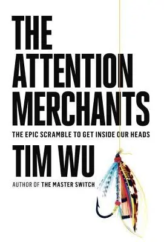

+++
title = "《注意力商人 The Attention Merchants》閱讀筆記：你該秤斤論兩賣注意力"
date = 2024-03-17
description = "《注意力商人》揭露了注意力產業發展史，從宗教、報紙、廣告到現代科技，提醒我們在資訊過剩的時代保護自己的注意力。這本書幫你看清注意力產業的遊戲規則。"

[taxonomies]
categories = [ "閱讀筆記",]
tags = [ "attention",]

[extra]
rating = 10
image = "jules-cheret.webp"

+++

一二三言以蔽之
=======

注意力商人提供便利、低價甚至免費的服務換取我們的注意力，你有好好確認過與他們的隱性合約嗎？推薦你用一本書的時間，了解注意力產業一路以來的發展，好好思考在這被注意力全面性籠罩的現代生活裡，你應該如何應對。

書籍
==

為什麼我會讀這本書呢？
===========

科技大幅度影響人類的行為，從農業改良、工業革命、網際網路、智慧型手機、生成式 AI 到混合實境（Mixed Reality），一旦新科技被採用，在短短數年或數十年，人類與生活、工作及社交的關係，就會大大地改變。

在注意力產業更是如此，從最早期的報紙、廣播、電視，到個人部落格、社群網路平台、影音平台，我們看似得到越來越好、也越來越便宜的服務，但背後的注意力產業是怎麼盤算呢？是引起我好奇打開這本書的原因。

摘錄觀點
====

注意力產業簡史
-------

這本書很精彩地描述了從古至今的注意力產業發展，很值得一看。我摘錄一些我覺得重要的，感興趣的話，非常推薦閱讀完整的書籍。

### 注意力早期以「信仰」的形式被宗教壟斷

在注意力產業還沒商業化前，宗教扮演很重要的角色。透過每日和每週的儀式穩固信仰，聖典也提供道德的指引與禁令。

### 1833 年 Benjamin Day 創辦《紐約太陽報》

紐約太陽報是第一個違反「售價高於成本」的傳統思維，採取注意力產業商業模式——先吸引注意力再轉賣給廣告——的媒體。除了低價，創報之初的策略是從法院獲取新聞，將法庭上出現的聳動消息或好笑的題材提供給大眾，在創報第一年後就達到了損益兩平。當時對於一些社會議題的討論，無形中引起大眾輿論的興起。

### 1860 年 Jules Chéret 在巴黎創造大型海報

{{ image(path="jules-cheret.webp", height=600) }}

from https://www.britannica.com/biography/Jules-Cheret

Jules Chéret 將視覺藝術手法用在商業上，用裝飾性的線條、明亮的色彩和吸引人的人物形象，為當時的娛樂場所和商品進行營銷。讓他贏得商業美術之父的美名。

### 1890 年 Claude C. Hopkins 將廣告帶入成藥業

前面提及宗教善於掌握了非商業化的注意力，曾經擔任過牧師的 Claude C. Hopkins 在藥商擔任廣告經理時得到大成功。過往的經驗使他擅長撰寫具有「神奇療效」的文案，他也率先提出了免費試用品的想法，搭上他能夠創造社群認同的文案：

> 已經有幾百萬人使用過了，別再猶豫了，現在就來試試...。

在 1904 年，該公司就送出了五百萬組免費試用品。

### 1905 年 Samuel Hopkins Adams 刊登了標題為〈美國大騙局〉的報導來抨擊成藥業

{{ image(path="the-great-american-fraud.webp", height=360) }}

from Amazon

在二十世紀初的美國，對於成藥並沒有監管機制。前犯罪新聞記者 Samuel Hopkins Adams 對能賺取如此暴利卻又無良的產業展開了調查。在刊登報導時善用了注意力機制，在雜誌封面上用了骷髏頭、金錢搭配著藥瓶，帶動大眾的不滿，最終突破產業的遊說，成功推動立法。

### 1914 年英美的徵兵宣傳
{{ image(path="uk-i-want-you.webp", height=360) }}

from Esty

{{ image(path="us-i-want-you.webp", height=360) }}

為了應付第一次世界大戰，英美兩國都有迫切的徵兵需求。除了用海報宣傳外，英國在室外投影大型愛國影片，成為了今日露天電影院的概念；美國有「四分鐘人計畫」，在電影院更換膠片時，邀請一般百姓發表四分鐘支持參戰的演講，超過七萬多名志願者，總共發表了七十五萬多次的演講，觸及超過三億一千多人次。

這是第一次將國家力量運用在注意力產業上，對民族主義宣傳和徵兵上達到卓越的效果。

> 創造出客觀的意志，超越個人，讓個人意識到自己屬於精神社會的一分子。
>
> —— Benito Mussolini

### 1928 年廣播創造了國家級的黃金時段

第一個廣播喜劇〈Amos n' Andy〉在推出當年受到廣大的喜愛，創造出播放時段大家會守在收音機前收聽的熱潮。

在廣播節目得到大成功後，CBS 老闆 William S. Paley 投入資源製造節目，混合高雅與通俗的節目，兼顧品質與普及大眾的市場；同時也降低廣告時間佔比，並努力建立新聞報導的專業名聲，一方面提升公司形象，也展現公司有對政治的影響力。

### 1933 年，希特勒利用廣播建立了一個單一輿論導向的國家

鑑於英美在一戰中宣傳手段的成功，希特勒利用廣播宣傳國家社會主義，讓全國屈服在一個人的意志下。除了利用廣播的新科技外，希特勒本身也是推銷的高手，從他的自傳《我的奮鬥》中可以看出他對宣傳的理解。

#### 希特勒對理性的反動

> 宣傳要訴求的對象是誰？是針對科學知識分子，還是教育程度較低的群眾？宣傳必須永遠、而且只針對群眾！

> 宣傳必須受到歡迎，而且要調整其精神層面，讓最不聰明的人也能理解......因此，宣傳的精神層面必須訂得越低，才能如你所願地吸引到越多群眾。

> 宣傳的任務不在於針對個人進行科學訓練，而是要將群眾的注意力導向某些事實、事件、必要性等等，目的是要讓民眾看見其重要性。至於那些已經有科學經驗，或者是......努力追求教育機會和知識的人，並非宣傳的對象。

#### 希特勒體悟大眾處理資訊的第一原理：任何事物都可以被忽略。因此，若要人牢記資訊，就必須簡化訊息並不斷重複。

> 宣傳的內容必須聚焦在少數幾個重點，並轉化成像口號一般的簡單訊息，讓每一個人都能透過單詞聯想到內容。

> 宣傳的強度也很重要，因為群眾有惰性，需要經過一段時間才會準備好去注意某件事情，而且他們只會記住已經重複幾千遍、同時又最簡單的想法。

#### 希特勒提及煽動者最重要的原則：教導或是說服人，比激起情感要困難得太多，而且更容易被排斥。

> 群眾最想要的是一個藉口，能夠讓他們充分體驗已經潛伏在他們內心的強烈感受，但這份感受可能被更有良知的自我所壓抑，而沒有爆發出來。

此外，德國宣傳部也成立廣播哨兵，確保人民都有收聽廣播。

### 1950~2000 年的電視時代

電視是把能啟動人們鏡像神經元能力、有強大影響力的電影帶入家中，成為新型態、強大的溝通工具。1953 年 Edward Murrow 藉由電視節目揭露有國家宣傳力量的 Joseph McCarthy 所引發的紅色恐慌，顯示電視有能對抗國家級宣傳的能力。

但很快地，商業的力量就入侵了電視，大量的廣告投放大幅度地侵入家中。1957 年，Vance Packard 出版了《隱藏的說服者 The Hidden Persuaders》，揭露了廣告主背後的計謀。

1960 年代的反文化運動認為電視是主流社會用來控制意識形態的工具，批評電視節目及廣告過度宣揚物質主義，會扼殺人類獨立思考與意識覺醒的能力。提倡大拒絕（Great Refusal）的 Herbert Marcuse 在《One-Dimensional Man》一書中也預言資本主義將會嘗試「商品化」反文化運動，要年輕人注意。即使如此，也無法抵擋廣告主的手段，最後「解放」的思想被磨練已久的廣告主轉化成「消費」，把群眾展現獨立個體的慾望變成對產品的需求。

雖然電視被商業所把持，由政府編制預算的公共電視台試著做出有教育性質的內容，在 1969 年推出〈芝麻街〉，嘗試轉化注意力到好的方面。和成人相比，兒童對注意力的控制能力更薄弱，但當兒童專注時，他們會更敞開心房接受電視播放的訊息。

後續隨著集群分析的發展，主流文化朝著接納次文化的多樣性前進，新電視台如雨後春筍般出現，針對不同的目標族群做節目。1994 年 Charlie Parsons 融合《單身宿舍》的紀錄片形態和競賽節目的特型，形成《實境秀》，這種新型態的節目也成為素人能夠翻身成為名人的機會。

### 1990 年至今——網際網路時代

在二十世紀末，網際網路的發展突破性地展開，其中美國線上（America Online）的匿名聊天室是其中的霸主之一，提供新型態的人際互動方式。匿名聊天室激發人們對人的好奇心與解放的滋味。1990 年代中期，最熱門的聊天室形式是虛擬性愛，當時美國線上完全成為網路性愛的同義詞。

後期美國線上利用推出圍牆花園（Walled Garden）來收割累積起來的使用者數量。在網際網路泡沫熱潮下，當時的 CEO Bob Pittman 形容美國線上的圍牆花園就像是出租的優質地段房地產，廣告商與網路新創公司爭相奉上大筆資金在花園裡強奪一席之地。

2000 年 Google AdWord 為廣告提供新的樣貌。改變以往用大量廣告轟炸使用者的方式，選擇在使用者搜尋關鍵字時顯示相關的廣告，造成較低的妨礙卻又提供精準的廣告。Google 也記錄廣告顯示與點擊的頻率，一方面能評估廣告的品質，一方面也提供廣告主需要的數據。

2000 年也是個人部落格的發展的開始，歷史上第一次有機會能夠知道這麼多其他人對於各式各樣話題的想法。言論和注意力民主化，普及到廣泛大眾，早期的網路就像 1960 年代的反文化風潮，人們花時間互相交流，而不是單純消費注意力商人包裝好的商品。

而在 2004 年，Facebook 崛起，在社群網站發表意見比維護部落格來的簡單，對大多數人來說也更容易獲得流量和關注。隨著人數變多，帶來了網路效應：使用者願意免費提交個人資訊，因為其他人也這麼做。臉書剛起步的時候，雖然流量很高，但廣告收入比 Google 搜尋差很多。Facebook 花大筆資金開發指標系統，記錄使用者的行為，提供給廣告主證明，就算沒點擊也有品牌知名度。

2006 年，短推文 Twitter 誕生，提供了以追蹤為主的社交方式，人們開始可以從追蹤人數衡量影響力和個人品牌的價值，給予「人人都可成名」的希望。

本書最後最後停在 2011 年的 Netflix，反注意力商人的商業模式回到訂閱制，意在使觀眾能控制自己的觀賞體驗，作為一個拒絕廣告的平台。後續的故事相信你我都熟知，短影音平台的興起，無限餵養推薦影片的演算法，AI 生成的內容...等等。注意力產業的發展不會停止，我們可以帶著歷史的眼鏡觀看之後的變化。

重複的模式
-----

從歷史可以發現，在一個新媒體出現時，起初社會會帶有美好的想像，期望新媒體會提供能打動人心、富有意義的內容、可以帶動大眾輿論的深度討論...。可能有一些人會這麼做，但人數並不會多到成為主流。

反之，有商業價值的激勵，能影響大眾行為的注意力商人會進入市場。注意力商人會以低價甚至免費的價格提供服務，並且根據受眾的口味調配出最合適的口味。由於競爭大眾注意力是一個零和戰局，群眾會漸漸對刺激的強度產生除魅效應，互相競爭的結果往往就讓媒體充斥著更極端、低俗、直接的內容。注意力產業也會盡可能剝奪所有清醒的時間，從讀報時間、晚間廣播劇、24 小時連播的電視頻道、隨身可收推播的行動裝置，資訊便利的反向就是注意力的剝奪。

過程中可能有出現一些覺醒人士，提供有「選擇」功能的技術，例如遙控器與錄放機；提供知識，出書踢爆注意力商人背後的操縱；激起社會運動，例如 1960 年代的反文化運動。但往往效果不持久或無法觸及大眾。

最終在無限疊加的廣告競爭後，會引起群眾的反彈。注意力商人一方面遊說政府、一方面調整廣告形式，希望壓抑人民的反抗；群眾群起激昂，力量夠大就有機會使政府推動法律改革。

廣告是單方面的不好嗎？
-----------

大部分的東西都是雙面刃，廣告也是。

從辭典裡，廣告的其中一個意思是「告知大眾」。大部分依賴充分知情選擇的活動都得依靠廣告才能順暢地運作，例如市場和選舉。大眾沒辦法真正了解所有商品的細節與品質的差異，導致古典經濟學的市場機制無法照理論發揮作用。

廣告能作為人類的認知擴大器，有效率地發掘很多你原本不知道的事情；廣告也能作為思想的傳播加速器，加速群眾認同的過程。如此強大的工具若落入只求最大化自我利益的注意力商人手上，你就得小心了。

被奪去注意力後只得到假的自由
--------------

> 在自由的社會，你可以自由地做一些對你有害的事情。

我們在生活中，看似能夠決定自己要怎麼運用時間、要購買哪些商品，我們可以藉由我們所關心的事物來定義自己是什麼樣的人，但是，當我們所關心的事物主要是由周遭氣氛所決定，而非出於自我意志時，這樣還算是自由嗎？

我們的生活很難脫離注意力產業的活動，你需要了解你和它隱藏的協議，否則會永遠處在資訊不對稱的賽局裡。

### 可被操縱的自由

在早期資訊尚未發達的時代，掌握主流媒體就能影響大部分人的思想。這些人也不覺得被操控，這是因為自由不僅是我們能有多少選項，還包含我們意識到有哪些選擇。

在概念性上，如果你不知道一件事情，就無法要求，更不會感覺內心有渴望而被剝奪的壓迫感。在擁有概念後，若在實際性上沒有覺得自己真的能做到這件事，也不會真的把它當作選項。人們還是可以在生活中自由選擇，只是在自己知道的選項範圍內。

在資訊爆炸的現代也是，我們無法消化所有的資訊，只能藉由有意識的選擇和演算法的推薦來決定自己要消費的資訊。但由於 [確認偏誤（Confirmation Bias）](https://zh.wikipedia.org/zh-tw/%E7%A2%BA%E8%AA%8D%E5%81%8F%E8%AA%A4)，人類會傾向消費更多符合自己想法的資訊，同時演算法也會推薦給你更多你喜歡的內容，最後我們就會被禁錮在無限強化自身想法的迴聲室。更遑論有人藉由你堅固的意識形態，融合一些操縱你想法的內容，就能拓展你的意識形態往他想要的方向前進。

### 現代人是「人屬分心種人（Homo Distractus）」

人的注意力可以分成兩類，自動注意力（Automatic Attention）和受控制注意力（Controlled Attention）。如果不加以用意志力控制，往往我們大部分的時間就是在自動注意力的狀態，短暫地在不同事物中切換，這也是注意力商人擅長操縱的部分。

在《[原子習慣](@/reading-notes/atomic-habits/index.md)》中有提到，我們可以透過設計環境來降低形成好習慣的阻力，降低需要用意志力的時刻。但如果我們的環境充斥著注意力商人設計好的商品，我們將難以專注在能為我們創造價值的工作上。

### 操作制約（Operant Conditioning）的上癮機制

[操作制約](https://zh.wikipedia.org/wiki/%E6%93%8D%E4%BD%9C%E5%88%B6%E7%B4%84) 是動物學習行為的核心，建立在行為與獎勵之間的關係。一旦某個行為得到獎勵，動物就會為了重複得到獎勵而學會重複該行為。

注意力商品也能對人達到一樣的效果，特別是從網際網路時代之後，人與人的社交被數位化，收到電子郵件、訊息推播、瀏覽短影音，都是能快速提供一劑快樂的多巴胺讓我們上癮的設計。

隨著廣告業發展地愈成熟，廣告主用更科學的方式研發注意力商品，引入行為心理學與商業心理學，巧妙地控制劑量，讓大眾願意付出注意力也願意掏錢購買商品。

應對注意力產業的策略
-----------

在了解這麼多之後，我們並不是要全面性地拒絕注意力產業提供的美好商品，畢竟商品在各種方面還是提供了便利性。但熟知背後我們交換的成本後，我們應該問自己，「哪些時間和空間應該被視為珍貴、私人、不可侵犯，不應該被注意力商人攻陷？」

1.  拒絕看起來不划算的交易，收回自己的注意力：關閉不需要的推播、拒絕瀏覽自己不想要的內容等等。

2.  主動使用服務，而不是被演算法推薦被動消費：訓練演算法成為你想要的樣子，可以根據不同的需求開設多種消費帳號。

3.  保護自己的時間，投入自己長期想達到的目標：利用 [時間箱（Timeboxing）](https://en.wikipedia.org/wiki/Timeboxing) 在行事曆上保留時間，在時間內拒絕任何干擾，專注在符合自己長期利益的項目。

讀後感
===

書中豐富的故事讓人沈浸在注意力產業的發展史，歷史雖然不會完全重複，但總是會存在一些相似的模式。了解注意力商人的手法，在日常生活中消費資訊時多留心，「這是我想要消費的內容，還是被動推薦的內容？」在資訊取得越來越容易的時代，人類的意識和心靈空間更是需要被保護的資源。

不要拒絕變化，要適應變化，讓它為你所用。
