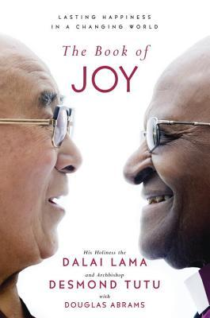
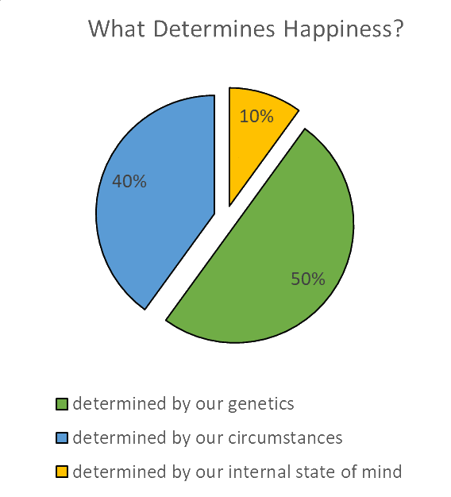
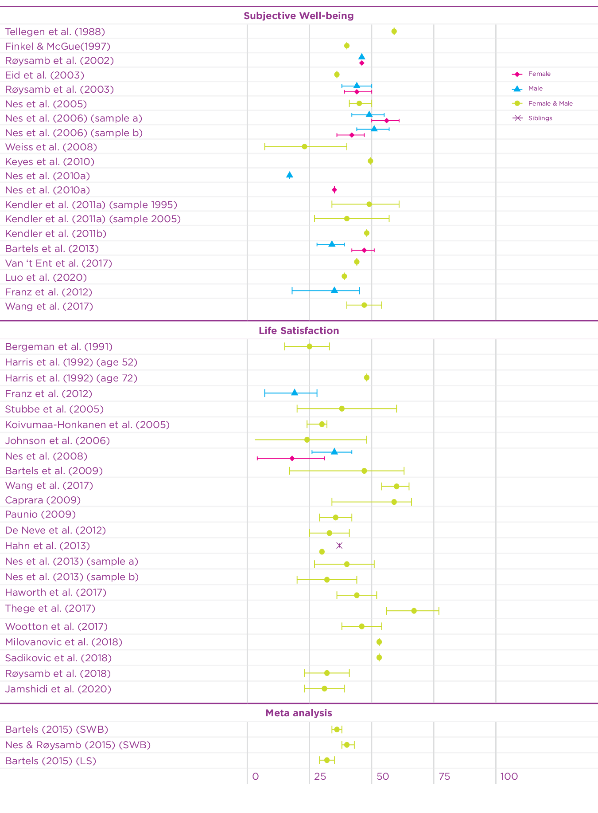
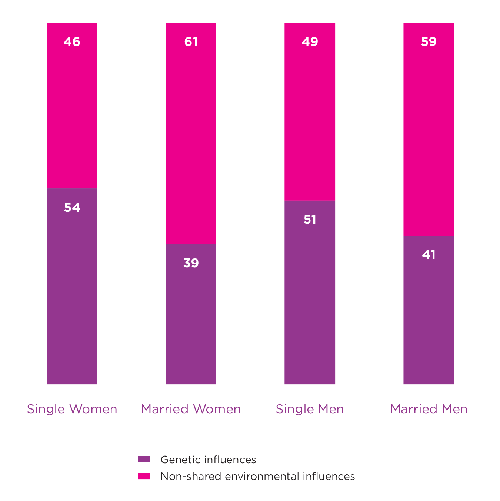

+++
title = "最後一次相遇，我們只談喜悅 The Book of Joy - 成為漣漪"
date = "2023-04-24"

[taxonomies]
categories = ["閱讀筆記"]
tags = ["快樂", "哲學"]

[extra]
rating = 5
+++

# 一二三言以蔽之

透過兩個精神領袖——**達賴喇嘛**與**大主教屠圖**——的對話，在可能是人生的最後一次相遇中，針對喜悅這個主題做多面向的討論。此書聚集了大量關於如何產生喜悅與面對苦難的智慧，是相當棒的哲學之書。

# 書籍

# 為什麼我會想讀這本書

一直以來都對於達賴喇嘛的哲學感到好奇，想藉由這本書初探了達賴喇嘛的想法，意外收穫了一本充滿智慧語錄的書籍。

# 摘錄觀點與解析

## 喜悅涵蓋的範圍

這本書特別把喜悅跟快樂區分開來，對於喜悅有不同的定義。

書上有定義喜悅涵蓋的範圍：
* 愉悅（pleasure，五感的享受）
* 樂趣（amusement，咯咯笑乃至於捧腹大笑）
* 滿意（contentment，較為冷靜的滿足）
* 興奮（excitement，面對新鮮事或挑戰時）
* 舒緩（relief，伴隨其他情緒而來，如恐懼、焦慮，甚至是愉悅）
* 驚奇（wonder，看見令人驚艷佩服的事物）
* 忘我（ecstasy or bliss，將人拉升到自我之外）
* 得意（exultation，勇敢完成一項艱困的任務）
* 難掩自豪（radiant pride，當孩子贏得殊榮）
* 幸災樂禍（unhealthy jubilation or schadenfreude，樂見他人痛苦）
* 崇拜（elevation，目睹善良、慷慨或慈悲的行為）
* 感恩（受到無私的幫助而心懷感謝）
* 欣慰（rejoicing，因為他人高興而快樂，佛家稱為「無量喜」〔mudita〕）
* 陶醉著迷（delight or enchantment，一種油然而生的滿足）
* 精神煥發（spiritual radiance，從深層的幸福與仁慈產生的祥和喜悅）

日常的快樂大多被定義在**愉悅**或是**滿意**，而作者感覺到達賴喇嘛與屠圖大主教的喜悅是偏向**陶醉著迷**和**精神煥發**。

## 快樂是命定論？

在 1978 年，由 Philip Brickman、Dan Coates 和 Ronnie Janoff-Bulman 的研究指出，樂透中獎者和因為意外而癱瘓的人的快樂程度在過了一段時間後都回歸到原本的基準值。

關於這個快樂的設定值，心理學家 Sonja Lyubomirsky 提及，50% 是由基因決定，另外 50% 為各種環境因素的總和。我們會漸漸習慣任何新的情況，最後會回到一般快樂基準值。

Source: https://www.trackinghappiness.com/50-40-10-rule-of-happiness/

### 什麼被決定了，而什麼沒有？

對於這樣子的數據感到好奇，在網路上查找了一些相關資料。

在 [The 50-40-10 Rule Of Happiness - What Is It?](https://www.trackinghappiness.com/50-40-10-rule-of-happiness/) 提及了其實這個分佈並不是由實驗產生而來，而是幾個專家們討論之後的估計值。

不過從 [Exploring the Biological Basis for Happiness](https://worldhappiness.report/ed/2022/exploring-the-biological-basis-for-happiness/) 中，可以發現有很多用雙胞胎做快樂遺傳力的研究，而大多的數據分佈都在 30%-50% 之間。

Source: https://worldhappiness.report/ed/2022/exploring-the-biological-basis-for-happiness/

雖說快樂是由基因與環境共同造成的，但與其他複雜系統相似，各個成因間並不是彼此獨立而是相互影響的。

基因和環境會互相影響其效果，例如已婚的環境因素就會影響到基因影響快樂的程度。

Source: https://worldhappiness.report/ed/2022/exploring-the-biological-basis-for-happiness/

此外，基因也會影響人類如何去選擇環境、影響賀爾蒙與激素的敏感度，也都間接影響人類快樂的程度。

### 有機會掌控的部分？

我們對於環境是有機會選擇的。我們可以去細細覺察生活中身體和情緒上的感覺，而壓力是其中很好的訊號源。我們可以透過生活中特別有壓力的部分，去探究其壓力來源。不管壓力源為何，我們都必須要接受現狀，再來尋找解決的方案。常見的方案有：
* 戰鬥：聚集能量翻轉現況
* 轉念：改變與壓力源的關係與觀點
* 逃避：逃避雖可恥但有用。但要認清，拖延型的逃避只是讓我們多了一些時間去反應，並沒有解決問題。能真正脫身的逃避才能真正遠離壓力。

<!-- TODO: Link -->

發現剛好對應到在快樂實現自主富有中提及的「*人生中不管碰到什麼狀況，你都有三種選擇：改變它、接納它，或是擺脫它。*」

## 喜悅的八大支柱

書中介紹了喜悅的八大支柱，透過這些正面特質，我們可以在生活中找到更多喜悅。八大支柱包括觀點、謙卑、幽默、接受、原諒、感恩、慈悲和付出。願你能從中找到適合你的種子。

### 觀點

> Everything can be taken from a man but one thing: the last of the human freedoms, to choose one's attitude in any given set of circumstances, to choose one's own way.
>
> -- Viktor Emil Frankl

每個人都有選擇看法的自由，只要你選擇用不同的面相去看待同一件事，往往都能帶給你新的見解。最明顯的例子就是概觀效應 Overview Effect，當你有了更高層次的視角之後，就會發現很多雞毛蒜皮的事情不太重要。或是對他人的處境用同理心來看待，常常就能突破自己的觀點，對事物有額外的見解。

### 謙卑

> 智慧如雨水，都在低處匯集。
>
> —- 西藏諺語

謙卑可以拉近人的距離。在無常的世界裡，把自己的成就與天賦當作被給予的禮物，不必傲慢於自己所擁有的，也可以不吝讚美他人所擁有的。

### 幽默

> Humor is tragedy plus time.
>
> -- Mark Twain

「笑」對於人有神奇的力量，不管在多糟的情境下，如果我們能以幽默看待，就能慢慢適應，將力氣導向於正途上。而自嘲也是一種能誠實面對自己的方式。

### 接受

> 既然可以改正，何必為之難過？假若無法改正，難過又有何用？
>
> -- 寂天大師

接納是一種處理事物的方式，透過充分感知事物的本質，發揮事物的正面價值，並做出適當的回應。

### 原諒

> 倘若不能原諒，我們就擺脫不了傷害我們的人，注定要被痛苦的鎖鏈束縛，動彈不得。除非原諒傷害我們的人，不然通往快樂的鑰匙將會握在他的手上，他反而成了監獄的看守者，囚禁著我們。選擇原諒才是奪回權力，掌控自己的命運與感受，當自己的救星。
>
> -- Desmond Tutu

原諒不代表遺忘，壞事有必要被記住，但是我們不能困在過去的怨恨裡。若是選擇原諒，就能打破復仇的循環，得以療傷、再生或放下這段關係。

### 感恩

> 感恩能轉化貧窮心態。當我們陷入貧窮思維時，就會專注在自己缺乏的東西上，感覺自己不值得愛，卻忽略了已經擁有的一切。
>
> —- Joan Jiko Halifax

接受代表不抗拒現實，感恩則代表擁抱現實。享受並擁抱每一刻當下。

### 慈悲

> 哪樣東西你一旦具備，就等於也具備了其他所有美德？答案就是慈悲心。
>
> — 佛陀

慈悲是把同情憐憫的感受，跟慷慨義舉與其他利他的表現串連起來。演化生物學發現，當我們做出善行義舉時，腦內的酬償中樞 Reward Centers 會得到獎勵，也會分泌較多的催產素，降低壓力因子皮質醇。所以利他的背後其實也利己，演化生物學家稱為互惠利他主義 Reciprocal Altruism。

### 付出
> 你用不著先擁有再付出。
>
> -- [僧人心態 Think Like A Monk](../think-like-a-monk/)

世界有太多問題，可以從自己能做的開始就好。除了物質上，給予時間幫助他人也是一種方式，提供諮詢、安慰、甚至分享智慧、價值觀，幫助人更快樂、更能自給自足，產生正向的善意流。

# 讀後疑問

在閱讀書籍、整理筆記的途中冒出了這兩個問題
* 如何讓內在價值的重要性外顯，讓人除了物質價值外能更重視內在價值？
* 書中有提到需要透過教育來重整下一代的價值觀，甚至就算在宗教裡，也不是每個人都充分理解核心價值觀，到底要怎麼讓人不斷地做文化傳承？

不過在整理寫心得的過程中好像也自己得到了答案。在這複雜的世界裡，很難有真理去套用在每個人的環境與經驗裡，終究人人只能去建立最符合自己現實的價值觀。

我們只能透過言教和身教去散播自己認為的善到更大的範圍，透過分享智慧、價值觀，擴大影響力，將善意與喜悅帶給更多人。

# 讀後感

年紀越長越覺得人生就是一場修行，每個人在生活中都會面臨到自己的困難與挑戰，而這都是我們成長與進步的契機。

舊約聖經提及人生有如一座幽谷，一座眼淚匯聚的山谷。「行經流淚谷者，將之化為泉源。」把眼淚、壓力和挫折當成一座泉源，從中汲取灌溉的養分，使我們的情緒與精神得以成長。

最後分享也是在書中看到很喜歡的話：
> 要當喜悅的泉源、祥和的綠洲、寧靜的深潭，輕輕蕩漾擴散到周圍所有的人。
>
> -- Desmond Tutu

# Reference & My Readwise Highlights
* [The 50-40-10 Rule Of Happiness - What Is It?](https://www.trackinghappiness.com/50-40-10-rule-of-happiness/)
* [Is Happiness Genetic? An Update on Recent Research](https://readwise.io/reader/shared/01gyp105yr9j8gek5a4rews966)
* [Exploring the Biological Basis for Happiness](https://readwise.io/reader/shared/01gyp125ea2apyf6fa1dz78zt9)
* [Genetics, personality and wellbeing. A twin study of traits, facets and life satisfaction](https://readwise.io/reader/shared/01gyp1hp9z4d3nxqcbbe69dyyd)
