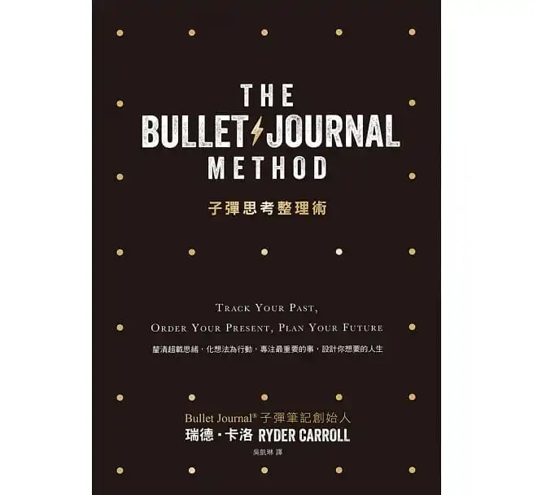
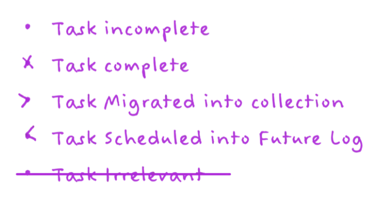
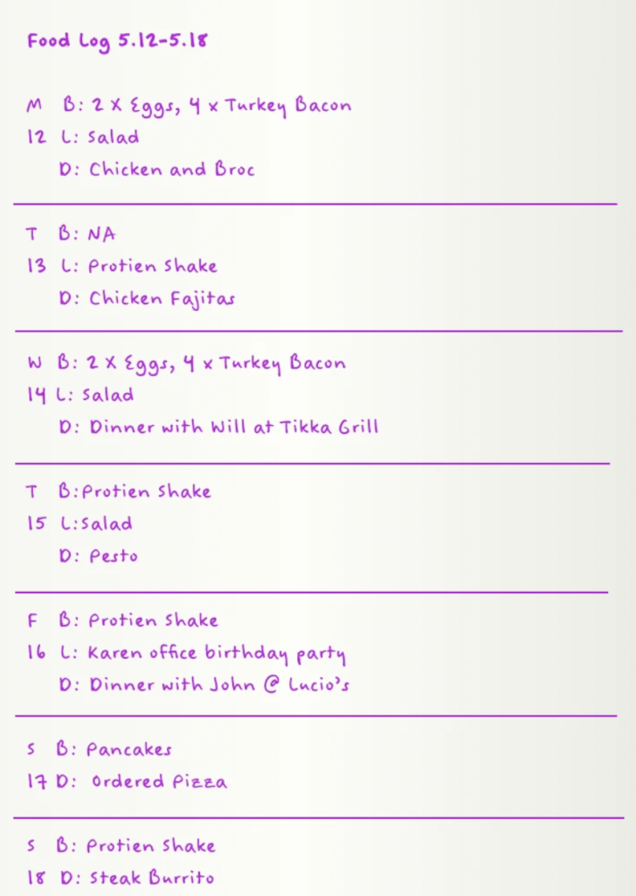
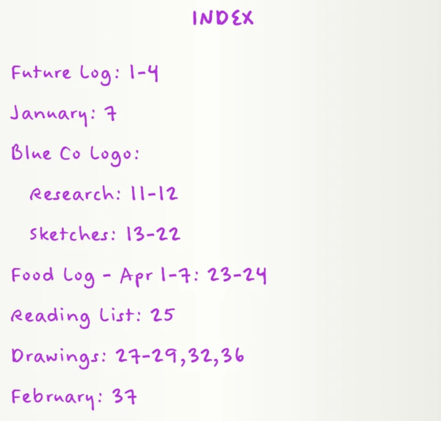

+++
title = "子彈思考整理術 The Bullet Journal Method：僧人心態的日記方法"
date = "2021-09-04"

[taxonomies]
categories = ["閱讀筆記"]
tags = ["自助", "生產力"]

[extra]
rating = 5
image = "the-bullet-journal-method.webp"
+++

# 書籍

# 前言

記得 2018 還在用 Evernote 記筆記時，為了能更有效率做出有品質的筆記，當時從 [Esor Huang 的子彈筆記術](https://www.playpcesor.com/2018/01/evernote-bullet-journal-1.html) 學了很多筆記技巧，雖然沒有完整地套用，但對子彈這個快、狠、準的代名詞很有印象。

時間轉眼到 2020，閱讀了 Sönke Ahrens 的 [How to Make Smart Notes](@/reading-notes/how-to-take-smart-notes/index.md)，讓筆記們彼此連結的想法衝擊了我的大腦，讓我直接轉戰到 Roam Research 上做筆記，重新打造我的第二大腦。在 Roam Research 上除了寫寫工作、讀書的筆記外，也開始把 6 分鐘日記的魔法的想法——早上晚上各抽出 3 分鐘的時間，為自己帶來感恩的想法與每天的自我反思——實際應用在 Roam Research 上。在 Roam Research 也用了將近一年的時間，除了從社群偶爾學習到一些新的應用，也想自己多閱讀關於筆記的技巧，這就是這次讀子彈思考整理術的契機。

因為對 Esor Huang 的子彈筆記術的印象很深，起初是抱著要強化筆記方法的心情打開了這本書。開始閱讀之後，反而覺得這本書帶給我的是僧人心態的日記應用版。

# 觀點摘要

## Bullet Journal

這種日記方式提供了一種快速的記錄技巧，你可以透過符號，很簡明扼要地記錄生活中的一切事物。

除了每日的日記外，你可以根據不同的需求，設計各式各樣的群組，讓日記長成最合適的形式。

再加上頁面編碼和索引，你就能精準地定位到你想要找的記錄。

你可以從 [Bullet Journal](https://bulletjournal.com/pages/learn) 的網站中，很快速以影片、圖像的方式來了解這樣的日記方式。

## 世界越快，心則慢

**快速**，想更有效率地做筆記，是我一開始閱讀的原因，而**緩慢**卻是我讀這本書最大的收穫。

這個日記方法其實是運行在手寫日記上。在這充斥著數位工具的時代，略顯的有點突兀。難以修改、無法搜尋、手寫速度比不上打字的速度，究竟這樣的日記方法可以帶給我們什麼好處呢？

## 子彈日記帶來的好處

* **手寫記憶**：在許多的研究顯示，透過手寫的方式來記錄事物，相較於用鍵盤敲打，大腦可以記憶的更好。
* **統一格式、隨身攜帶**：透過子彈日記的框架跟符號，能夠快速地記錄生活中發生的事情。把這些事情從腦中移除，讓腦袋更專注於當下，避免蔡式效應。
* **手寫成本**：因為手寫成本較高、也較為緩慢，反而給予空間讓我們反覆消化想法，寫出最重要且簡明扼要的內容。
* **任務遷移**：在利用子彈日記的 Daily Note 時，每日未完成的任務，是需要靠手抄一份到新的一天。相較於快速地在數位工具上剪下貼上，重新抄寫讓你再一次的審視這些認為對你的重要程度與意義。

## 反思 (Reflection) 與減法 (Subtraction) 是現代世界的必備良藥

緩慢在現代生活中額外的重要，便捷的數位時代使得大腦一整天都被灌輸著大量的資訊——快速的訊息傳遞、大量創作的數位影音、超即時的手機通知，我們花太少時間審視哪些訊息對我們是重要、有意義的。

我們必須給自己更多的時間停下來反思，用減法留下真正對我們有益處的東西，少吃點垃圾食物有助於健康。

## 目標——為生活設定指南針

> If you fail to plan, you are planning to fail.
>
> -- Benjamin Franklin

目標是生活最重要的指引方針，但你要找到真正屬於你自己的，而不是別人告訴你應該要做的。

這本書也提供了好幾種找尋目標的方法：
* **Mental Inventory**：列出生活中「你在做的事」、「你覺得應該做的事」、「你想要做的事」，列完之後針對每個列出的行為思考「這件事對你真的重要嗎」、「這件事對你是需要的嗎」，來幫助你去除掉生活中會讓你分心的事。
* **54321 練習**：列出 5 年、4 個月、3 週、2 天、1 小時，你分別在生活與工作中想要完成的事情，最後在每個時間區間跟項目各選擇一項，專注在生活與工作中達成。
* **5 個為什麼**：對你打算要做的事情，連續用 5 個為什麼反問自己原因，找尋自己真正的動機與想得到的目標。

# 後記：沒有目標的忙碌並不是生產力。

若你手中握著目標，你對於遭遇到的困難就會更有忍耐力，我們也較容易在資訊爆炸的現代找到真正值得你花時間的事物。

願大家都能找尋到自己的目標，在生活中做出更有意識的選擇，進而把這樣正向的能量帶到你周遭的生活，成為這世界的正向漣漪。
