+++
title = "《文化地圖 The Culture Map》閱讀筆記：跨國合作的八大維度"
date = "2023-10-13"

[taxonomies]
categories = ["閱讀筆記"]
tags = ["culture", "work"]

[extra]
rating = 4.5
image = "culture-map-painting.webp"
+++

一二三言以蔽之
=======

我們的日常不自覺地沈浸在文化中，文化影響了我們如何解讀、如何思考、如何行為。面對不同的文化，你善意的舉動可能造成對方截然不同、負面的解讀。透過簡單的文化量表，讓彼此開始搭建文化差異溝通的橋樑。

書籍
==
[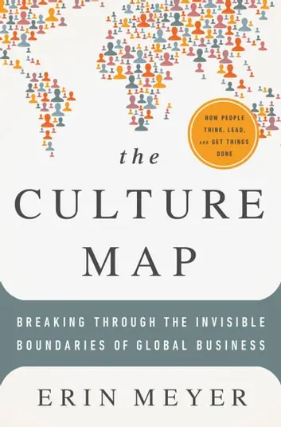](https://www.goodreads.com/book/show/22085568-the-culture-map)

為什麼我會讀這本書
=========

我很喜歡的《[零規則 No Rules Rules](@/reading-notes/no-rules-rules/index.md)》，是由 Netflix 的執行長 Reed Hastings 與本書的作者 Erin Meyer 共同著作而成。Netflix 這幾年爆炸性的成功與其跨出非英語系市場的策略息息相關，透過與世界各國的團隊合作，創造出《紙房子》、《魷魚遊戲》等非英語卻發燒全球的經典作品。Reed Hastings 在《零規則》提及 Netflix 利用《文化地圖》的文化量表，能夠快速地對比 Netflix 與一個國家文化之間的差異。透過這樣的對比，可以更準確地去歸因問題的可能原因，探討適合該文化的解決方法。

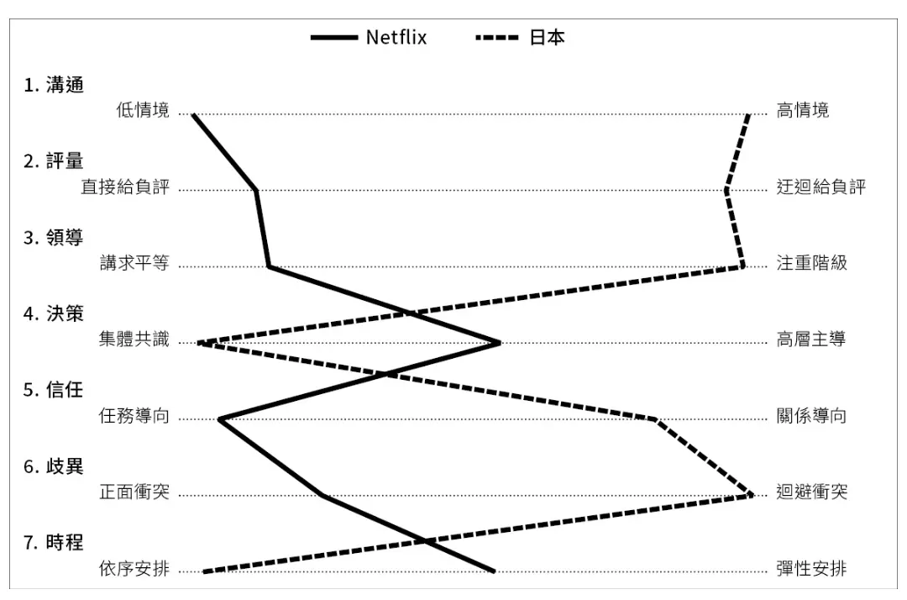

出自《零規則》

當時就把這本《文化地圖》加入我的待讀書單。直到今年計畫去英國讀三個月的語言學校，覺得或許能透過這本書暸解其他的文化，就閱讀了這本書。

摘錄觀點
====

八個維度的文化量表
---------

作者以近二十年研究跨國文化在工作上的差異的經歷，列出了在工作中最容易受到文化差異影響的八個維度，透過與不同國家的中高階管理者訪談，找出不同國家在八個維度的分佈，最後以分佈的中間點當作該國家在此維度中的代表位置。

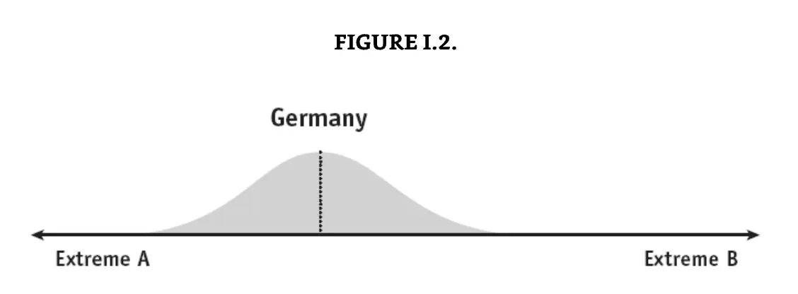

出自本書

這八個維度分別是：
- [溝通：低情境 vs. 高情境](#communicating)
- [評估：直接給予負面回饋 vs. 間接給予負面回饋](#evaluating)
- [說服：原理優先 vs. 應用優先](#persuading)
- [領導：平權式 vs. 階級式](#leading)
- [決策：集體共識 vs. 高層主導](#deciding)
- [信任：任務導向 vs. 關係導向](#trusting)
- [歧異：正面衝突 vs. 迴避衝突](#disagreeing)
- [時程：依序安排 vs. 彈性安排](#scheduling)

以下會簡述各個維度的意義和我摘要的重點。作者在書中給了很多在實務上的案例，想了解更多可以直接閱讀本書。

### 溝通：低情境 vs. 高情境 {#communicating}

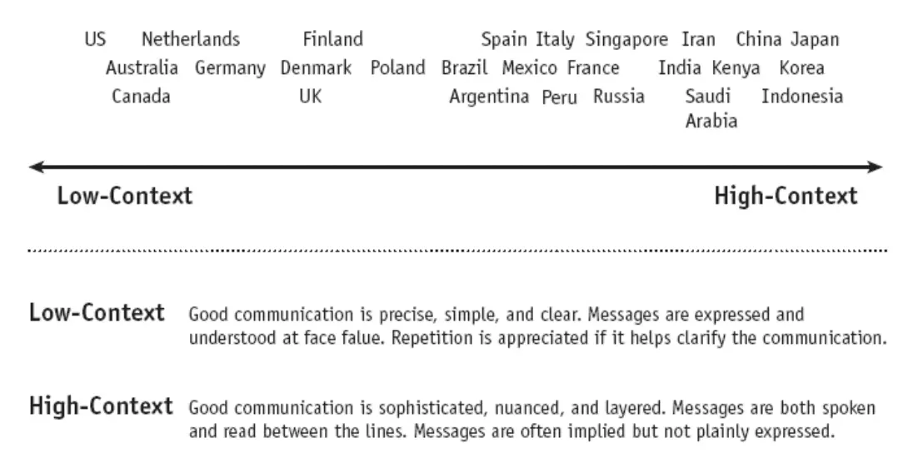

出自本書

情境（Context）指的是在溝通前，需不需要對於交談的背景有預先的了解以達成有效的對話。也隱含了在溝通上是否會使用直接明確的方式，抑或是會用比較多隱喻及不直接的溝通。

從量表中可以發現，語言和歷史會是主要的差異點。英語系會相較亞洲語系更為直接；而擁有較短的歷史且多文化的社會，也會趨向使用明確的表達來達到更有效的溝通。

作者額外發現有趣的一點是「教育越高會使人越符合文化的形狀」。在亞洲國家，教育水平越高的人不是走向使用更精確簡單的溝通方式，而是更擅長使用模糊、複雜的語言。

在多文化的團隊，追求理解「高情境」文化的隱喻是困難的事，所以明確的討論、訂定出團隊「溝通」的「低情境」模式是相當重要的事。

### 評估：直接給予負面回饋 vs. 間接給予負面回饋 {#evaluating}

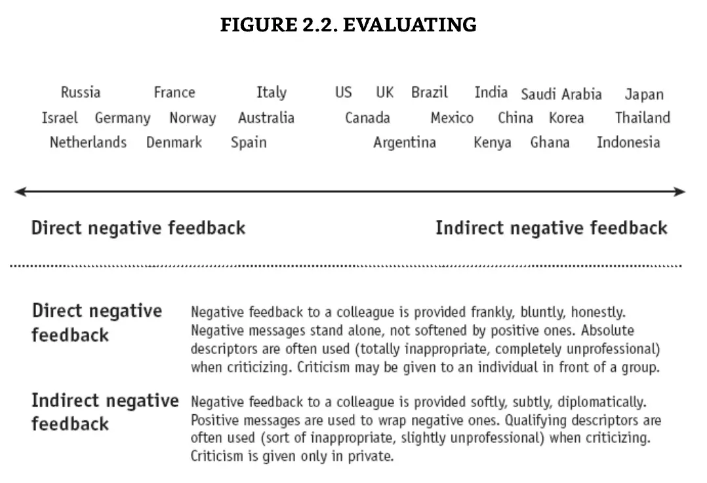

出自本書

在工作中，除了透過讚揚來強化好行為，給予負面回饋讓同事能夠改善自己的缺點也是增進團隊整體能力重要的一環。

但不同文化對於如何給予和接收負面回饋有很大的差異，華人傾向不在眾人面前給予負面回饋，荷蘭人傾向要誠實並直接地給予負面回饋，英國人傾向用好話去包裝負面回饋降低傷害，法國人傾向用強烈的字眼表達負面回饋增加感受度。若在不了解另一個文化時，用自己文化的方式去給予負面回饋，可能會得不到好效果。書中給了一個英國人與荷蘭人雞同鴨講的例子：
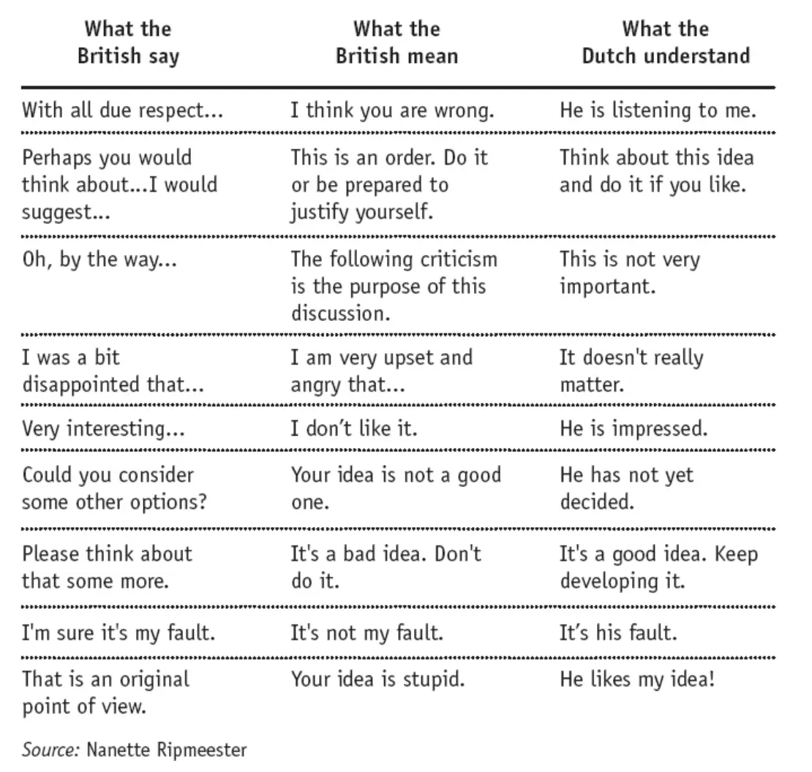

出自本書

面對不同的文化，在給負評時我們需要試水溫、做滾動式的調整，有時你需要更直接一點，或選擇強烈一點的字詞；有時你需要委婉一點，私下給予回饋，或是用好話包裝負面回饋。在接收負面回饋方面，可以先假設對方是有好的意圖、不是故意要冒犯你。

### 說服：原理優先 vs. 應用優先 {#persuading}

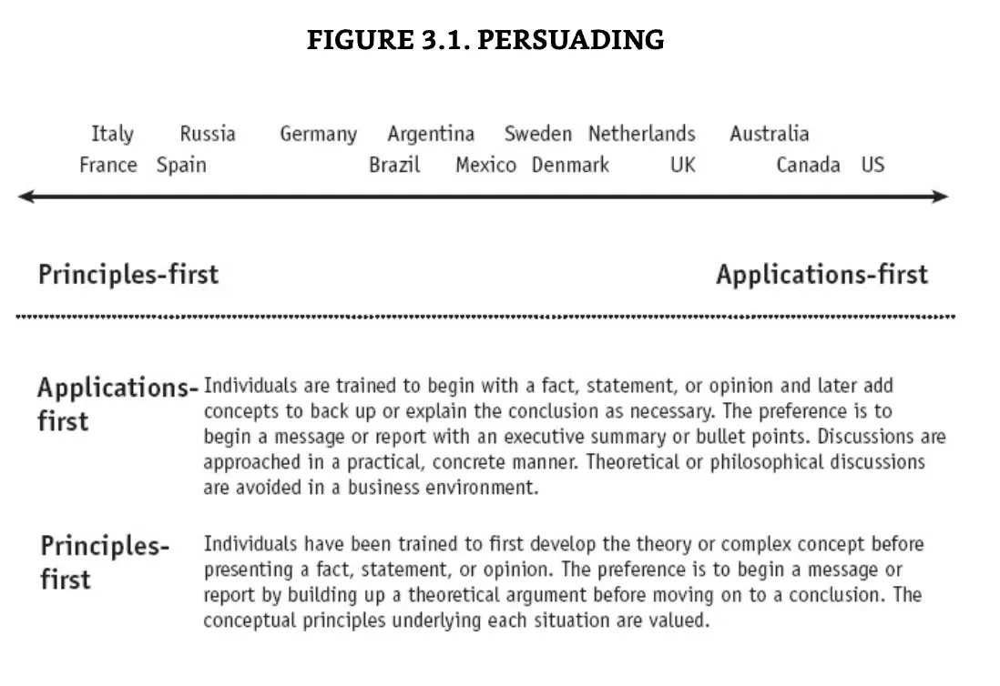

出自本書

在工作中，我們常常需要透過提案或報告爭取支持與認同以獲取資源推進專案，說服當中是不可或缺的過程。但在說服這個維度上，有兩個截然不同的方法————「原理優先」和「應用優先」。在原理優先中，必須先給予理論基礎，才能在理論基礎上架構你的假設和想達到的效果。如果理論有誤，會造成你後面的推論完全讓人失去興趣。另一種是應用優先，必須先說明實務面上可以達到的效果且在應用層面上有可行性，再往回討論各種實作細節與理論。如果未先建立可見的成果，你可能會失去聽眾的注意力。

而在跨文化的場合中，你很難預想到受眾是用何種思考方式。最佳的方式是在舉例和理論面上來回敘述，滿足雙方面的需求。

### 領導：平權式 vs. 階級式 {#leading}

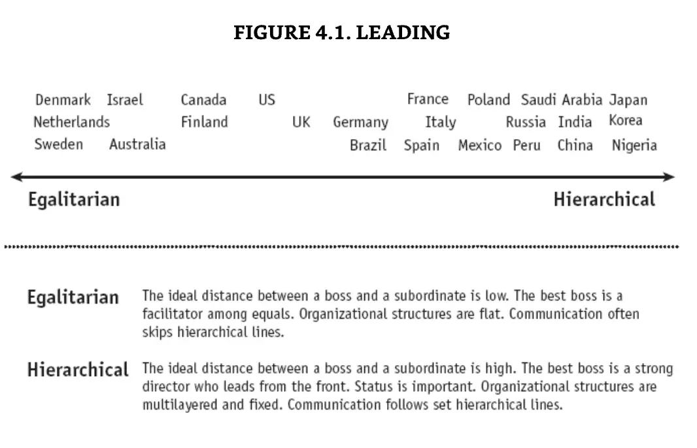

出自本書

在領導層面的差異是[權力距離（Power Distance）](https://en.wikipedia.org/wiki/Power_distance)，意指在公司權力最高的老闆與最底層的員工的距離。最底層的員工是否有能表達意見的方式，或是只能透過多層的階級傳達意見。

這樣的差距主要來自於歷史與宗教。崇尚平權式的國家大多來自「最平權與共識導向的維京人文化」與「能直接與神對話，跳過牧師的新教」的地區；而偏好階級式的國家則多半來自羅馬帝國或是信奉天主教及儒教的地區。

在面對不同的領導維度，需要注重不同的細節。在平權式的領導下，直接溝通是受歡迎的，定義團體的願景與賦權給予自由度是團體成功的關鍵；在階級式的領導下，先與同階級的同事溝通，如果需要更多權力與決策，再向上呈報。領導者需要清楚定義想得到的答案，請下屬提供，在會議中透過主動邀請發言或匿名化方式收集意見是最大化資訊收集的方法。

### 決策：集體共識 vs. 高層主導 {#deciding}

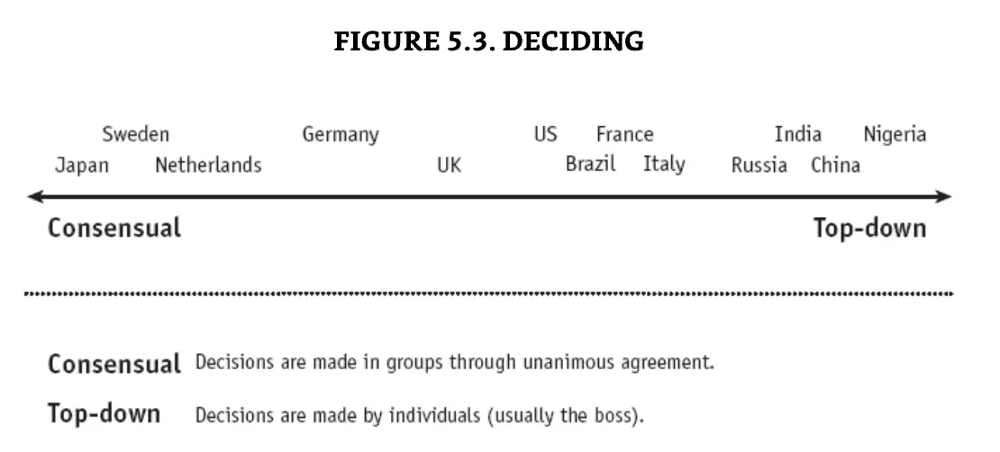

出自本書

決策是公司組織決定方向、形成共識的方式。在這個維度可以區分為先取得共識再前進的「集體共識型」與領導者推進的「高層主導型」。「集體共識」關鍵在於共識的形成，所以會有比較長的前置討論時間，但一旦共識達成後，團體可以用高速的協作完成任務。但在過程中必定要確保決策品質，因為一旦達成共識後就難以更改。而「高層主導」以領導者的決定權快速決定初版，後續再透過討論與修改滾動式調整，是相對有彈性的方式。在此種模式下，高度仰賴決策者收集資訊、決策速度與決策品質。

此維度會與領導風格極度相關，平權型會傾向用集體共識決策，階級型則會以高層主導為主。但還是有一些例外，像日本雖然是階級制領導，但組織常常使用「下層組織先討論達成共識後向高層提案請求許可」的「[稟議制](https://www.newton.com.tw/wiki/%E7%A8%9F%E8%AD%B0%E5%88%B6/9316765)」，所以也十分在意集體共識。

在領導多文化的團隊時，可以在團隊內討論決策產生的方法、時程與決策後的彈性。

### 信任：任務導向 vs. 關係導向 {#trusting}

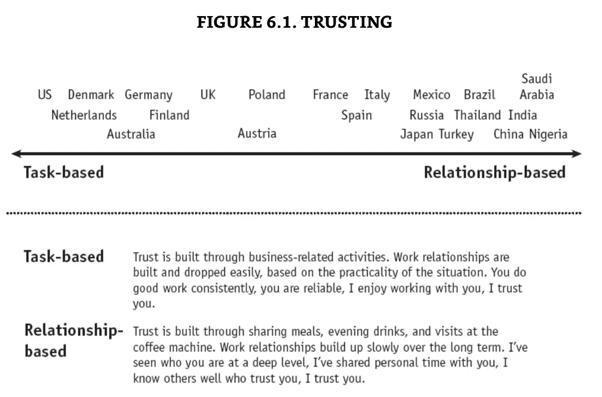

出自本書

信任是人與人合作的基礎。在不同文化下，建立信任基礎的方法也有所不同。「任務導向」指的是信任建立在他人完成任務的能力上，成功的合作產生了信任感，輔助推動下一次的合作；在「關係導向」裡，信任則是建立在友好度上，彼此關係越好願意在合作上給予更多幫助。

此維度會受到該國家法治的成熟度影響，若法治效果不彰或無法信任，那人們在合作上就只能仰賴相互的關係，會更偏向「關係導向」。

與以「關係導向」建立信任的夥伴共事時，建立工作外的關係是讓合作順利的關鍵。要用有溫度的方式建立連結，適時展露私下的自己、參與團隊下班後的活動。在前期合作時，試著建立能面對面交談的機會，否則冷冰冰的郵件往來會讓你的起步阻礙重重。相對而言，若與以「任務導向」產生信任的夥伴交流，你或許會發現你只能碰觸得到他們工作時的人設，無法踏入其私人領域。請不要介意，那不是他們熟悉的互動方式。

### 歧異：正面衝突 vs. 迴避衝突 {#disagreeing}

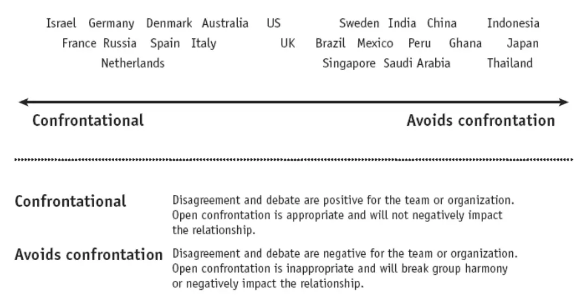

出自本書

在工作中，大小事情上都可能產生歧異，如何處理歧異影響到所需要花費的心力和時間。

對於衝突的偏好度，以東西方為主要分界。東方人受儒教思想影響，注重和諧。如何不破壞和諧是重要的考量。在生活的衝突上會傾向保守，不攻擊他人的意見，且在對內和對外的互動會完全不同，以顧及自己和對方的「面子」。而西方對於衝突相對客觀，會有「好的想法需要在不同意見衝突時才能激發」的想法，因此不會刻意去避免衝突。

在與迴避衝突的文化合作時，需要較在意給予意見的方式與內容。可能會遇到以下的問題：

### 對方為了避免衝突，不願提出自己的意見。

有發現這樣的狀況時，可以在未來需要收集意見時做一些改變：

-   延遲提出自己的意見。

-   提前告知對方在會議中想收集對方的意見。

-   匿名化搜集意見，如透過便條紙。

### 提出意見產生衝突讓他人不適。

若察覺到在自己提出意見後，與對方的互動關係有些改變。可以考慮以下列的方式互動，慢慢建立信任：

-   用柔和的文字和語氣尋求想法與意見

-   可以透過「[魔鬼的訟辯人](https://zh.wikipedia.org/zh-tw/%E9%AD%94%E9%AC%BC%E7%9A%84%E8%A8%9F%E8%BE%AF%E4%BA%BA)」、幽默或謙遜來包裝反向的意見。

### 若你是迴避衝突傾向的人，如何融入正面衝突的文化？

不要刻意去學習對方直接的方式，因為那不是你原生的習慣。但當你發現你的意見沒有被注意到時，可以試著調整選擇強一點點的字眼。告訴自己有異議代表參與度高，而不是為了破壞和諧。

### 時程：依序安排 vs. 彈性安排 {#scheduling}

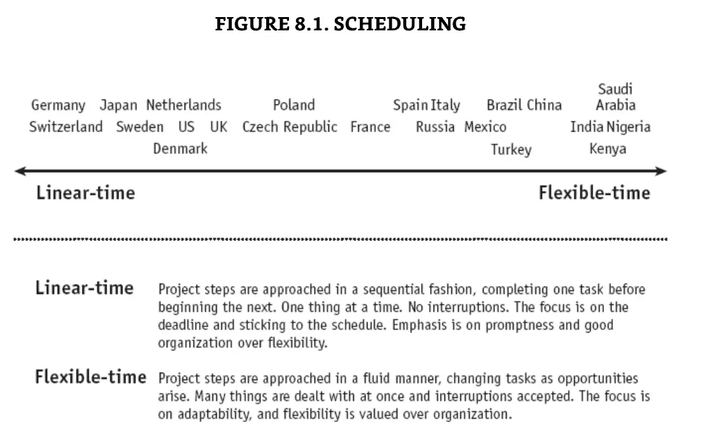

不同文化對於時程安排的敏感度不一，有些文化偏好有條有理的時程安排，可以預估結果且掌控順序；也有些文化偏好有彈性的安排，即使有排定的日程表，但如果遇到較為重要的事情，可以取消後續的行程專注在當前重要的問題上。

在多文化的團隊裡，最重要就是把時程安排的問題丟出來討論，確保團隊對時程安排的彈性上有一致的規則。

如何成功建立一個全球團隊
------------

在看完以上的八大維度文化量表，我們究竟要如何實踐在全球團隊中呢？

### 彼此的關係是相對的

即使是文化相近的國家，單向維度的強度可能還是不太一樣，所以重要的是要看相對位置。

### 用開放心態接受「每個人都是不同的個體」還不夠

我們都習慣用自己的文化所產生的視野去解讀世界，但對於無法理解的不同或爭論，如果我們只用不同個體的概念去理解，我們可能會將其錯誤歸因給個人的特質。透過文化量表，給我們多一些視角去看待不同的文化可能產生的不同。

### 可以的話，讓成員在不同國家居住一段時間

如果公司可以負擔成員的出差，讓跨國的成員有機會在彼此的國家下生活一段時間會讓互相理解很有幫助。

在相同的邏輯下，如果能找到一名有多文化生活經驗的成員，會成為不同文化之間很好的橋樑。

### 理解後，建立團隊規則

可以利用本書當作討論的引子，大家一起觀看並討論每個文化維度不同之處，最終討論一個適合這個團隊的解決方案，並記錄討論出的解決方案，成為團隊的守則。

讀後感
===

這本書是在去英國念語言學校前夕開始看，花了一段時間才看完，試想在國外的生活會不會有能用到的部分。不過實際上，在交友和工作的面向還是差距蠻大的，沒有真實找到運用的契機，只有在課堂上討論文化時當作話題互相交流。不過在閱讀此書時，反而有蠻多是對自己文化的反思。文化會影響我們如何認知、如何思考，和做出的行為。當我們生活在一個文化中時，不一定能察覺文化帶給我們的一切。就像長期生活在水中的魚，並不能知道什麼是水。

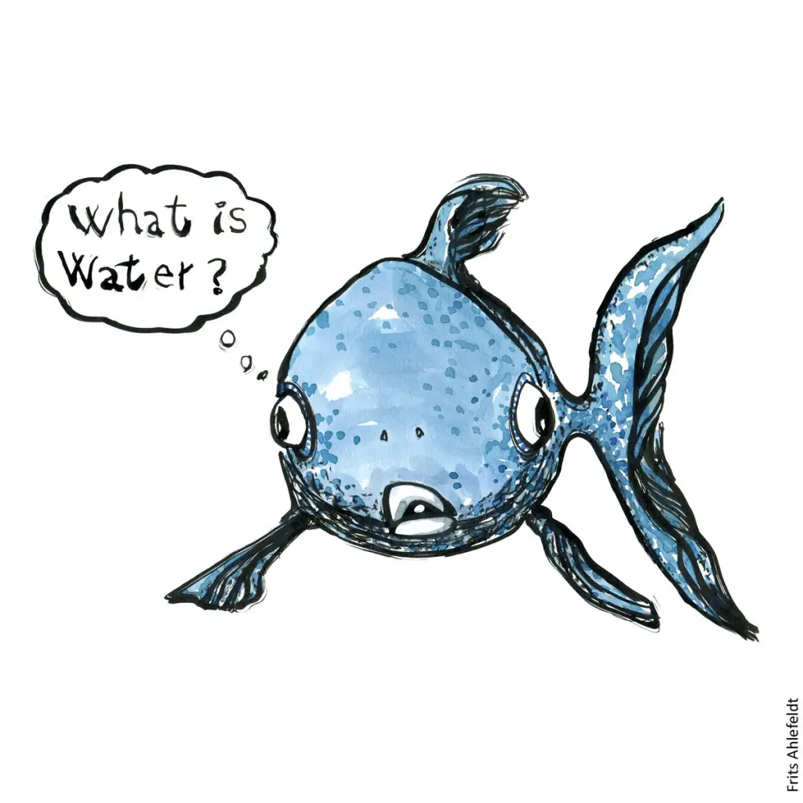

出自 <a href="https://museumofpsychology.org/2019/07/09/the-what-is-water-fish-story/">The What is water? fish story</a>

透過這本書的視角可以好好認知文化影響我們思維的部分，可以仔細思考文化是否帶給我們什麼樣的優勢和劣勢，能不能透過什麼方式改善自己文化帶來的弱項。

> 當你認知自己的病時，你已經好了一半。
>
> -- Thomas Fuller
