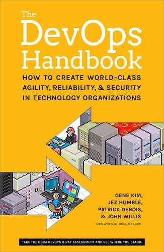
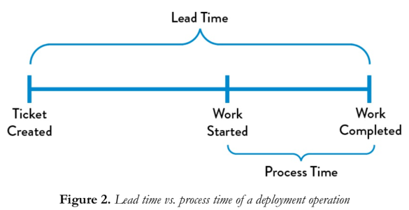
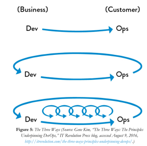

+++
title = "《The Devops Handbook》閱讀筆記：三步工作法"
date = 2020-03-08
description = "《The Devops Handbook》閱讀筆記：探索三步工作法，包括暢流、回饋和持續學習，助你提高開發效率和系統穩固。立即點擊了解更多！"

[taxonomies]
categories = [ "閱讀筆記",]
tags = []

[extra]
rating = 10
image = "the-devops-handbook.jpeg"

+++

# 書籍

# 摘要

## 價值流

簡單說起來是從「需求 -> 執行 -> 交付」的所有過程。

轉換成軟體開發中可能就是「商業構想 -> 開發 -> 交付給使用者」。

我們通常會覺得時間最漫長的或許就是在開發的過程，我們需要設計架構、實作、大量測試，以產生品質夠好的產品。但在實際的工作經驗裡，開會討論、被隕石砸到、重工、需求變更、等待上下游、政治因素（？），或許才是在工作中佔據大多數的時間。

除了程式架構、開發的考量，究竟如何排除阻礙開發的因素，降低 Lead Time，也是一個重要的課題。

## 什麼是三步工作法？

三步工作法包含了三個部分
* 暢流（fast left-to-right flow）
* 回饋（fast right-to-left flow of feedback）
* 持續學習與實驗（generative）

### 暢流
暢流最主要的概念是快速地將商業構想，以科技實現，快速地推及市場呈現價值。除了技術實現的困難度以外，其實在流程面也會有很多拖慢上線速度的阻礙。將工作可視化、減少切換工作項目、降低等待時間、降低功能的批次規模都是可以注意的地方。

### 回饋
在現代工作中，我們越來越容易開發出複雜的系統，有可能是功能性上的複雜，或是為了要達到高流量、高穩定度的系統。如何偵測系統的異常，建立足夠數量的可視性相當重要，當我們有足夠的視野能看見問題，我們就能慢慢地強化系統的弱點。

### 持續學習與實驗
在軟體開發中，持續學習其實是工程師延續職業生命非常重要的課題。若能在工作中建立高度信任，在邊開發時，也能從維運系統中去實驗、去學習，成為學習性的組織，將決定整個組織的成功與否。

# 後記
原本想要一口氣把三步工作法的細節實踐都寫完，看來沒有辦法。只好拖稿一下，後續會再補充三步工作法的細節實踐。
