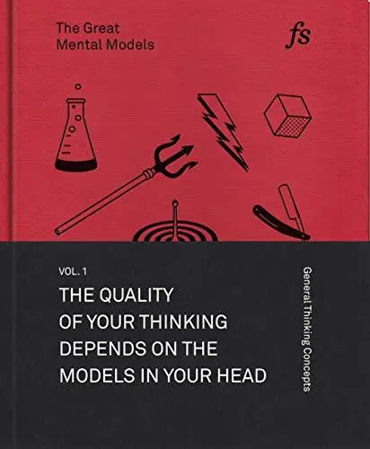
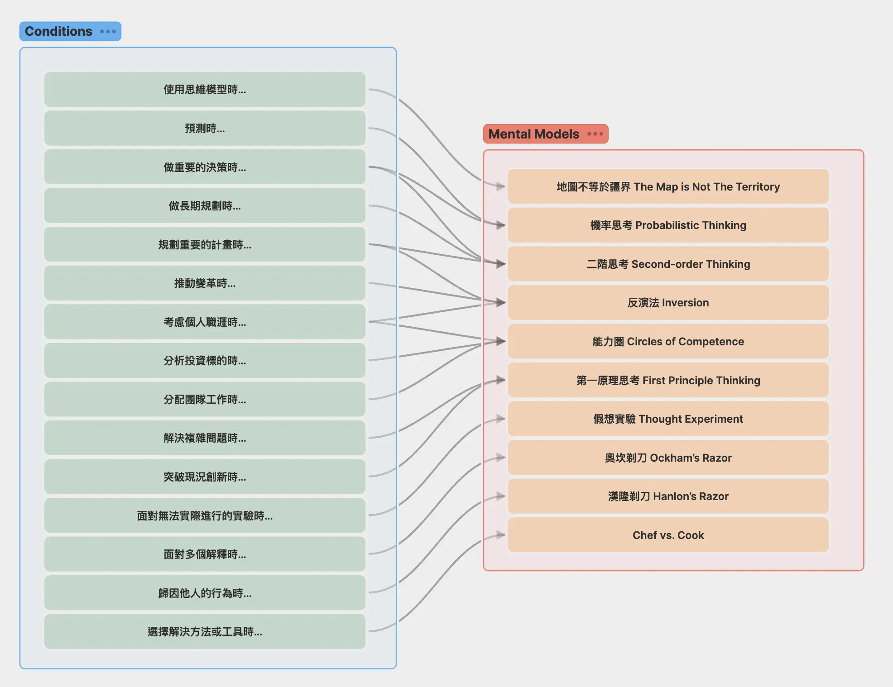

+++
title = "《思考的框架 The Great Mental Models》閱讀筆記：建立多元思維模型"
date = 2024-02-23
description = "《思考的框架 The Great Mental Models》介紹了多元思維模型的重要性，幫助讀者建立形成智慧的框架。點擊閱讀，探索如何利用這些模型提升認知與決策品質。"

[taxonomies]
categories = [ "閱讀筆記",]
tags = [ "mental-model",]

[extra]
rating = 10
image = "og-image.webp"

+++

一二三言以蔽之
=======

作者也是查理蒙格的粉絲，為了要實驗他提到的多元思維模型（A Latticework of Mental Models），作者幫忙列出重要的思維模型們。

書籍
==

為什麼我會讀這本書
=========

在閱讀查理蒙格的《[窮查理的普遍常識 Poor Charlie's Almanack](@/reading-notes/poor-charlies-almanack/index.md)》和 Naval Ravikant 的《[快樂實現自主富有 The Almanack of Naval Ravikant](@/reading-notes/the-almanack-of-naval-ravikant/index.md)》這兩本書，都提及了建構多元思維模型的重要性，也分別提出自己的清單（[查理蒙格 Charles T. Munger 的多元思維模型清單](@/wisdom/lists/charles-munger-a-latticework-of-mental-models/index.md)、[Naval Ravikant 的多元思維模型清單](@/wisdom/lists/naval-ravikant-a-latticework-of-mental-models/index.md)）。

要建立多元思維模型，怎能不讀這本幫你整理一些最常用思考類思維模型的書呢？

摘錄觀點
====

一定要建立多元思維模型嗎？
-------------

想要先引用費曼先生的話：

> 事實上，你只是以為自己知道，你多數的行動都是根據不完整的知識，不知道事情的全貌，或世界如何運作，你不知道的事很多。不知道，也能過日子。
>
> —— 費曼 Richard Feynman

在一個固定的認知範圍內生活，可以帶來更高的安全感。如果我只想好好生活，沒有想要追求智慧，難道這不是更好的選擇嗎？

這讓我想到世紀帝國這款遊戲，你當然可以不探索黑霧，靠採集水果維生，過著安逸的生活。但這個世界的其他勢力會不斷研發新科技，不管是在經濟上、知識上或武力上會開始產生差距，當你被迫遭遇其他勢力時，你可能就得要繳很多知識税或是被他人支配。

當然，你可以決定你想要怎麼生活，但如果有餘力，你必須確保自己的生活和認知不會受到破壞，或是，你要確認自己可以接受這些結果，不會過意不去。

> Until you make the unconscious conscious, it will direct your life and you will call it fate.
>
> —— Carl Jung

當我們採取被動態度時，我們也容易認為是這些壞事情找上了我們，而不是我們做了什麼而導致事情發生。這種被動代表我們很少會反思自己的決定及造成的結果。少了這些認知就讓我們少了學習的機會，而被命運擺佈。增加認知可以讓我們開始利用物品創造價值，而不只是消費物品。

> 經驗與反思的交匯處，就會產生學習。
>
> —— 《思考的框架》

學習最常見的思考類思維模型
---------

為了方便未來想法的發展，我把這些思維模型放在專屬的資料夾，想要整理這些思維模型的目的、使用情境和風險，未來也可以持續搜集其他地方看到的思維模型。額外在每個思維模型如果有不錯的細節可以補充，我也都會加在該頁面。

歡迎點選你感興趣的思維模型觀看：（順序是我覺得重要的排序）

-   [反演法 Inversion](@/wisdom/mental-models/inversion/index.md)

-   [二階思考 Second-order Thinking](@/wisdom/mental-models/second-order-thinking/index.md)

-   [第一原理思考 First Principle Thinking](@/wisdom/mental-models/first-principle-thinking/index.md)

-   [機率思考 Probabilistic Thinking](@/wisdom/mental-models/probabilistic-thinking/index.md)

-   [地圖不等於疆界 The Map is Not The Territory](@/wisdom/mental-models/map-is-not-territory/index.md)

-   [能力圈 Circle of Competence](@/wisdom/mental-models/circle-of-competence/index.md)

-   [假想實驗 Thought Experiment](@/wisdom/mental-models/thought-experiment/index.md)

-   [漢隆剃刀 Hanlon's Razor](@/wisdom/mental-models/hanlons-razor/index.md)

-   [奧坎剃刀 Ockham's Razor](@/wisdom/mental-models/ockhams-razor/index.md)

開始建立多元思維模型
-----------

要有效地累積經驗形成智慧，建立多元思維模型是一個捷徑。我們可以透過閱讀學會理論、學會他人的思維模型，接著我們將這些思維模型組織成框架，導入經驗。透過消化經驗，我們可以更清楚使用個別思維模型的情境、時間點和目的。透過累積，我們可以篩選出對我們有用的模型，甚至創造我們自己的思維模型。

> 第一條規則是，如果你只是記得一些孤立的事實，而試圖把它們硬湊起來，將無法真正理解任何東西。如果這些事實不在一個理論框架中相互聯繫，就無法派上用場。你必須在腦中擁有一些思維模型，靠這些模型組成的框架來整理間接和直接的經驗。你必須把經驗掛在腦中一個由許多思維模型組成的框架上。
>
> —— 查理蒙格

### 數位第二大腦該登場了

查理蒙格強調在腦中建立多元思維模型，但當你學習一個新的思維模型，還沒有成功地在現實生活中使用前，很難真的在腦中靈活地調用這些思維模型。透過電腦軟體的輔助可以幫助我們記憶並設定觸發點來使用這些思維模型。

我目前的做法是在 Heptabase 裡創造一個多元思維模型的白板，將每個思維模型使用的情境特別拆出來整理，這樣在重要決策前我就可以快速瀏覽這個列表，看看有沒有適用的思維模型。

讀後感
===

一直以來我在閱讀和寫作間都有時間差，總是在閱讀完好幾個月後，為了寫作而重新瀏覽一遍之前閱讀的重點標記。這樣的延遲複習在這本書帶來了一些奇妙的好處，在為了寫作的第二次複習比第一次閱讀時多瞭解了很多當時沒想通的道理，讓我覺得閱讀、做筆記、寫作這個循環真的讓我額外收穫了更多。雖然每次寫作時摩擦力都很大，但我想我會持續堅持這樣的活動。

額外的感想是好像有開始摸索到一點 Heptabase 的用法，雖然訂閱很久，之前也都會用 Heptabase 整理閱讀心得，但好像都沒有太多額外的收穫。近期開始在 Heptabase 導入 PARA 裡 Area 的概念，有漸漸覺得自己在利用視覺化這點上有一點點收穫，或許還要再走一段時間看有沒有更多感想。
