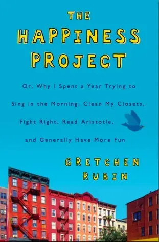
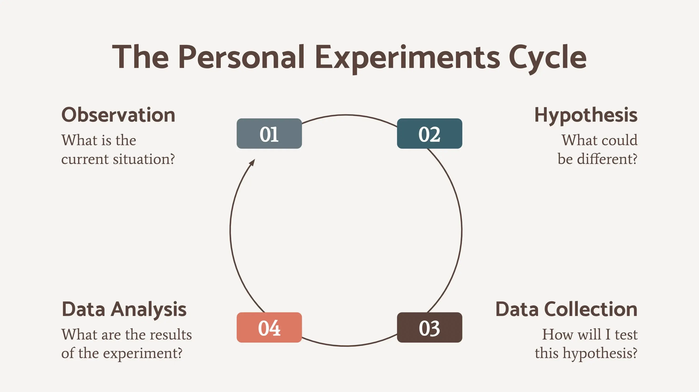

+++
title = "《過得還不錯的一年 The Happiness Project》閱讀筆記：以實驗心態讓自己趨向快樂"
date = 2024-01-29
description = "用實驗的心態讓自己更快樂！《過得還不錯的一年》提供十二個月的快樂提案，幫助你實現幸福生活。"

[taxonomies]
categories = [ "閱讀筆記",]
tags = []

[extra]
rating = 8
image = "og-image.webp"

+++

一二三言以蔽之
=======

作者在一個尋常無奇的早上忽然領悟到自己一直在浪費生命，並想起法國女作家 Colette 的話：「*我擁有多麼美好的一生......但願我能早一些明白。*」作者想認真用十二個月的時間，制定自己的快樂生活提案，每個月探究一個能讓自己快樂的守則，看看自己能否更快樂。

書籍
==

為什麼我會讀這本書
=========

這本書是讀書會投票出來的選書。隨著年紀的增長，在生活中擁有了更多，有更多經濟自由帶來的生活的自由，但一方面好像也漸漸從生活中失去以前簡單的快樂。

「沒有不快樂，但也沒有很快樂。」

到底快樂的來源是什麼嗎？

另外我也好奇和達賴喇嘛的 [《最後一次相遇，我們只談喜悅 The Book of Joy》](@/reading-notes/the-book-of-joy/index.md) 有什麼相同和不同的地方。

摘錄觀點
====

快樂生活提案 The Happiness Project
----------------------------

作者對「什麼是快樂」迅速做了研究，決定要跟隨亞里斯多德（Aristotle）的「快樂就是至善」的想法，並且效仿美國開國元勳班傑明富蘭克林（Benjamin Franklin）的美德表。富蘭克林訂出十三項想培養的美德——節制、沉默、秩序、決心、儉樸、勤勉、誠懇、公正、適中、清潔、鎮靜、貞潔、謙遜——同時制定執行計畫，把這些美德分配一星期中的不同天去實行。

作者省思出自己的版本，寫出十二個能增進快樂、「具體且可以衡量」的決心事項，每個月針對一個項目去實行。

作者訂出的十二守則如下：

一、做自己。

二、凡事看開。

三、表現出自己想要的感覺。

四、馬上行動。

五、要有禮貌，要講道理。

六、享受過程。

七、物盡其用、不浪費。

八、把問題弄清楚。

九、放輕鬆。

十、該做的事情就去做。

十一、不要斤斤計較。

十二、心中只有愛。

最重要的是**定義出屬於自己的「決心事項」**，作者也提供以下的問題來幫助你找尋讓自己快樂的決心事項：

-   什麼事情讓你有好感覺？什麼活動你覺得有趣、滿足，而且來勁？

-   什麼事情，讓你有壞感覺？生活中讓你生氣、心煩、無聊、困惑、焦慮的來源是什麼？

-   在你的生活中，哪些事情讓你無法感覺對了？你希望換工作、換地方住，或改變家庭狀況，或改變其他環境嗎？你實現了對自己的種種期望嗎？你的生活反映出你的價值觀嗎？

-   你有成長的氣氛的來源嗎？你生活中有什麼元素，能讓你覺得進步、學習、挑戰、改善，或是增加掌控程度的？

實驗心態 Experimental Mindset
-------------------------

前面提到要了解自己、列出屬於自己的「決心事項」是最重要的事，但了解自己是一個過程，你不需要在這個時候就列出一個最完美、最正確的答案，重要的是擁有「實驗心態」搜集資訊使自己更了解自己。

最近 [Ness Labs 的電子報](https://nesslabs.com/newsletter) 也有針對實驗心態做了一集，我們可以針對想了解的問題——「我如何得到快樂？」、「我最在意的是什麼？」——設計實驗、搜集更多資料了解自己。

簡單的步驟如下：

1.  觀察自己：花一點時間對於自己想問的問題搜集一些資訊。假設想知道自己如何得到快樂，可以透過回想過去一段時間，自己在什麼時刻或做什麼事的時候特別愉快，也可以用幾天的時間，加強覺察、更頻繁地關注自己的心情變化。

2.  設定可執行的假說：根據剛剛的觀察，試著提出「如果我增加／減少／調整什麼事情，是不是會更快樂？」

3.  搜集資料：實際訂定一段時間來執行、搜集過程中的感受與結果，重點是要重複足夠多的次數來搜集資料點，如果執行不順利，也可以記錄下實行的阻礙來自於哪裡。

4.  分析資料：看看執行結果是否與假說一致，是否有想要調整的地方。假說成功與否並不是關鍵，而是在過程中更暸解自己，知道什麼方式適合或不適合自己，就已經是成功的實驗。

From Ness Labs

透過實驗心態，我們可以有系統地去成長、更認識自己，也能在每次的實驗中增加適應力。我們可以調整實驗的強度，降低改變的壓力。在一次一次的實驗學習中，也能培養決策的能力。

作者整本書就像每個月針對一個大主題在做實驗，假設自己做什麼事會快樂，並且在生活中實驗並衡量是否如自己期待的更快樂。很喜歡作者在過程中的其中一個感觸：

> 我會遺憾，出於兩個原因。一是我明白了自己的局限，這個世界這麼豐富，這麼美，這麼多樂趣，但大部分我卻無緣領略。另一個遺憾的原因是，在很多方面，我原先希望自己很特別。

正如我在 [接受每個人的獨特，包括自己的](@/blog/accept-peoples-uniqueness/index.md) 所提到，「每個人的獨特性也代表了個人的局限性」，甚至包含感知上與興趣上的局限。很多事物很美好，但卻不一定適合你。去體驗、去感受、去選擇你愛的；接受自己的感受、接受自己的局限、接受自己的平凡。

過程聚焦 Process Focus
------------------

很多研究都提及，以目標導向的快樂都會在達成不久後消退，恢復到平常的水平，這種狀態稱之為 [享樂適應（Hedonic Adaptation）](https://en.wikipedia.org/wiki/Hedonic_treadmill)。我們只能靠著增加強度讓自己感到快樂，最後我們就成為了跑步機效應（Treadmill Effect）的奴隸，要不斷努力地奔跑讓自己維持在跑步機上。

如果在實現目標的過程中，把眼光從望著達成目標的未來移到當下，珍惜每刻的感受、成長、解決問題的喜悅，我們可以從每時每刻中獲得更多的快樂。學習正念冥想、寫感激日記，都可以讓我們從「當下」覺察更多快樂。

翻轉易得性偏誤
-------

最後感想是樂觀真的是一個很重要的特質，樂觀讓人對未來有希望，因此可以制定計畫、承擔風險，有更多的能量去面對未來的不確定性。

但基因、生長環境、過往的經驗可能塑造我們成為一個悲觀的人。人們天生受到負面偏誤（Negative Bias）的影響，會放大負面的經驗，再加上易得性偏誤（Availability Bias），我們會重複讀取失敗的記憶，那就會陷入悲觀迴旋之中。那該如何逃脫這個困境呢？

從 [《原子習慣 Atomic Habits》](@/reading-notes/atomic-habits/index.md) 一書學到，除了建立習慣很重要以外，如果有用一次性的努力就能有長期功效的行動，我們就要用意志力努力去執行。尋找生活中是否有能切除、不斷循環的痛苦，例如有毒的習慣或是關係；增加生活中看見美好的機會，例如把能給予希望的物體放在更顯眼處、加入能帶給你社會支持的社群等等。

讀後感
===

相較於 [《最後一次相遇，我們只談喜悅 The Book of Joy》](@/reading-notes/the-book-of-joy/index.md) 統整性地給予了喜悅的八大支柱，這本書用實驗的方式，分享了十二個月的實踐過程與感想，更有代入感。如果你對於快樂的方法有興趣，喜歡以實驗心態為導向的書籍，推薦你閱讀這本書！
