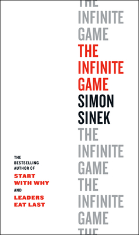

+++
title = "無限賽局 The Infinite Game：無限之戰"
date = "2021-06-16"

[taxonomies]
categories = ["閱讀筆記"]
tags = []

[extra]
rating = 4
image = "the-infinite-game.jpg"
+++

# 書籍

# 前言

在 Together Is Better 語錄書才真正第一次遇到 Simon Sinek，之後就想著什麼時候一定要來讀一下他的書。這次直接挑了他的比較新的著作來看——無限賽局。

# 摘錄觀點

## 「有限」與「無限」

貫穿全書就是「有限」跟「無限」的差別。有限賽局其實在生活中相當常見，一場比賽、一個賭注、今年的 KPI。有限的好處在於簡單、明確，有既定的規則、限制的時程、明確的評分機制，我們可以在這樣的限制之下找出屬於我們的必勝法。

而人生是否也是場有限的賽局？每個人的生命都有其限度，而社會階級、甚至公司職稱都在評斷著我們，我們也汲汲營營地在打人生這場戰役。你是否還在生涯規劃裡？你是否落後了？你是否不夠努力？

## 「信念」帶你邁向無限

而「無限」與「有限」的差別在於「信念」。信念改寫了規則，甚至不定義規則。你與對手間的關係，並不只是你死我活的勝負決，你們的競爭關係或許一起把餅做大，甚至你們擁有不同的勝利條件。而競爭關係，變成進步的最佳催化劑。勝負不再是賽局唯一的重點，而重點在於成長，在於你又將你的信念往前推進了多少。

而人類的有限生命似乎也從信念裡得到了延長。

## 「領導」才能走得更遠

> To go fast, go alone. To go far, go together.

Simon Sinek 身為一個領袖思想家，還是在本書裡帶了很多領導的概念，畢竟要推動更大的信念，你就需要有更多的夥伴。要維持信念，你需要有持有願景的願景長，你需要有執行任務的士兵，你需要有資源，你需要建立充滿信任的團隊關係。

像僧人心態裡提到的，找尋與你志同道合的人，每個人會以最適合自己的方式，實行自己的法，帶給宇宙服務，共同前往理想，那或許就是最棒的樣子。

