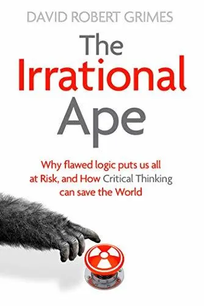

+++
title = "《反智 The Irrational Ape》閱讀筆記：打擊假訊息從你我開始"
date = 2024-07-04

[taxonomies]
categories = ["閱讀筆記"]
tags = []

[extra]
rating = 9
image = "belief-tree.webp"
+++

一二三言以蔽之
=======

理解人類機制的弱點，用批判性思考補強思考的完整性，抱持開放的心態用現實的證據改正認知。

書籍
==

為什麼我會讀這本書
=========

在閱讀《[思考整理學](@/reading-notes/thinking-organization/index.md)》時，覺得如果要讓思考更清晰且明確，就要更熟知批判性思考的方法與邏輯。而反智英文書名的副標題——Why Flawed Logic Puts us all at Risk and How Critical Thinking Can Save the World——大大滿足我想探索批判性思考的心情。

摘錄觀點
====

本篇我打算以《[快思慢想（Thinking, Fast and Slow）](https://www.goodreads.com/book/show/11468377-thinking-fast-and-slow)》作者 Daniel Kahneman 所提出人類的大腦有快思（System 1）和慢想（System 2）兩種系統來當作基礎架構。快思讓我們能本能性地對面前的處境快速應對、做出反應，在危急時刻是不可或缺的能力；慢想則是能做出有意識的思考、反省和邏輯推論。這樣的雙軌機制讓我們既能快速應對即時性的風險，也能做長遠的規劃與思考。

謊言操弄了你的快思系統
-----------

快思系統除了快速反應的優點外，所需要的心智資源也比較低，所以常作為人類的預設模式。而領導這個預設模式的行為則來自於我們從文化及生活中所獲取到的經驗與記憶，以[捷思法（Heuristic）](https://zh.wikipedia.org/zh-tw/%E5%90%AF%E5%8F%91%E6%B3%95)、信念或意識形態的形式，影響潛意識做出自動的選擇。

就像「[腦筋急轉彎 2（Inside Out 2）](https://www.imdb.com/title/tt22022452/)」中所出現的「信念樹」一樣，我們從經驗與情感中選取重要的記憶，逐漸建立我們對世界的認知與反應邏輯。

{{ image(path="belief-tree.webp", height=300) }}

取自電影畫面

但這樣潛意識的自動系統卻有一些可能被運用的弱點：

### 記憶不是精確的錄放機

我們在生活中偶爾會遇到和朋友對於過往的事的描述有些許不同，除了可能是記憶遺忘不完整外，我們也容易根據信念去做符合信念的細節修改。更危險的是，我們的記憶甚至會受他人影響——「[從眾效應](https://zh.wikipedia.org/zh-tw/%E5%BE%9E%E7%9C%BE%E6%95%88%E6%87%89)」就是指我們會受社會因素的影響，他人版本的記憶也會影響我們的記憶。

> 記憶的運作並不像錄影裝置，你只要錄下事件，以後就可以回顧。記憶其實更接近維基百科，你可以上去改動它──但是別人也可以。
>
> ——美國心理學家 Elizabeth Loftus

### 易得性偏誤（Availability Bias）

人類對於事物的判斷容易受到易得性的影響，所謂的易得性，就是這件事情我們容不容易從記憶去提取，會間接影響我們在潛意識判斷一件事發生的可能性或重要程度。

有一些因素會造成一個事件更容易提取而提高易得性，造成更嚴重的偏誤：

-   最近發生

-   引發情感

-   簡單

-   有故事性

-   重複出現

在網路資訊快速流通的現代，帶有陰謀論的論述或是操作議題的假訊息就會利用這種易得性偏誤的漏洞，神不知鬼不覺地寫入我們的潛意識中。

書中舉出[俄羅斯消防水喉（Firehose of Falsehood）](https://en.wikipedia.org/wiki/Firehose_of_falsehood)的例子，俄羅斯透過多種管道（如新聞和社交媒體），快速、重複且持續性地播放大量訊息。一則消息可能不容易改變我們的想法，但若同一則消息來自多種管道可能就會使我們建立不正確的「印象」。其內容和邏輯是否有一致性並不重要，而訊息被踢爆造假、被查核也沒關係，只要能在社會中種下紛爭的種子，就已經達到效果。

再加上社群平台分眾化行銷的精準投放和利用 AI 生成真假難辨的影像，若不及時培養思辨能力，我們恐將陷入被資訊操縱的急流之中。

用慢想系統真的能解決所有的問題嗎？
-----------------

為了避免針對快思系統的攻擊，我們傾向用慢想系統分析資訊，納入更多的證據、數據與邏輯思考，做出更高品質的決策。

在邏輯方面，我們常會使用[演繹法（Deduction）](https://zh.wikipedia.org/zh-tw/%E6%BC%94%E7%BB%8E%E6%8E%A8%E7%90%86)來做推論，當中最有名的就是三段論，由一個大前提（普遍原則）加小前提（特殊事例），進而推導出結論。

> 範例：
>
> 大前提：人皆不免一死。
>
> 小前提：蘇格拉底是一個人。
>
> 結論：蘇格拉底不免一死。

從正面舉例看來，這樣的推論很直覺也很簡單。但若帶入有謬誤的例子相對來講就沒有這麼容易辨識。其中。謬誤分為[形式謬誤（Formal Fallacy）](#formal-fallacy)和[非形式謬誤（Informal Fallacy）](#informal-fallacy)。

### 形式謬誤{#formal-fallacy}

指的是在**邏輯推論**上有錯誤。最常運用到的邏輯規則就是國高中數學教的命題邏輯——「*若 p 則 q，非 q 則非 p*」，也就是「若一個命題為真時，其逆否命題也會為真」。而形式謬誤就出現在這命題邏輯的例外之處。

#### 逆命題錯誤（Converse Error）

誤用上述邏輯成「*若 p 則 q，q 則 p*」，很常被用於陰謀論或是貼標籤的論述上。

> 陰謀論範例：
>
> 大前提：如果有隱情被揭穿，官方必然會嚴正駁斥。
>
> 小前提：官方駁斥了我們的主張。
>
> 結論：必定有隱情被我們揭穿了。

> 貼標籤範例：
>
> 大前提：如果是此陣營的側翼，就會對這件事表達這個立場。
>
> 小前提：這個人的論述顯示這個立場。
>
> 結論：這個人就是側翼。

#### 中詞不周延謬誤（Fallacy of the Undistributed Middle）

用分布不明確的中詞，造成以偏概全的結果。其中「中詞」代表「有出現在兩個前提，但沒有出現在結論的名詞」。

> 範例：
>
> 大前提：所有通訊用的射頻都屬於電磁輻射。
>
> 小前提：某些電磁輻射會導致癌症。
>
> 結論：通訊用的射頻會導致癌症。

#### 肯定選言謬誤（Fallacy of Affirming a Disjunct）

假設了有兩種無法同時為真的情況，但實際上並沒有宣稱的互斥存在。在政治人物的攻防上容易透過這種方式藉由貶低他人來增加自己的正確性，但事實上沒有相依性，有可能兩個人都是錯的。

> 範例：
>
> 大前提：要不是你錯，就是我錯。
>
> 小前提：而你錯了。
>
> 結論：因此，我就是對的。

### 非形式謬誤 {#informal-fallacy}

相較於形式謬誤的邏輯錯誤，非形式錯誤則是在前提或使用的語境上有問題。書中有十種以上的非形式謬誤，以下我挑出比較有感的謬誤。

#### 單因謬誤（Fallacy of the Single Cause）

將複雜的事實過度簡化。常見的用法有「找戰犯」和創造「假兩難」。

「**找戰犯**」指的是把事件的結果過於簡單總結於單一原因。

「**假兩難**」只是將複雜的現實簡化成極端的二分法，強迫選邊站。

#### 因果謬誤（Causal Fallacy）

把兩件因巧合發生或有相關性的事論證為有因果關係。明顯的例子如用統計數據會發現冰淇淋的銷售量跟泳池溺水的案件成正比，將此與天氣炎熱相關性推論為因果關係的「吃冰淇淋導致溺水」。

#### 乞題謬誤（Begging the Question Fallacy）

將待證明的結論偷渡到前提之中，硬推得想要的結論。

> 範例：
>
> 大前提：墮胎是謀殺。
>
> 小前提：謀殺是不合法的。
>
> 結論：墮胎是不合法的。

非形式謬誤的樣式多元，一不注意就會被鑽入漏洞置入前提，所以除了論證邏輯外，前提的正確與否也是必須小心驗證的部分。

### 數據思考的謬誤

除了邏輯外，利用真實的數字做量化也能讓我們更認清事實。其中包含[機率思考（Probabilistic Thinking）](@/wisdom/mental-models/probabilistic-thinking/index.md)與統計學，但我們也必須提防其中可能出現的謬誤。

#### 機率思考

除了要納入[貝氏定理（Bayes' Theorem）](@/wisdom/mental-models/probabilistic-thinking/index.md#bayes-theorem)中已知事實機率的考量之外，隨機事件的機率運算也常發生錯誤，最常見的是賭徒謬誤（Gambler's Fallacy）與梅德法則（Meadow's Law）。

**賭徒謬誤**指的是人類擅長從世界中找到規律，但在很多賭博性遊戲每次的結果都是獨立事件。但賭徒會嘗試從中歸納出模式，對於隨機事件發生的機率做出錯誤的評估。

**梅德法則**則來自於梅德爵士的名言「一個嬰兒猝死是悲劇，兩個嬰兒猝死是可疑，三個嬰兒猝死就是謀殺，除非能證明無罪。」把有相依關係的家族遺傳疾病導致嬰兒猝死當作隨機事件來計算，做出家中若有三個嬰兒猝死的機率不可能發生所以是謀殺的錯誤推斷。

#### 統計學

統計若用在執行良好的實驗上，能穿透雜訊，判斷實驗組和對照組之前是否有差距。

其中最為人所知的方法是統計顯著性（Statistical Significance），利用計算出統計數據中的 p-value 來判斷是否有統計顯著性，而不像是隨機結果。

統計顯著性可以當作實驗的驗證工具，但如果誤用統計顯著性來當做宣傳的工具，就大錯特錯了。第一，統計顯著性只能當作「有關聯性」，而不代表效果強度；第二，有些實驗會以採櫻桃（Cherry Picking）的方式胡亂嘗試，挑選有統計顯著性的結果來發表其發現。

> 只要把數據折磨得夠久，它終究是會認罪的。
>
> ——英國著名經濟學家 Ronald Coase

除了上述指出在「慢想系統」中可能會發生的錯誤，在實際生活中還有更多的變形。所以即便我們刻意慢下來思考，也還是很有可能會做出錯誤的判斷。除了針對最常出現的錯誤時常做辨識練習外，我們也可以用檢查清單來輔助。

從書中節錄下來的「[分析性思考提問清單](@/wisdom/lists/analytical-thinking-checklist.md)」提供了可以從各方面去檢視的問題錦囊。當在生活中遇到重要或有爭議、有矛盾的說法，可以從這個問題清單出發。有想到其他能幫助自己思考的問題時，也能持續更新這個清單。

額外還有什麼可以努力的事嗎？
--------------

除了自發性的學習及運用批判性思考做資訊的判讀外，身在高度連結的社會，錯誤資訊的傳播強度，加上演算法滿足了人類避免認知失調而趨向[確認偏誤（Confirmation Bias）](https://zh.wikipedia.org/zh-tw/%E7%A2%BA%E8%AA%8D%E5%81%8F%E8%AA%A4)的傾向，會使得群體逐漸分化，各自處在同溫層裡，接收與自己信念或意識形態相符的資訊，增加極端化團體出現的風險。唯把能辨識真偽、客觀看待事實的中間族群擴大，我們才能擁有更健康與共榮的社會。

如果行有餘力的話還可以做以下的這些事情：

#### 教導、提供工具

讓更多人有批判性思考的能力，讓更多人能站在事實面上討論，減少偏向意識形態的相互攻訐。加入更多元族群的討論，讓社會的與論更完整與健康。

#### 讓資訊更透明

很多不必要的爭吵其實來自於資訊落差，而且過多的紛擾也會讓人遠離，變得冷漠。讓更多的資訊公開可取得、讓更多人可以參與，不管是找尋更好的資料呈現方式或讓更多人可以使用資訊，有更透明的資訊才有更好的利基點促進有意義的討論。

#### 平衡聲量

在[《衛報》針對網站評論的分析](https://scholarlykitchen.sspnet.org/2013/01/04/the-guardian-reveals-an-important-truth-about-article-comments/)中提到，「在七千萬讀者當中，最多只有 0.7％ 的讀者會留言評論。每個月六十萬則留言當中，有 17％ 是每月至少留言四千則的人貼上的，只占《衛報》讀者人數的 0.0037％。」如同大部分的社群網站，網路的聲量來自於少數的人群，且論述的聲量也不代表正確性。

要想辦法讓關乎事實的討論聲量提高，可以試著為自己所在意的事情發聲、也可以檢舉錯誤資訊讓平台減少曝光或是貢獻類似 [Community Notes](https://help.x.com/en/using-x/community-notes) 或是[事實查核](https://cofacts.tw/)。認同書中作者所說：「我們不需要翻轉整個世界，只需要把話題轉向證據和理由即可。」

讀後感
===

在談論到「自由」時，我們直覺會想到「得到更多，多到可以不用煩惱」，像是「財富自由」，或是曾經讀到的「[肌力自由](@/reading-notes/strength-training-for-older-adults/index.md)」。但另外一個方向是有不被侵犯的權利，例如言論自由、人身自由，「不被操弄的自由」應該也算在這個類別。但法律和國家沒有辦法保護我們不被欺騙，我們只能藉由訓練心智強度，認識人類的傾向與弱點保護自己與他人，要保持開放心態接受與我們想像不同但真實存在的事實，要誠實面對自己的無知和尋求改善。

> 人類真正的問題出在：我們具有「舊石器時代的情緒；中古時代的習俗；以及上帝般的科技。」
>
> ——社會生物學之父 Edward O. Wilson
