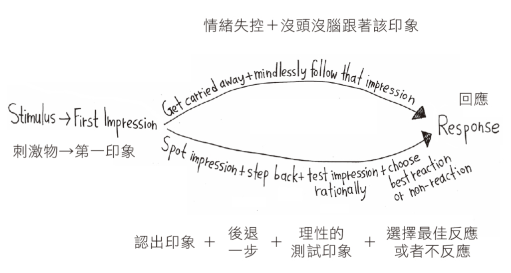

+++
title = "斯多葛生活哲學 55 個練習 The Little Book Of Stoicism – 幸福之路"
date = "2023-03-24"

[taxonomies]
categories = ["閱讀筆記"]
tags = ["哲學"]

[extra]
rating = 4.5
image = "the-little-book-of-stoicism-timeless-wisdom-to-gain-resilience-confidence-and-calmness.webp"
+++

# 一二三言以蔽之
哲學是探究如何生活、如何找尋人生的課題。我們可以從來自古希臘的古老智慧——斯多葛主義——來學習如何在現代的生活中生存。

# 書籍

# 為什麼我會讀這本書

在之前看過的許多書籍和網路文章中，經常提及斯多葛主義（Stoicism），但我卻一直沒有深入了解其細節。雖然知道最好的方法應該是去閱讀斯多葛主義哲學家們的著作，但還是先選擇這本整理過後的內容當作入門磚。

<!---
TODO: Add Link
-->

看到提及斯多葛主義的書及內容摘錄：
* 僧人心態 Think Like a Monk - 以價值觀驅動你的人生摘錄斯多葛哲學家 Seneca 對於恐懼的看法，「我們的恐懼遠多於實際的危險，我們在想像中受的苦，也多於現實生活的苦。」
* 反脆弱 Antifragile – 凡殺不死我的必使我更強大提及現代的斯多葛主義可以將恐懼化為謹慎、痛苦化為資訊、錯誤化為啟示、渴望化為行動。斯多葛主義能幫助我們調適情緒。

# 摘錄觀點

## 什麼是斯多葛主義？

斯多葛主義是起源於古希臘，而蓬勃於古羅馬時期的哲學流派。強調將哲學運用在生活中的重要性。較專注於個人，藉由個人對美德的修煉與對於事物客觀的應對來達到人生的幸福以及穩定的情緒復原力。

## 斯多葛幸福三角：達到幸福的方法

### Live with Arete：展現出最高自我，堅持把事情做到最好。

不管是自己的行為、或是與他人的互動，通常我們都有一個想像自己的能做到最好的樣子，也就是最理想的自己。斯多葛主義鼓勵我們時時刻刻去追逐最理想的自己，展現自己的美德與價值觀。

這也意味著我們要更有意識的覺察自己的情緒，選擇自己的行動。世界上有許多和你擁有不同價值觀的人，當你越確認自己的價值觀，也能更堅定自己的行為，而不需要迎合他人對你的期待來行事。世界不是非黑即白，即使你做了你覺得 100% 正確的事都有可能影響他人的利益，我們沒辦法照顧所有人的利益，只能盡量懷著好的意圖去行動。

提供斯多葛定義的四大基本美德：

* 智慧：如何行動與思考的準則
* 正義：如何與他人互動的準則
* 勇氣：在不好的環境下堅持正確的行為
* 自律：在不好的自身狀態下堅持正確的行為

### Focus on What You Control：掌控可以掌控的，接受其餘的事。

> 神啊，賜予我寧靜，去接受我無法改變的；賜予我勇氣，去改變我能改變的；賜予我智慧，去分辨兩者之間的差異。
>
> ---— 寧靜禱文

世界是無常且變化多端的，若我們的喜悅綁在外在的事物上，難以得到理想的寧靜。斯多葛主義認為真正在我們掌控之中的事，只有我們對於事物的判斷，還有我們決定如何回應它們。事物會怎麼發展、結果是否如我們所願常常在我們的掌控之外。我們應該要聚焦在過程，而不是結果。

接受不代表我們是消極以對，而是對於已發生的事實了解自己已經改變不了，因此最佳的選擇就是接受它，然後出於這份接納，調整對應方式、盡力而為。

### Take Responsibility：對自己的行為與選擇負責。

> Between stimulus and response there is a space. In that space is our power to choose our response. In our response lies our growth and our freedom.
>
> -- Viktor Emil Frankl

在清楚自己想達成的美德與能辨識出我們能控制的事物之後，如何做出反應就完全在我們的自由的選擇之下。每個選擇的行為都如同我們對自己的價值觀投了一票。

時常反思並改善自己的行為，打破自己不良的預設行為模式，讓自己更接近理想的自我，從而達到幸福。

## 斯多葛的錦囊妙計

本書提供了斯多葛主義的 55 個心法，讓我們在生活中可以加以運用。其中最說服我的概念是，將價值觀用自己的語言簡單寫下後，就更有機會在需要的時候可以從腦中提取回來。某種程度應該也類似 Ray Dalio 的原則 Principles – 生活的原則。

以下列出我消化此書之後整理出的心法，不會詳述其內容，純粹當作個人的價值觀記錄與重點提醒，不過如果有想要延伸的話題也歡迎跟我聊聊。也建議自己閱讀以挑選能說服你的價值觀。

* 固定安排反思的時間
* 盡可能保有同理心
* 當個傾聽者
* 用自己的語言簡單地寫下價值觀，以便在危急時刻能從記憶中提取出使用
* 讓哲學抹去你自身的缺點，而非作為一種譴責別人過錯的手段
* 接受現況、接受無常，盡力做最好的自己
* 勿忘你中有一死 Memento mori
* 客觀看待事物，選擇要如何回應
* 盡可能維持正念
* 以多種角度看待事情，巨觀和微觀兼具
* 保持開放心態，避免掉入既定印象
* 課題分離
* 每個挑戰都是成長的機會
* Less is more
* 作最壞的打算 Premeditatio Malorum
* 刻意吃苦來擴展自己的舒適圈
* 當責來避免僥倖心態
* 投資時間在重要的事情上
* 定義自己的成功，玩自己的遊戲
* 終生學習
* 陪伴自己的情緒，而不是關閉情緒
* 堅定自己的意圖，堅持做自己覺得對的事
* 對擁有的一切心懷感恩
* 對他人寬容
* 幽默是萬靈丹
* 努力成為影響他人的小漣漪
* 解決問題才能解決焦慮
* 慎選長期相處的人
* 不要為了能見度發表廢話
* 扮演好自己想扮演的角色，拿出適當品質的服務
* 以身作則是第一要務

# 讀後感

一直覺得哲學是台灣教育中缺少很重要的一塊，加上自己年少時閱讀的很少，直到這幾年才慢慢建立自己的價值觀。選擇一個跟自己價值觀相近的學派當作起點像是走了一個捷徑。

過往會擔心自己的認知不夠正確，會猶豫輸出自己的想法，或是在寫作時做很多自我審查。在 AI 爆發的 2023 年，我突然覺得分享自己認為好的東西，展現人性，或許就是人類在未來能做出最好的事情了。
