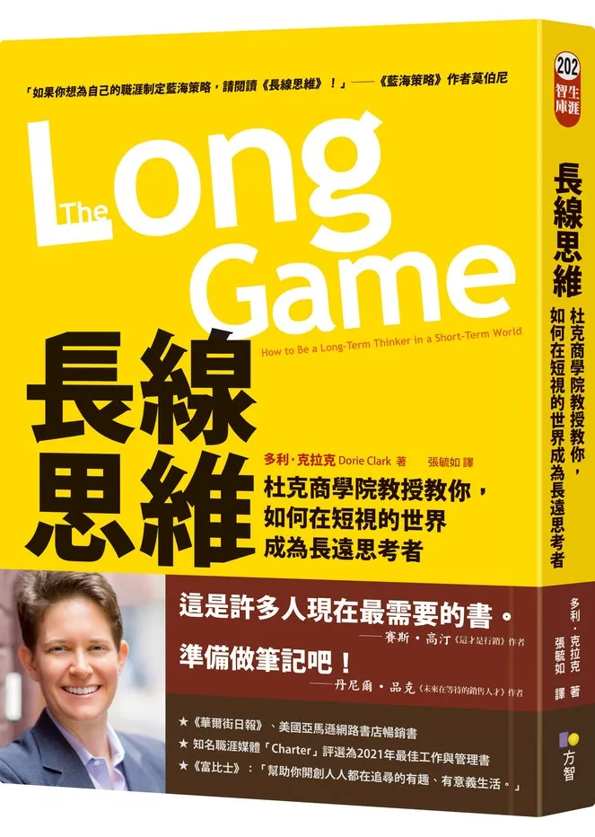

+++
title = "《長線思維 The Long Game》閱讀筆記：不要瞎忙好嗎"
date = 2022-08-24
updated = 2022-09-20

[taxonomies]
categories = ["閱讀筆記"]
tags = []

[extra]
rating = 8
image = "the-long-game.webp"
+++

# 書籍

# 前言
最近參加了學弟主辦的讀書會要閱讀長線思維這本書。想藉由這次的機會利用 Heptabase 在每週的讀書會之前，先整理心得寫短篇文章。在讀書會的過程如果有什麼有趣的收穫，也能再補一篇延伸的收穫。

希望會是個有趣而且可以堅持下去的過程。

# 觀點摘要
## Intention Is The Key
本書主要指出現代成功人士都十分忙碌，忙碌某種程度上就成為了「成功」的代名詞。但我們應該回頭檢視我們究竟為了什麼而奮戰，小心別讓「忙碌」成為了生活的麻醉劑，當作不面對其他問題的擋箭牌。

而要減少忙碌就要先釋放自己的時間，與其成為一個什麼都說 Yes 的 Yes Man，作者強調說「不」的重要性。除非是眼睛為之一亮的邀約，否則都不要答應。給自己一個選擇的空間，專注在自己的長項或是感興趣的項目上，而減少花在其他事務的時間。

## Pause To Move Faster
首先要立下正確的目標。正確的定義因人而異，必須利用覺察力看看自己對什麼事情感興趣？特別擅長做什麼事？什麼事情吸引了你的注意力和好奇心？另一方面也要檢視這些事情能不能通過時間的考驗，以去除那些因為新鮮感而進入你的眼簾的事物。

可以利用 Google 所提出的 20% Rule 應用在生活中：80% 的時間與注意力投入你已經擅長且可以取得收穫的事物，利用剩餘 20% 的時間做探索，開拓更多的可能性。**開拓新可能性最適合發生在你狀態好、生活有餘裕的時候，而不是在你脆弱而選擇較少的時候。**

## Be Aware Of Where You Are
首先要看清楚自己所處的位置，確認現在所處的位置與朝向目的的方位與距離。關鍵點是在對的時間點運用對的策略。

有時候我們在強化我們已經會的部分，想辦法最大化利益；另一些時候我們在探索新的事物，尋找新的可能。作者提供了職涯波段思考法（Career Waves）切出學習、創造、聯繫、收割四個階段，在不同時期設定正確的策略與期待。

* 學習：熟悉基本框架和想法，漸漸形成自己的觀點。不要期望在這個時期能得到報酬。
* 創造：把思想透過任何方式外化，讓別人可以發現你，讓別人知道你的觀點和貢獻。
* 聯繫：透過社群和人脈將成果放大，也能透過他人的回饋做為修正自己的參考。
* 收割：得到投資時間與精力後的報酬，享受成功，但切記收割成果是有限的，要適時投入創造下一個作品。

此外，在執行時可以覺察自己當下的狀態來選擇適合做的任務。在適合專注時做需要專注的任務以推展進度，在專注度較低或閒暇時可以做一些比較概念性、偏長期的思考。也要妥善運用手上的資源，除了金錢以外，專業和人脈也都是一種稀缺資源，要有計畫的運用來開拓更多的可能性。

## Connections
我們想到人脈時，常常會有利用別人的感覺，將其納入負面的詞彙。但我們這種想法其實只是人脈的其中一種形式——短期人脈。在短期內帶有強大目的去接觸別人，是最不好的一種人脈形式。我們在生活中時常看到伸手牌型的人，抱著「問一問無傷大雅、臉皮厚天下無敵」的心態，亂槍打鳥地得到了一些好處。短期內或許運氣好得到不錯的收穫，畢竟是個無本生意，但實際長期來看其實是販賣了自己的形象，會漸漸流失人脈。比較好的方式是培養長期人脈，甚至是無限期人脈。以對他人或一個群體的好奇心為出發點，以互信互利的方式做交流，沒有要從對方獲取利益的心態。

而後討論了短線思維的陷阱，人類都有享樂適應 Hedonic Adaptation 的現象，體驗了很快樂的事情，但快樂的維持時間總是不長，並且很快就會適應新的快樂強度，造成我們只好持續增強快樂強度或是尋求不同樣式的刺激來維持快樂。長線思維能帶來更高品質的快樂與滿足感，但需要長期投入，人們容易在前面的欺騙期卡關，因而慌張地改變策略甚至放棄目標。

那我們該如何堅持在正軌上呢？

要確認自己的核心價值觀，並選擇合適的指標來橫量自己，不要錯誤地套用別人的標準，畢竟所處的環境跟目標都不盡相同。
要當個現實主義者，抱著不切實際的期望容易讓自己陷入低潮，可以研究跟你有類似目標的人，了解他們做了什麼，花了多少時間，來幫助自己設定更符合現實的計畫。
擁有顧問或是能相互扶持的社群也很重要，在你迷失時可以以旁觀者的角度給你一些建議。

## Keep Moving Forward

最後的章節專注如何在艱困的長線上保持信念，堅持自己的步伐。在執行長線思維時，常常要開發新的可能性、充滿不確定性與挑戰。最關鍵的一步就是開始執行，萬事起頭難，我們要盡可能降低摩擦力。將想做的事情拆分至足夠小塊可執行的部分，並在行事曆押上日期以便我們能週期性地回顧進度。不要害怕失敗，因為害怕失敗而裹足不前才是真正的失敗。

從著名的「先別急著吃棉花糖」實驗中，透過自制力和沈著拒絕短期誘惑的小朋友，在長期都有比較好的發展。而面對短期誘惑最好的應對方式就是「停止」，讓自己先不作為來冷卻衝動，謀定而後動。將自己的戰線拉長，等待更豐盛的結果。

> 如果你所做的一切需要在三年的時間內完成，那麼你得與很多人競爭。但如果你願意在七年內做長期投資，那麼你只會與一小部分人競爭，因為很少有公司願意這樣做。
>
> —— Jeff Bezos

# 收穫最大的部分
在生活或工作中，總會有大大小小來自於自己或來自他人的需求。作者提供了一些問題讓我們檢視需求是否值得去做。

## 對於他人提出的需求
我們該多踩一步問問他的意圖，他需要我們幫忙什麼？他預期可以得到的成果？

一方面讓我們可以更正確給予適合他的建議與幫助，一方面也可以剔除還沒想清楚的需求或轉導需求給更合適的人。

## 對於自己的檢視
可以在做決策前好好思考這些問題
* 一共要投入多少時間？
* 機會成本是什麼？
* 身體和情感成本是什麼？
* 如果不這麼做，一年後的你會感到難過嗎？

在一個投資裡面，我們往往最看重的就是投資報酬率——需要投入多少成本？可以回收多少利益？

在生活中決定要不要投資時間到一件事務上也是一樣的道理。

投入一件事務最大的成本就是時間成本和專注力成本。在時間成本上最容易被忽略的是：如果是一個需要與他人合作的事務，必須考量溝通成本與準備時間。而作者也提出身體和情感方面的成本，畢竟健康與人際關係也是人生中非常重要的課題。

而在利益的方面，要回到自己的價值觀與意圖。在所注重的事物上可以得到什麼樣的進展與好處。另外要注意的是，應該要與「如果不做這些事，我可以把時間與注意力投入到另一個事情所能得到的收穫」的機會成本相比，才能知道究竟值不值得做這個投資。

最後是把時間拉長，問問自己放棄做這件事情會不會感到難過。把時間拉長，可以沖淡短時間情緒所帶來的偏差，可以在抽離現狀遠一點的情況下再思考一次，比較容易做出對長遠來看有幫助的選擇。

## 追尋人生的意義

人生的意義，或是自己真正想做的事一直是一個大哉問。作者利用一個章節做了此議題的討論，研究一些成功人士常見的模式。

* 有興趣或感到有趣的事。
* 自願投入、多做的事情。
* 吸引注意力的事物。
* 花比較多時間在做的事。
* 價值觀。想成為什麼樣的人？做什麼事可以往這個價值觀前進。

多給自己時間回顧每天所經歷的一切，慢慢更了解自己，找尋對自己最重要的事。

## 人脈就是利用別人？

我也曾經陷入「人脈就是利用別人」的想法，剛好自己也不擅長社交，就蠻不重視人脈的這塊，覺得自立自強也能開拓自己的路。藉由認知不同形式的人脈，可以讓自己更清楚瞭解什麼樣的人對自己的人生有幫助，該用什麼樣的角度去看待不一樣的關係。

以收割時間分為

* 短期人脈：短時間內利用別人得到好處。
  * 不要認為隨便問一下沒有成本，實際上是消費自己的名聲。
  * 對於認識一年內的人，不提出關乎政治資本的請求。
* 長期人脈：內心無所求，以自己的價值觀與目標去認識人或參與社群。
  * 強調優勢策略：接近同階級的他人，有更多交換意見的機會。
  * 以自己的興趣與長期目標主動創造或接觸相關的社群。
  * 同時思考雙方的利益，互利才能創造最大的價值。
  * 建立信任是最核心的部分。
  * 不要接近不願付出的人。
* 無限期人脈：只因為對他人充滿興趣而結識。
  * 忘記自己的目標，純粹認識有趣的人。在人生的不確定性中，在不預期的時間點可能有意料外的幫助。

## 定期檢視進度

在進行長線策略時，在設定遠大的目標之餘，要記得設定定期檢查點來確認進度。透過設立檢查點，可以讓我們在無法準時完成事情時進行相對應的策略調整。
* 利用減法策略做出選擇，拒絕低價值的事物來空出更多時間。
* 研發新方法、優化流程，更有效率地完成想完成的事。

