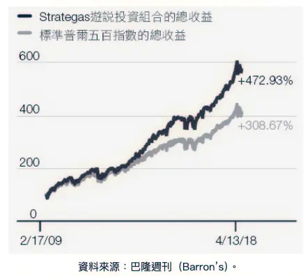

+++
title = "《競爭已死 The Myth of Capitalism》閱讀筆記：資本主義失靈的真正主因？！"
date = 2024-08-02

[taxonomies]
categories = ["閱讀筆記"]
tags = []

[extra]
rating = 6
image = "og-image.webp"
+++

# **一二三言以蔽之**

資本主義帶來豐盛的成長與進步，但伴隨而來的貧富不均與環境傷害也是不可否認的債。作者認為政府該用適當的規則，保護市場看不見的手，打破資本主義的矛盾。

# **書籍**

[{{ image(path="book.webp", height=640) }}](https://www.goodreads.com/book/show/40751646-the-myth-of-capitalism)

# **為什麼我會讀這本書**

偶爾會拿資本主義來開玩笑，例如「*你要拿回自由，不要被資本主義綁架了*」或批評某件事是資本主義的餘毒等等，但實際好像沒有那麼理解資本主義的本質。一直有想了解的心情，但動機又沒有足夠到去閱讀《國富論》的程度。忘記是誰推薦這本書，說此書對資本主義的批判很有道理，在閒暇之餘就讀了這本書補充一下知識。

# **摘錄觀點與延伸思考**

## 資本主義的起源

亞當斯密（Adam Smith）在 1776 年所著的《國富論（*The Wealth of Nations）*》堪稱是資本主義的啟蒙之作，書中強調了自由市場和看不見的手，這樣的思想後續也推動了個人自由、私有財產與市場經濟的理念。隨著十八世紀末、十九世紀初工業革命的進展，大量人口湧入城市，工廠成為主要的生產單位，資本主義經濟模式漸漸取代農業社會成為主流，其後國際貿易與金融市場的擴展，使得資本主義更加全球化。

喜歡《[人類大命運（Homo Deus）](@/reading-notes/homo-deus/index.md)》將資本主義的優點歸於其分散式的架構：個體有決策和行動的自由，而市場會用價格來協調不同人的行動。在世局變化快時，可以有很高的適應力。而市場的競爭性，激發了更多創新，造就經濟發展與成長的動能。

## 馬克思可不這麼想

在看《[奧本海默（Oppenheimer）](https://letterboxd.com/film/oppenheimer-2023/)》時，除了欣賞電影對於核爆與劇情的精湛呈現外，一直盤旋在我心頭的問題反而是「為什麼當時共產主義會在美國如此盛行？」

資本主義雖然帶來了進步，但其中隱含著剝削與不平等。若成長成為無上的目標，不受道德倫理考量的制衡，就容易衍生出一場災難。從 1929 開始十年的美國大蕭條（Great Depression）更引起人民對資本主義的不信任。

> 聰明的人轉向可以從資本主義拿到最多好處的路，而不是對文明最有貢獻的路。
>
> —— 查理蒙格（Charles Thomas Munger），《窮查理的普通常識（Poor Charlie’s Almanack）》
>

而馬克思在十九世紀就已指出資本主義存在核心的矛盾：

- **生產與消費的矛盾**：資本主義的生產方式旨在追求利潤最大化，這常常導致生產過剩或不足，從而引發經濟危機。
- **資本家與勞工的矛盾**：資本家追求利潤的動機與勞工獲得合理報酬的需求之間存在根本衝突，這導致了社會不平等和階級鬥爭的加劇。
- **技術進步與失業的矛盾**：隨著生產力的提高，資本家為了降低成本而自動化生產，這雖然提高了生產效率，但卻使得大量勞工失業，進一步加劇了社會矛盾。

## 馬克思主義的反對者怎麼說？

Thomas Piketty 在《二十一世紀資本論 Capital in the Twenty-First Century》中提到貧富不均的源頭來自於缺乏成長，當結構性成長處於低谷時，資本主義就會遭遇到非常接近馬克思所形容的矛盾。而高資本報酬率加劇資本家與勞工的經濟鴻溝，將會造成經濟崩潰或革命。他主張把高所得者的稅率提升到 80%，並開徵富人稅。

本書作者引用《金融時報》及國際貨幣基金的研究，指出 Thomas Piketty 核心結論的謬誤，實際上有高度成長，但貧富不均與資本報酬率均下降的國家。本書作者認為，雖然高稅率可以緩和症狀，但資本主義失靈的主因是缺乏競爭，使得市場在資本主義中的角色無法發揮其作用，一旦市場成為寡頭壟斷，價格機制將失靈，看不見的手也將消失於無形。

## 寡頭壟斷的有毒雞尾酒

寡頭壟斷將經濟高度集中化，成為單邊市場少數的買方或賣方，進而能帶來以下好處：

### 定價能力

作者從數據中發現，在企業合併後，往往帶來的不是更高的生產力，而是企業會因為競爭者變少而得到定價能力，透過提升價格來獲取更高的利潤。當競爭者越少時，競爭者們也更容易形成聯盟，合謀來提升價格。

> 我們的競爭對手是我們的朋友。我們的顧客是我們的敵人。
>
> —— Archer Daniels Midland（ADM）公司總裁 James Randall

這裡指的價格，可以是產品的價格，受害者是身為消費者的個人或企業；指的也可以是勞資市場中的價格，也就是薪資，而受害者就是勞工。

### 影響政治

企業資本更集中，也意謂著有更多進行遊說的預算，影響政府的政策方針，帶來極大的利益。書中用一個圖指出，將「花最多錢在遊說與影響管制機構的企業」股票納入投資組合，其績效總是能打贏大盤。

取自於書中截圖

這樣的寡頭壟斷市場，帶來了價格上漲、經濟動能流失、新創公司被抑制、生產力降低、薪資下滑、經濟不平等擴大、小社區的危害等等的負面影響。

## 秩序自由主義（Ordoliberalismus）

資本主義不代表要給予市場無限的自由，因為其中的不當經濟誘因會使得整體經濟傾斜。秩序自由主義主張，資本主義需要強而有力的政府來建立一套規則框架，以維繫自由市場妥當運作所需的秩序。如同亞當斯密在《國富論》提到的：「公民政府的設立原本是為了保障財產安全，但實際作用卻是保護富人而非窮人，或是保護那些有一點財產的人，而非一無所有者。」

作者指出政府應該更強硬地防止寡頭壟斷，進行改革，提出以下的建議：

### 改革的原則

- 資本主義無法獨立於政府和社會而存在。
- 資本主義必須支持機會均得，而非結果均等。
- 競爭是資本主義主要的關鍵元素，因為它有助於經濟權利與政治權利的普及化。
- 效率最大化並非資本主義不可或缺的作用。

### 解方與療法

#### 反寡頭壟斷

- 最簡單的經驗法則是如果產業裡的玩家數量少於六，便不應允許合併。
- 前四大廠商集中度比率超過六六％或赫氏指數（Herfindahl-Hirschman Index (HHI)）高於一千六百六十六的產業，不應允許合併。
- 地方性獨占企業應被拆解。
- 反托拉斯機構應該有更大的透明度。

#### 管制法規

- 管制法規應服務社會，而非幫獨占企業豎立進入障礙。
- 建立規則以降低轉換成本，減少顧客被鎖定在單一平台的現象。

#### 專利權與著作權

- 為了促進競爭，只能授予專利權與著作權一段限定期間，且不能展延。

#### 股東

- 員工應該配股，使勞工成為資本的擁有者。

### 個人層級可以做的事

- 消費時多考慮背後的企業。在資本主義的世界，天天都是投票日，你要用你的錢包投下神聖的一票。
- 避開網路巨擘；如果他們提供免費的服務，你的隱私和注意力就是商品。
- 積極參與政治，敦促你的民意代表及議員們復原競爭。

# **讀後感**

老實說，這本書文字不算太好讀，雖然給了很多例子與數據，但感覺都是為了扣回是減少競爭造成的問題，有時邏輯不是很通順。

身在資本主義中，的確有很多想法已經跟資本主義融為一體，比如用資本去賺資本才能更快累積資本，或是要努力創造被動收入，才能得到自由等等，但這些作法的確可能會造成更大的貧富差距。最諷刺的是，在書中讀到的寡頭壟斷有強大的定價能力和遊說預算，巴菲特（Warren Buffett）會稱之為企業的護城河（Moat），說這些企業反而是很值得投資的標的。

在資本主義主流的時代，覺得還是不能完全拋棄主流，一心朝向革命，但要支持覺得正確的改變，推動更長遠的未來。
