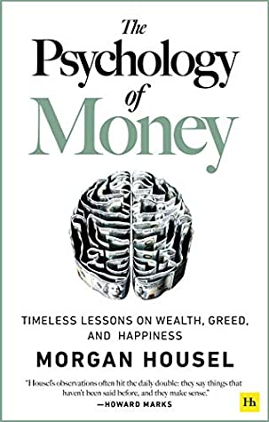

+++
title = "致富心態 The Psychology Of Money – 沒人是瘋子"
description = """
評分: 4.0/5.0

"""
date = "2021-02-10"

[taxonomies]
categories = ["閱讀筆記"]
tags = ["金錢觀", "投資"]

[extra]
rating = 4
+++

# 書籍
## 評分
4.0/5.0

# 前言
趁著這次2021線上國際書展，買了一台Mooink來閱讀中文書，因為在Kindle的中文書還真是有點稀少。而會選擇「致富心態」這本書則是因為聽了股癌在Podcast裡的推薦決定來閱讀一下。整本書還蠻好入口的，雖無太新穎的觀點，但對於大部份人的財務計畫或許會有點幫助。

# 摘要
## 沒有人是瘋子
致富心態帶給大家的第一個觀點是，「沒有人是瘋子」。常常我們會看著股市的大起大落，每次的股價交易，其實都是一次的買賣行為，代表在同一個價格，有人想要買入，有人則想要賣出。為什麼兩邊的思考會差距的這麼大呢？一定有一邊是等著被收割的韭菜，或是不理性的投資群眾？

但作者認為，在怎麼對你看起來瘋狂的行為，在當事人的立場，對他來講是一個「合理」的選擇。有可能關乎到他的價值觀、他的Mental Model、或是資訊不對等、甚至跟風。書裡面舉的一個有趣的例子是：「鮮少人根據試算表做財務決策，他們是在晚宴席間或是企業會議上敲定這些決策。那些對有個人歷史、看待世界的獨特視角、自我、自豪感、行銷話術和奇特的激勵誘因，全都錯綜交織再一起，最終就變成一則說服你的故事。」拉到今日來看，甚至可能聽了個Podcast、Clubhouse的對談就改變了決策。

## 理性？合理？
那我們是否要強迫自己去執行一個100%絕對理性的「完美計畫」呢？很多的投資書提供了我們一些算式，你應該怎麼計算安全邊際，你應該如何設立目標價與停損點。算式很完美，但在執行的是人。雖然在「理性」上，你只要持續堅持下去，越過這次的損失，後面還是有美好的報酬；但在「執行」上，若堅持的困難度過高，對心理的壓力過大，以致於無法承受，那對你或許就不是一個「合理」的計畫。

## 時間是複利的好朋友
巴菲特是傑出的投資人，但若把他的成功全都歸因於精明的投資，那重點就錯了。他成功的真正關鍵在於，他認真投資了七十五年。複利是個簡單的道理，大家都知道，但能堅持的並沒有知道的那麼多。

## 合理
這裡強調了選擇「合理」財務策略的重要性，但「合理」的財務策略可以為你帶了多少的報酬？「合理」的區間會回到你的價值觀與世界觀，所以多學習、多閱讀吧，投資自己才是穩固投資報酬率最重要的事情。