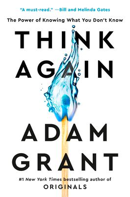
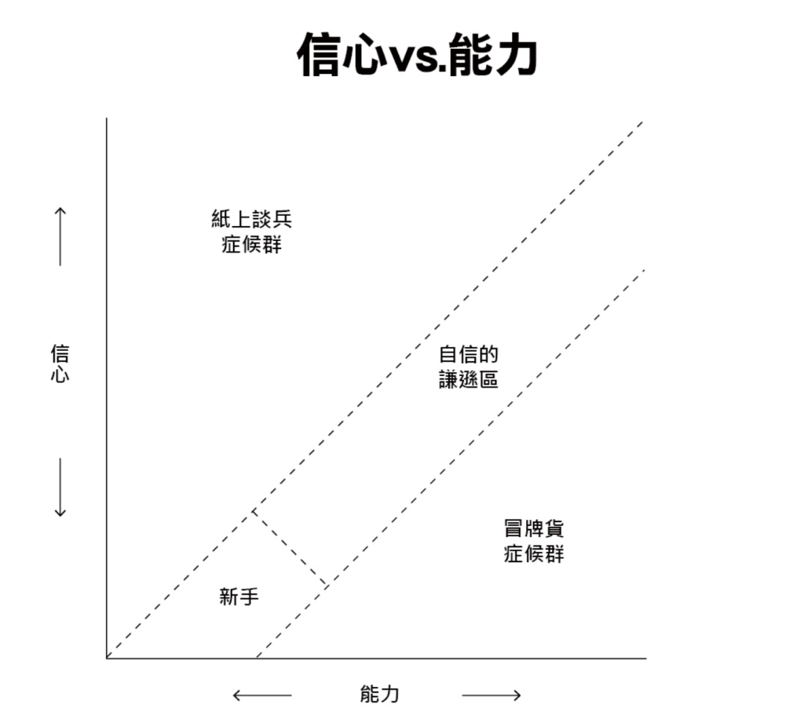

+++
title = "《逆思維 Think Again》閱讀筆記：當變化越快，你更要停下來，重新思考。"
date = 2022-11-16

[taxonomies]
categories = ["閱讀筆記"]
tags = []

[extra]
rating = 5
image = "think-again.webp"
+++

# 一二三言以蔽之

在快速變化的複雜世界中，基礎的假設有可能產生變化，資訊之間的互動方式也有可能改變，我們從生活中培養的信念隨時有可能過時而不再適用。重新思考跟思考有同等的重要性。我們必須要保留更多時間重新思考以適應這複雜的世界。

# 書籍

# 摘錄觀點

## 有毒的信念 {#poisoned-belief}

以前都覺得**信念**是很正向的詞彙，是一種能持續提供能量的心靈能量體。要成為偉大的人都得要擁有著偉大的信念。但如果信念過於極端化，成為了根深蒂固意識形態，或是被過去自己的選擇所牽制，成為無法撼動的固執，那信念就成為阻礙我們改變、成長的心魔，成為我們自己打造給自己的牢籠。強烈的信念也決定了我們可以看到什麼，而什麼會成為我們的盲點。我們會為自己打造「**信念免疫系統**」，去阻擋一切與我們信念不符的事實、邏輯、數據、與證據，最終關閉了我們的心智。

## 高效率的陷阱

現代的社會崇尚高效率，我們期待著用更少的時間得到更多的收穫。我們會利用我們的聰明，學習到事物運行的模式（Pattern），藉由判斷模式去做出最適當的回應；我們也會在組織中訂定標準作業程序（SOP），讓組織的成員們都可以遵循同一套標準做事情；甚至人體就內建了快思慢想作者 Daniel Kahneman 所提出的 System 1（本能反應），我們大部分的行為都由潛意識直接反映做出行為。這些都可以讓我們減少思考，減少能量消耗，加速處理事情的效率。但當環境改變時，我們仰賴的 Gut Feeling 反而會讓我們陷入重複的錯誤之中。

## 「重新思考」特效藥

**定期的重新思考有助於所有的「開放性系統」**，例如人生、職涯、身份認同、人際關係等等。

「開放性系統」指的是一個不斷改變的系統，環境內的事物會互相影響。

有以下兩種關鍵特性：
* 殊途同歸：有多條路徑可以通往相同的目標。
* 多目標性：相同的起點可以到達許多不同的目標。

在這樣的系統內，如果你在做了一個長期的策略打算筆直地往終點前進，有非常大的機率在過程中會因為環境的改變而受到影響，造成你無法到達原本設定的終點，或是堅持在已不再重要的目標裡。要在這樣的系統內生存，最重要的是**開放心態**。定期地去檢視我們目前所處的位置以及我們想要達成的目標是否有所改變。在這樣相互影響、快速變化的環境中，我們可以嘗試做一些符合我們價值觀的小改變，為生活帶來一些新的意義。這也讓我想到在僧人心態中提到的 Job Crafting，我們可以將我們的法（Dharma）加入我們的工作中，為工作帶來一些新的意圖。

不妨為自己設定每週、每月、每季度、或每年對自己的重新檢視，為自己設定一些關鍵問題，都會有助於我們釐清自己目前的狀態，和未來想達成的目標是否有改變，應該要採取什麼樣的策略繼續前進。

附上書中提供的一些關鍵問題的範例供大家參考：

* *你是什麼時候訂定你目前追求的志向，以及在那之後做了哪些更動？*
* *你是否在你的角色或職場達到學習高原，以及是否到了考慮轉變的時間？*

## 用對話、提問與傾聽來觸發別人的重新思考

如果行有餘力，我們也該試著讓周遭的人一起變好，不過要小心執行的方式，減少熱臉貼上冷屁股的機率。

當我們嘗試推薦或說服別人去選擇我們覺得比較好的選項時，我們可能會使用理性的傳教士或檢察官模式，以邏輯分析利弊理性輾壓；或是使用政治人物模式，訴諸濃厚情感來撼動他人的選擇。但透過這些方式都會讓人覺得失去主導權，縱使建議聽起來是有道理的，也會感覺是被迫接受別人提出的選項。

> 好的老師引進新思想，偉大的老師引進新的思考方式。

更好的方式是成為一個**引導者**，拿出同理心，先不做道德批判，專心聆聽，以提問引導他人的重新思考。甚至可以利用像是「動機式晤談」這樣的方法，以系統性的方式來引導他人作出改變、重新思考。

## 冒牌者症候群算是不錯的開局？

冒牌者症候群是「信心 < 能力」的現象，對於自己的成功無法歸因於自己的能力，而是機運使然。嚴重時會陷入自我懷疑，不敢做出決策或新行動。

在重新思考的領域，最佳的狀態稱為「**自信的謙遜**」，一方面對自己能達成目標的能力有自信，但對於目前擁有的工具保持謙遜、清楚自己的弱點、尋求改善的機會。作者利用這張圖顯示與「信心 > 能力」的紙上談兵症候群相比，冒牌者症候群更有機會達到自信的謙遜區。

擾人的不自信其實帶來了一些優點：
* 有比較高的同理心。
* 尊重並採納他人的意見。
* 知道自己不夠好，激勵自己更加努力。
* 雖然難以下定決心，但一旦決定了之後，能堅持的比較久。

# 讀後的問題

## 如何建立起異議網路？

在書裡多次談及擁有異議網路對於重新思考的重要性。**所謂的異議網路，是一群我們信任且會指出我們盲點，並協助我們克服弱點的人。他們不為了尋求他人的認同，所以可以更直接地質疑既定的做事方式，指出問題點。**

在生活或工作中，一旦建立信任感之後，都有機會建立起「支援網路」，達到互助的效果。但是要更進一步成為異議網路感覺就需要更強烈的化學反應，需要組織成員更直接、敢言，目前在工作和生活中比較少達到這樣的境界，不知道是不是在華人的世界比較難達成？

# 讀後感

我相信重新思考對於不確定且變化性高的開放性系統是有相當的必要性。我們必須要一次次地打磨我們的思維，才能擁有更高的智慧、更高的彈性來迎接各種挑戰。不過重新思考會帶來短期的低效率，我們用了對長期而言有助益的策略，但短期會因為捨棄了許多快速的捷徑而帶來低效率的結果。要在什麼樣的時機使用什麼樣的策略是值得延伸思考的議題。不過定期的重新思考是一定不會虧的一個投資。
