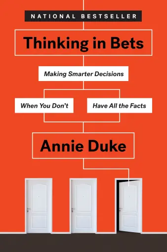

+++
title = "《高勝算決策 Thinking in Bets》閱讀筆記：要不要下注？"
date = 2023-05-17

[taxonomies]
categories = ["閱讀筆記"]
tags = ["belief", "decision-making"]

[extra]
rating = 4.0
image = "thinking-in-bets.og.webp"
+++

# 一二三言以蔽之

了解自己對世界的認知是根據信念架構而成，且世界持續不斷地在變化，我們必須常常回顧自己的信念是否依然準確。利用下注的思維審思我們做決策的過程，考慮機會成本、風險與不確定性。保持開放心態，根據執行過程與結果更新信念，別被自己錯誤的信念囚禁。

# 書籍

# 摘錄觀點

## 生活品質＝決策＋運氣

還記得前一陣子老高的[真正的人生攻略，這一期也許你會看了又看](https://youtu.be/qzIfQ5_gYzc)引起了蠻多的討論。**「只要擁有能夠把握機會的才能，而成功得靠運氣。」**

除了強調才能與成功沒有絕對的相關性外，不管在老高的影片、[志祺七七的臉書貼文](https://www.facebook.com/ChihChyiChang/posts/pfbid02J9HqDfQWmk8Uf5hmxtp4dcJ6tFwMnXYGS9rRdcesxjsMUDb1mDGq6Gpp2s4U9aCSl)、或[Vicky Ho 的【2022 年搞笑諾貝爾經濟獎】比起才能，抓緊好運才是邁向成功的關鍵？](https://vickyho.com/the-role-of-luck-in-life-success/)，都提及了關於運氣重要的話題，像是：
* 遠離不可控的風險：雖然無法完全規避，但在生活上可以透過選擇去除部分明顯的風險。
* 提高自己的辨識能力：對事物的認知更加成熟，能夠對遭遇的事物做更好的判讀與回應。
* 提高交流的機會：建立自己的品牌，分享自己的想法。除了增加機會外，也可以從他人的失敗學習，提升自己的辨識能力。

## 信念是有色眼鏡

我們靠著吸收資訊與生活中的經驗來建立我們的信念。正如之前在逆思維提到過[有毒的信念](@/reading-notes/think-again/index.md#poisoned-belief)，錯誤的信念會讓我們對世界有錯誤解讀因而做出錯誤的決策。

### 人是輕信的動物

想像中人形成信念是透過這些步驟：
1. 我們聽到了什麼。
2. 我們思考並驗證耳聞之事，確定它是真是假。
3. 形成信念。

但實際上形成信念的方式：
1. 我們聽到了什麼。
2. 我們相信那是真的。
3. 如果有空閒或意願，我們偶爾會思考並驗證耳聞之事。

人們通常沒有時間去驗證所有的資訊，實際上我們的信念部分是由未經驗證的資訊所建立。

從 [Daniel Gilbert 針對信念的實驗](https://explorable.com/understanding-and-belief)中甚至發現，一旦人們建立信念後，當被告知一個與信念相符但被標註為已知錯誤的資訊時，人們還是高程度傾向將其視為正確的消息。

再加上易得性偏誤（Availability Bias）的影響，人們會傾向把比較有印象的資訊當作事實，也就造成如今假消息猖獗的現象。

### 讓自己的信念有彈性

為了不要讓自己被困在錯誤的信念裡，最好的方式就是保持開放且追求真相的心態，用經驗和資訊不斷客觀地更新自己的信念。

最簡單的方式就是在自己的信念裡加入不確定性。信念不是非黑即白的選擇，而是一個光譜。利用「*我對這件事的信心程度是 XX％*」或是問自己「*我願意為這個信念下注嗎？*」可以退一步來檢視對自己信念的信心程度甚至是信念的來源。

## 用下注的思維來做決策

了解自己的信念帶有不確定性後，利用下注的思維做決策，可以讓我們更客觀、準確且具有開放性。每次的決策都像是下注，你會決定要投入多少資金、可能發生的狀況是什麼、有沒有替代的選項等等。

### 歸因結果也是一種下注

我們如何看待決策執行後的結果也會受信念的影響，特別會受到自利偏差（Self-serving Bias）的影響。自利偏差指的是在歸因結果的時候，人們經常把成功歸因給自己的努力或人格特質，但卻把失敗歸因於環境影響。

因此，在歸因結果時，我們要先處理自己的情緒，將成功的喜悅或失敗的沮喪充分消化後，再來解讀結果是因為決策與執行成功的技巧面，還是來自運氣面。

有兩個還不錯的技巧可以使用：
1. 思考不確定性。造成結果的原因中，有什麼是我可以掌控的，而什麼不是。
2. 把事件主角換成是其他人來嘗試跳出自利偏差。用客觀的方式看待，如果是他人做了這個決策，你會怎麼幫他歸因結果。

## 時間折價（Temporal Discounting）

最後提到的是時間折價，人會偏愛現在並犧牲未來來追求短期的利益。

先快速回顧人心智的 System 1 與 System 2。System 1 指的是快速的直覺反應，無須耗用太多心智能量的自動駕駛模式；System 2 是比較深層的思考，用於決策和長期計畫，但速度較慢且較消耗能量，不適合處理太多事情。所以最佳解就是讓 System 1 去做 System 2 的最佳意圖，符合長期的目標。

書上提了幾種方法：
* 把未來帶入當下的決策
* 尤利西斯合約（Ulysses Contract）
* 模擬未來

### 把未來帶入當下的決策

想像決策在十分鐘、十個月、十年後的後果。

### 尤利西斯合約

在當下設定有利於未來的規則。

書中提到蠻棒的方法是失言罐。列下當符合某種條件的時候，要立刻停止行為來檢視自己當下的決策與想法。有點像是在[斯多葛生活哲學 55 個練習學到的錦囊妙計方法](@/reading-notes/the-little-book-of-stoicism/index.md#mental-hints)，讓自己在心裡永遠有一些容易記憶的原則，可以時時取出警惕自己。

提供一些作者為自己設下的失言罐範例：
* 過度自信
* 任何抱怨運氣不好的話
* 放大某個經驗
* 説別人錯了

### 模擬未來

如果有長遠的大計畫要做決策，也提供幾個方法的關鍵字：
* **Scenario Planning**：模擬可能發生的情景與問題
* **Backcasting**：假設達成目標的情況下，往前推算自己成功的原因。
* **Premortem**：假設目標失敗的情況下，往前推算自己失敗的原因。

# 讀後感

作者將在德州撲克的經驗轉化成生活上的應用還蠻有趣的，透過一句「你會為你的信念下注嗎？」立刻會讓人退一步思考自己的信心程度到底高不高，是一個蠻有效的方法。我也蠻喜歡他提到失言罐的方法，如果可以成功當作一個特殊狀態的提示，可以減少很多在自動駕駛模式下不注意所產生的錯誤。

願大家都能從中獲得一些方法來調整信念、做出更好的決策，來等待好運降臨。

