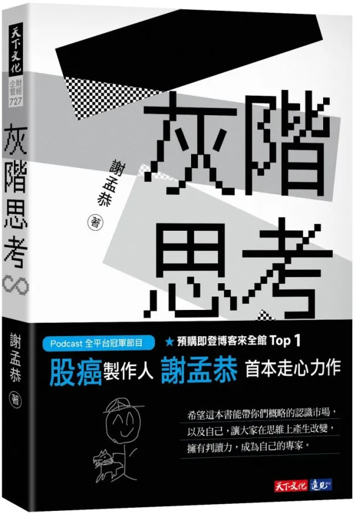
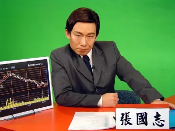

+++
title = "灰階思考 – 調配黃金比例才好喝"
date = "2022-03-30"

[taxonomies]
categories = ["閱讀筆記"]
tags = []

[extra]
rating = 4
image = "thinking-in-grayscale.webp"
+++

# 書籍

# 前言

斷斷續續都有在聽股癌的 podcast，出書的時候其實猶豫了一下沒馬上買，不過後來還是在大採購書的時候順手買了。聽 podcast 就已經知道大部分的價值觀都跟股癌蠻類似的，閱讀時果然很順暢，有蠻多蠻有趣的比喻，順順地就看完了。

# 觀點摘要
## 灰階思考

灰階思考，就是不要做非黑即白的判斷。最關鍵點就是要保有開放心態。不激進的偏向哪一邊，能夠掌握雙方面的優點。股癌用李小龍「以無法為有法，以無限為有限」的截拳道來比喻，同時放棄了傳統武學的套路也擁抱所有武學的招式。

## 正確的飲食

實務上最重要的就是要多吸收資訊，學習是下檔有限 (時間)，而上檔無限的最佳案例。但在資訊爆炸的時代，要吸收什麼樣的資訊就是最關鍵的課題。

> You’re what you eat.
>
> -- Jean-Anthelme Brillat-Savarin

想起以前看悶鍋郭子乾模仿投顧老師的名言，「好的老師帶你上天堂，不好的老師直接帶你住套房。」

取自於網路

但好的老師並不是自己說了就算，拿出對帳單，認真檢視老師的方法拿去回測，讓數據說話。如果有投資美股，也可以直接研究 13F 報告來品味大戶們的判斷。

同溫層也是一個陷阱，多吸收資訊很重要，但如果都吸收同一種看法的資料，只能叫做壯膽，要均衡飲食才健康。

要掌握自己的意圖，回歸到最初為什麼要做這件事，定期檢視每一步、每一個閱讀材料，是不是符合你的目標。

## 成功 = 樂觀 + 耐心 + 承擔風險

最後提到成功的大師都有三樣共同的特質，樂觀、耐心、承擔風險。

樂觀不是無腦的信心爆棚，而是能有正向的遠見，做好準備。有耐心地朝著目標前進，任何的偉大都不是一蹴可幾的。而承擔風險就是樂觀和有耐心的實踐，如果做一切事情都太過於小心，則一事無成。抓準可承受的風險，讓自己反脆弱，越挫越勇。

願大家都能獲得屬於自己定義的成功。

