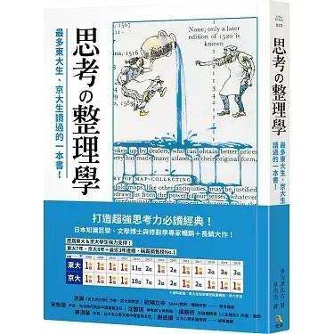
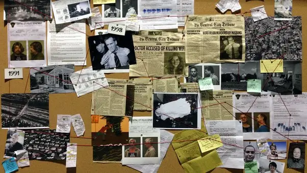
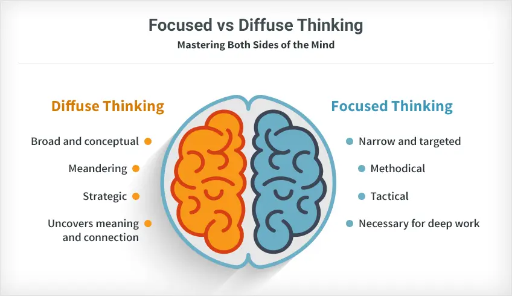

+++
title = "《思考整理學》閱讀筆記：用工具賦能思考"
date = "2023-12-15"

[taxonomies]
categories = ["閱讀筆記"]
tags = []

[extra]
rating = 3.5
image = "og-image.webp"
+++

一二三言以蔽之
=======

在學習各種知識時，除了記憶事實與理論外，更重要的是從中培養獨立思考的能力，去聯想、疊加看似不相關的知識，成為能獨立創造新價值的飛機人。

書籍
==

為什麼我會讀這本書
=========

其實忘記當時為什麼選這本書，可能想看一下日本對思考這個主題的想法，而且這本書的副標是「*最多東大生、京大生讀過的一本書！*」，或許抓住了我的眼球。

第一次順順地閱讀，好像沒有太多記憶點。不過最近重新整理閱讀筆記跟延伸思考後，好像也有一些所得。

這次摘錄觀點會混雜比較多我的思考整理。

摘錄觀點
====

不要成為滑翔翼人，成為飛機人！
---------------

這本書的初版是在 1983 年，其實是蠻有年代的一本書。書中的主軸是在提倡獨立思考的重要性，作者警告在強調「服從」的學校大眾教育下，會產生很多習慣「被教導」要做什麼的「滑翔翼人」。在有人指導且目標明確時，可以穩定地執行任務。但在需要透過創意解決問題，甚至考慮現代已經是越來越複雜的 [VUCA 時代](@/reading-notes/aesthetic-consciousness/index.md#what-is-vuca)，擁有能夠獨立飛行的「飛機」能力是更重要的事。特別在電腦與 AI 都越來越強大的現代，滑翔翼人有更高的機會被電腦取代。

不要相信你的頭腦，它不是強健的儲存系統
-------------------

在思考時，我們會考慮我們已知的一切，像是相關的事實、理論、知識...等等，檢視其中的邏輯與解決衝突，來推論出我們想要的答案。

小心！當我們試著提取腦中已知的事實時，可能會掉入[可得性偏誤（Availability Bias）](https://zh.wikipedia.org/zh-tw/%E5%8F%AF%E5%BE%97%E6%80%A7%E6%8D%B7%E6%80%9D%E6%B3%95)的陷阱。為了有效率的思考，我們會過度相信我們從腦中提取出的內容，但我們腦中會記憶什麼內容大量受到價值觀、意識形態所影響，那些我們不理解、不相信的資訊會自然地被遺忘，甚至被扭曲。

當然我們可以蒐集更多的新資訊來使思考更準確，但我們通常受限於時間等經濟因素，沒辦法花這麼大的能量來思考，但至少我們應該找回過往曾經擁有的知識來幫助判讀。因此，建立一個能夠促進你思考的筆記系統相當重要，你有了可以外化的儲存空間，就少了遺忘的風險。切記，要確保你的筆記系統支援高效率的**搜尋功能**，讓我們可以隨時安心儲存及提取內容。

第一層、第二層、第三層知識
-------------

我喜歡這本書將知識分層了以下三層：

* **第一層知識：記憶**

* **第二層知識：連結**——集結、整理同類的事實和知識，連結這些事物之間的關係

* **第三層知識：萃取**——以第二層知識為基礎，進一步轉化、萃取當中的規則與道理

### 第一層知識：記憶

當我們認知新的事實或理論，而還沒有時間對其有過多的見解時，我們會試圖將它寫入我們的記憶中。期望我們在需要這些知識的時候可以提取、背頌出來回答問題。

這樣的記憶可以做簡易問答，但若不加以整理思考，沒辦法產生更多的見解和價值。

### 第二層知識：連結

當我們累積越來越多相關的知識與事實，我們就可以進一步從事物之間的關係，產生更深的理解甚至產生新的洞見。

傳統上，我們在學習的時候都會在理論與範例中跳躍，利用更多的事實增進我們對理論的理解。當在做研究時，我們也會蒐集大量相關的資料，攤在一起做比較，找尋之間的關聯性。

近幾年的筆記軟體也紛紛提供連結筆記之間關係的功能，像是我在用的 [Roam Research](https://roamresearch.com/) 和 [Heptabase](https://heptabase.com/) 都是原生就有提供這樣的功能，平常在做筆記的時候就可以透過做連結來累積筆記間的關係，主動增加偶然力碰撞的機會。

### 第三層知識：萃取

> There is no such thing as a new idea. It is impossible. We simply take a lot of old ideas and put them into a sort of mental kaleidoscope.
>
> —— Mark Twin

擁有足夠的第二層知識後，我們甚至有機會從中去萃取第三層知識。我們可以透過書中提到的積讀法——短時間閱讀大量同領域的書籍，增加不同想法在腦袋碰撞的機會。甚至利用心智圖、白板等等思考工具輔助，讓視覺化輔助我們思考。適時的休息抽離也很重要，去放鬆或運動，讓在潛意識中執行的 Diffuse Mode 有機會做比較大範圍、偶然性的整合，就像偶爾在通勤、洗澡過程中偶然的靈光一閃。

### 活用不同層級的知識

從第一層到第三層的知識，就是一個抽象化的過程，也就是哲學化的過程。我們將具體的事實抽象成更廣泛的洞見，進行更高層級的思考。

雖然抽象化有很高的價值，但我們也要注意在溝通時切換適當的層級，我們需要將抽象的概念輔以具體的事實與故事，才能讓他人更容易理解你思考的脈絡。

以工具賦能思考
-------

在 1983 年，作者外山滋比古強調思考的重要性，不然將被擅長「滑翔翼」記憶能力的電腦給取代。

在 40 年後的今天，各種新科技都不斷改變我們的生活，保持開放心態、保留探索習慣、持續學習新知，了解新工具的能力與極限、嘗試整合進生活、改善工作流，讓自己更有餘裕去生活、去思考。

讀後感
===

電腦擅長記憶，它其實還擅長運算，甚至在 2023 它也擅長講話和畫圖了，思考是目前人類還能守住的一塊瑰寶，學習批判性思考、培養表達能力，是新時代越來越重要的技能，有了這些技能之後，你就可以透過生成式 AI 大量探索、學習無限的知識。

提到不同層級的知識，也很建議大家要建立自己的[第二大腦](@/reading-notes/building-a-second-brain/index.md)，參考 [The CODE Method](@/reading-notes/building-a-second-brain/index.md#the-code-method) 和 [The PARA Method](@/reading-notes/building-a-second-brain/index.md#the-para-method) 去建立自己工作流與筆記系統原則。

讓第一層的知識可以很安心地被儲存與被提取，讓大腦更專注在思考的工作而不用害怕遺忘。甚至可以將第二層和第三層的知識脈絡儲存在 Heptabase 的白板上，可以用來還原當時思考的脈絡，也可以作為分享的工具。

願大家都能用科技與工具賦能自己，過更好的生活！
