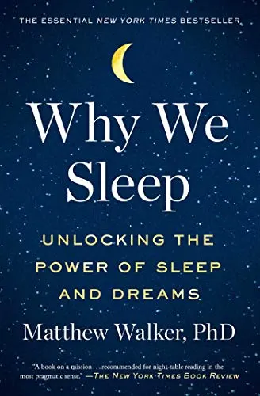

+++
title = "為什麼要睡覺 Why We Sleep – 多睡一點就對了"
date = "2021-07-29"

[taxonomies]
categories = ["閱讀筆記"]
tags = ["科學", "健康"]

[extra]
rating = 5
image = "why-we-sleep.webp"
+++

# 書籍

# 前言

會知道這本書是因為比爾蓋茲在他的 2019 冬季書單中列了這本書，也在股癌的某集 Podcast 中有提到，增加了我對這本書的印象。雖然睡覺在人生佔了一大塊時間，但好像從未認真思考睡覺的意義，這次就決定先看這本書一解睡眠的奧秘。一開始其實在 Kindle 買了原文版，雖然閱讀原文比較吃力，但內容的豐富度還是讓我維持持續閱讀好一段時間，雖然最後還是被擊敗買了中文版。

# 摘要觀點

## 「生前何必久睡，死後自會長眠。」

對蕭紅的這段文字很有印象，因為它是我高中時期隔壁班級寫在牆上的一句話，對高中的我算是蠻有重量的一句話。偶爾在努力追求什麼時，腦中也會想起這段文字。看完這本書後有一些不同的想法——**如果你想要更多的時間，或許你該多睡一點。**

## 為什麼要睡覺

從演化的角度上，睡眠狀態為生存帶來許多風險。古人為了躲避猛獸，需要在樹上或洞穴中睡眠，甚至需要點火或輪班站哨在半夜裡守護家園。若睡覺沒有其重要性，早該在長久的演化中被剔除。

在健康三要素 (睡眠、飲食、運動) 中，睡眠相較於其他兩項對身體的影響大很多。睡眠不足除了影響隔天的體力外，其實對身體還有數不盡的壞處，免疫力降低、情緒控制降低、克制力降低、不易有飽足感、血糖升高、高密度脂蛋白下降等等，而這些只是書中提及的一部分，倘若長期都處於睡眠不足的情形下，會有更嚴重的後果。

除了睡眠不足所帶來的缺點外，這本書也進一步解析了睡眠對人類帶來的益處。睡眠是由快速動眼期（REM）與非快速動眼期（NREM）所組成。

在快速動眼期，是大家比較熟悉的做夢階段，大腦會再次審視記憶、情緒和動機，在一個較安全的沙盒系統裡重演，穩定我們的情緒。也進一步在不同記憶、情緒的碰撞下，帶給我們全新的想法。相較於在洗澡的時候思考困難的問題，你下次或許可以考慮先睡一覺。

而在非快速動眼期，大腦會將短期記憶鞏固成長期記憶，一方面也清理神經元的代謝物和短暫記憶的海馬迴，為嶄新的一天做好準備。

每一輪的睡眠都包含非快速動眼期和快速動眼期，一個循環大概是 1.5 小時，而一個正常人一夜需要 5 個循環。**若你的睡眠時間少於 7.5 個小時，或許你有睡眠不足的風險。**

## 天然的尚好

作者最後也提到現今的安眠藥都沒有太顯著的效果，大多只是鎮定掌管思考的前額葉皮質。減少咖啡因及酒精的攝取，睡前遠離藍光電子產品，或許才是一夜好眠的秘訣。

# 後記

最近習慣在睡前看書，每次從這本書認知睡覺的重要性時，當晚都很容易會沒睡好，或許我該想個更好的方式跟我的大腦相處😅😅😅。
