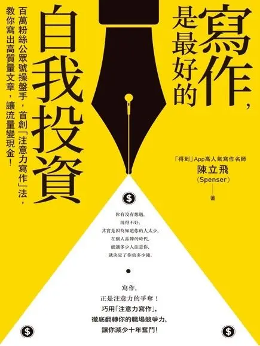

+++
title = "《寫作，是最好的自我投資》閱讀筆記：如果缺乏這些思維，你就不懂新媒體寫作"
date = 2024-07-19
description = "《寫作，是最好的自我投資》提醒新媒體寫作者應具備產品思維、用戶思維和社交思維，透過精練的標題、痛點選題和系統化的系列文創作，提升寫作質量與影響力。"

[taxonomies]
categories = [ "閱讀筆記",]
tags = [ "writing",]

[extra]
rating = 7
image = "og-image.webp"

+++

# 一二三言以蔽之
除了大量閱讀與練習寫作外，你還必須擁有產品思維、用戶思維、社交思維，才能成功經營你的新媒體，發揮綜效。

# 書籍

# 為什麼我會讀這本書

2020 創建自己的部落格，目的就是想從寫作得到更多的價值，斷斷續續將寫作筆記整理後輸出成閱讀心得文，嘗試「自然地」訓練並產生自己的行文風格，不過「是否要閱讀關於寫作的書」一直迴繞在我心弦，但又往往覺得這件事的優先順序不高而放下。

在猶豫的拉扯之下，只有在遇到寫作挫折、或找尋下一本書的閱讀空檔才閱讀這本書，這本書整整橫跨了三年的時間才讀完。不過這次藉由整理筆記又把內容好好地順過一遍，覺得還是有蠻多在寫作上很棒的思維。

期待你也能從中得到一些想法。

# 摘錄觀點與延伸思考
## 經營新媒體的思維
覺得蠻有收穫的是，書中提及你在經營新媒體（或稱自媒體、部落格）時，你該擁有以下三種思維
* [產品思維](#product-thinking)
* [用戶思維](#user-thinking)
* [社交思維](#social-thinking)

### 產品思維 {#product-thinking}
產品思維指的是，要把自己的網站當作一個產品去經營。
* 需要思考網站的定位在哪裡，你的網站和文章能**提供什麼樣的服務與價值**？
* 透過穩定地提供價值**贏得信任感**，讓讀者願意奉獻注意力。
* 透過 [試誤法（Trial and Error）](https://zh.wikipedia.org/zh-tw/%E5%B0%9D%E8%AF%95%E9%94%99%E8%AF%AF%E6%B3%95)**實驗不同內容的效果**，利用工具去搜集客觀的數據，根據數據調整策略。
* 嘗試與讀者建立更深一層的關係，**透過定期的電子報建立訂閱關係**。

### 用戶思維 {#user-thinking}
用戶思維指的是除了自我呈現外，也應該從用戶，也就是讀者的角度去觀看你的網站。
* 考慮「碎片化」的主流閱讀方式，大量不同的媒體佔據了人們可支配的時間，空一段時間靜下來閱讀成為奢侈的選項。因應碎片化，必須要**克制表達的慾望**，用精練的文字與結構敘事；要適時插入刺激點，維持讀者的注意力，**插入故事與金句是提供刺激的好方式**。
* 文章不僅是作者單方面的表達，另一方面也是**幫讀者表達他自己**，創造與讀者的關聯，產生代入感，代替讀者講出說不出口或不明顯的想法。
* 試圖觸發讀者的情感，**提供情感體驗**，能更加引出讀者的共鳴。

### 社交思維 {#social-thinking}
除了觀點的輸出外，整體網站的美感與立場也決定了讀者是否願意分享給其他人，這些都仰賴著你對細節與品質的堅持。

有了基本思維後，書中也針對新媒體寫作提供很多方法與小訣竅：
## 標題決定打開率
好的標題決定了讀者是否會點閱，書中提供了一些下標的方向：
* **觸發 [馬斯洛需求金字塔](https://zh.wikipedia.org/zh-tw/%E9%9C%80%E6%B1%82%E5%B1%82%E6%AC%A1%E7%90%86%E8%AE%BA) 底層的需求**：如 *「不會寫作的你，正在失去職場競爭力」*，能夠觸發讀者底層的生存恐懼。
* **產生共鳴**：針對普遍的痛點下標，能引起更多關注，就有更強的傳播力。
* **顛覆大眾認知**：若能用一個特別的切角下標，就能給讀者一個鉤子，試圖從文章找尋背後的原因。

但也要避免自己成為標題黨，像是大多的新聞媒體為了流量在標題做 [點擊誘餌](https://zh.wikipedia.org/zh-tw/%E6%A0%87%E9%A2%98%E5%85%9A)，別為了單篇文章的流量，損耗了網站的信譽。

## 高流量的選題：痛點與熱點
針對痛點的文章能引起共鳴，讀者期待能從你的文章中找到解方。

書中列出四種「人性中的永恆痛點」：
* 事業上的激進與保守
* 生活上的穩定與冒險
* 能力與平台的博弈
* 認知成長的前與後

前三種都屬於「兩難」的抉擇，通常都沒有完全正確的答案。每個人在生活中會遇到的問題不完全相同，但分享個人的處境與選擇的理由，讓讀者透過閱讀經歷你的體驗，能當作個人痛點解方的參考。

而熱點就是當下流行的話題，若反應時間很快，就有機會蹭到熱度，雖然不一定能給予很深刻的見解，但是是很好吸引眼球的方式，也能提供現有讀者即時的新鮮事。

## 行文的萬能框架
接著就是文章的核心寫作，要提高寫作品質，還是得依靠大量的閱讀與寫作。在尚未找到自己的風格前，作者也提供了他自己的萬能框架——「**亮觀點，說現象，做分析，下結論**」——開門見山亮出觀點，描述現象建立認同感，帶入自身的立場與情緒做分析，最後用精練、一針見血的結論總結，最好是一句金句，帶給讀者更大的收穫與啟示。

> 結尾是你把小說的主旨釘在讀者的記憶中，並讓他回想數天的最後一次機會。
>
> —— 美聯社國際寫作指導 Bruce DeSilva

## 編修文章的要點

之前在閱讀朱雷的《[入行 15 年，我還是覺得編程很難](@/wisdom/articles/15-years-in-programming/index.md)》，最有感的就是他提到寫作與寫程式的相似性，都需要大量閱讀別人的作品才能使自己的更好。在閱讀編修文章的這一段也很有感，編修文章其實就與寫程式的 [重構（Refactoring）](https://zh.wikipedia.org/zh-tw/%E4%BB%A3%E7%A0%81%E9%87%8D%E6%9E%84) 很相似，先寫出根據需求的第一版，達成目標但很醜的作品，隨著一遍遍的編修文章（重構），產生出更好的風格與結構，最終打磨成好的文章（程式碼）。

本書有提出關於 [編修文章的問題清單](@/wisdom/lists/editing-questions/index.md)，可以在編修文章時使用。

## 用「系列文」做專業寫作

還有一塊很有感的是作者提到如果定位是專業寫作，做系列文的創作能大幅提升專業感，也是一個系統化輸出專業知識的最高效途徑。

在系列文裡也要引用產品思維做整體的規劃，要考慮每篇文章的內容側重、預期在系列文達到一定數量後想達到的效果...等等。也可以帶入新創公司的思維，在一個領域中找一個較小的切點進入，降低進入門檻。

書中提到系列文可以選擇從**深度**或是**時效性**這兩個方向發展。我覺得可以從深度先著手，有了深度，一方面在熟悉領域後，閱讀前沿資訊的速度會增快；一方面也能對新資訊提供更深度的見解，在時效性上疊加價值。

在提升深度上，除了閱讀經典書籍與最新趨勢外，理論與實踐的結合能帶來更多的價值。在有些領域，當國外資訊領先國內資訊不少時，「[搬磚](https://theinitium.com/article/20170321-mainland-infosmuggler)」也能為你帶來一些優勢，最近剛好在聽《[區塊勢 EP258｜Threads 值得經營嗎？什麼是聯邦宇宙？ft. INSIDE 創辦人蕭上農](https://blocktrend.firstory.io/episodes/clyokllla0dmj011da1ck7vu4)》時，[蕭上農（Fox Hsiao）](https://x.com/pirrer) 大大也有類似的分享。

# 讀後感
過往在寫作時，我比較注重的是結構的精鍊和文章邏輯的通順度，閱讀這本書給我蠻多不同的思考方向，在未來的寫作上可以多實驗這些方法。如果沒有太拖延的話，下一步想試試系列文的寫作，把想要寫的內容做比較有系統化的規劃。
