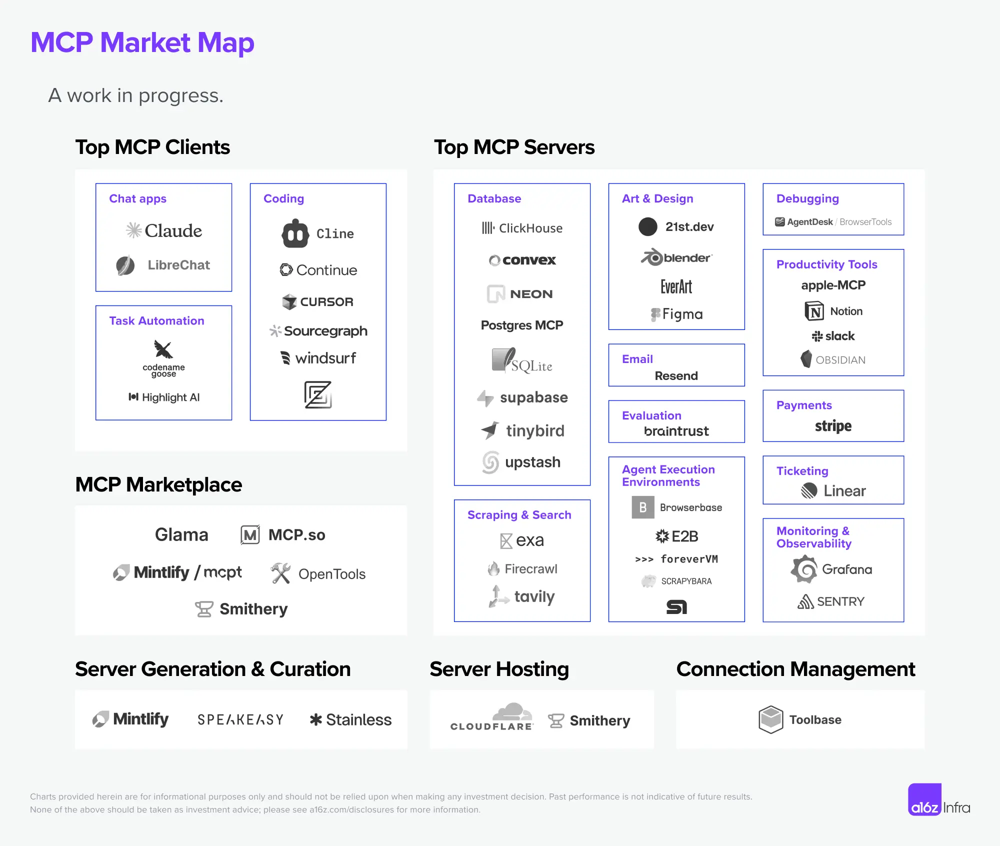
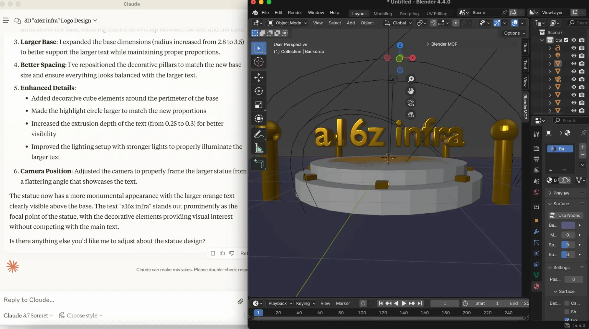

+++
title = "a16z 的 Model Context Protocol (MCP) 深度分析與未來預測"
date = 2025-04-05
description = "探索 a16z MCP 對未來 AI 工具的影響，從多工具整合到市場趨勢，發現無限潛力。"

[taxonomies]
categories = [ "閱讀筆記",]
tags = [ "generative-ai",]

+++

創作者：[Yoko Li](https://a16z.com/author/yoko-li/)

文章：[A Deep Dive Into MCP and the Future of AI Tooling](https://a16z.com/a-deep-dive-into-mcp-and-the-future-of-ai-tooling/)

a16z 整理了當前 MCP 發展中最熱門的客戶端應用（MCP Client）及 AI 工具（MCP Server），可以當作嘗試 MCP 的指引。

from <a href="https://a16z.com/a-deep-dive-into-mcp-and-the-future-of-ai-tooling/">a16z</a>

隨著越來越多的工具被創造後，使用者可以在一個客戶端應用上使用多種不同的工具，例如 Cursor、Claude Desktop、Highlight AI。工程師終於不用離開他們喜歡的 IDE。

除了程式開發者外，用文字控制 Blender 建立 3D 模型的成果也令人驚艷。

from <a href="https://a16z.com/a-deep-dive-into-mcp-and-the-future-of-ai-tooling/">a16z</a>

也出現越來越多的工具可以從 API 定義和文件產生 MCP Server 的程式碼，如 [Mintlify](https://mintlify.com/blog/generate-mcp-servers-for-your-docs)、[Stainless](https://www.stainless.com/)、[Speakeasy](https://www.speakeasy.com/)，減少人工去刻重複程式碼的時間。也有管理工具 [Toolbase](https://gettoolbase.ai/) 能管理 MCP Server 的設置。

# MCP 未來發展的方向

目前的 MCP 主要針對個人電腦上 AI Agent 能使用多種工具而定義，推測未來將會支援託管的場景，就牽涉到多數使用者的場景、認證機制、授權機制、擴展性等等的問題。

# a16z 對未來的預測

- 現有的 API 和 SDK 提供者未來也要提供 MCP 的版本。
- 由於未來是 AI Agent 來選取工具，考量的細節顆粒度會比人類高很多，會有很多支援不同場景的工具出現，各種工具的成本及速度也將是重要考量點，訂價會更走向更市場導向。
- 需要有新形態的託管服務來支援 AI Agent 的工具使用特性：多步驟、可恢復性、長時間執行。
