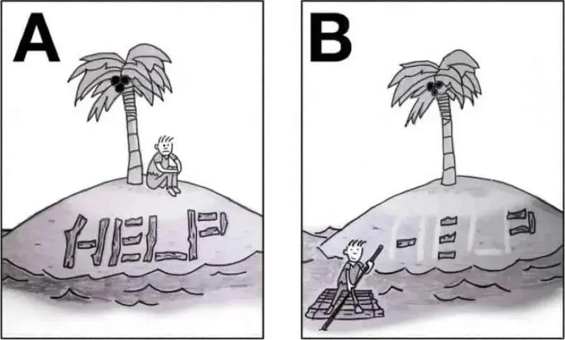

+++
title = "能動性（Agency）"
date = 2025-04-06
description = "在人工智慧時代，能動性成為稀缺資源。通過 George Mack 的指南，學習如何在短短三十分鐘內提升個人能動性，精通思考、行動和質疑，突破現狀成為自己生活的主導者。"

[taxonomies]
categories = [ "閱讀筆記",]
tags = []

[extra]
image = "agency-meme.webp"

+++

創作者：[George Mack](https://www.george-mack.com/)

文章：[High Agency In 30 Minutes](https://www.highagency.com/)

上個月讀了【[Andrej Karpathy 的 "Agency > Intelligence"](https://x.com/karpathy/status/1894099637218545984)】，提到在 AI 越來越聰明後，智能不再稀缺，稀缺的反而是能動性。

記得最早的時候，是在這個迷因圖看到 Agency 這個詞。

具有高能動力能讓我們突破現狀，成為自己生命的領航員。

今天就讀到 George Mack 的這篇 "High Agency In 30 Minutes"，花三十分鐘掌握能動性的要點。

蠻喜歡文章開頭的形容：

> 樂觀主義看待半杯水是半滿；悲觀主義是少了一半；有能動性，你本身就是水龍頭。

# 高能動性三輪車

要達到高能動性，必須要掌握以下三個技能，缺一不可：
- 清楚的思考：如果沒有，容易衝動選擇第一個想法。
- 行動偏向：如果沒有，只會成為思想的巨人，行動的侏儒。
- 抱持懷疑：如果沒有，會受限於權威的說法。

# 低能動性陷阱

低動能性是人類的預設，教育體制傾向把人培養成能服從的上班族，維持社會穩定及發展。

我們通常最容易受限於以下陷阱：

- 空泛：沒清楚定義問題，也不會有解法。
- 中庸：想聰明的解決問題，但不夠聰明能解構問題，也太聰明無法輕易行動。
- 依附：過度依附自己錯誤的假設，造成確認偏誤。
- 反覆思考：卡在想找到完美的答案而缺少行動。
- 被複雜性淹沒：不知道從何開始。

# 高能動性練習步驟

但高能動性是可以刻意練習的，以下是練習步驟：

1. 寫下對自己重要的價值
2. 寫下能實現自己價值的十種方式
3. 選擇一個，拆解成可執行的小步驟
4. 執行
5. 覺察、反思執行的感受
6. 重複練習

掌握你的生命，提升你的能動性。
