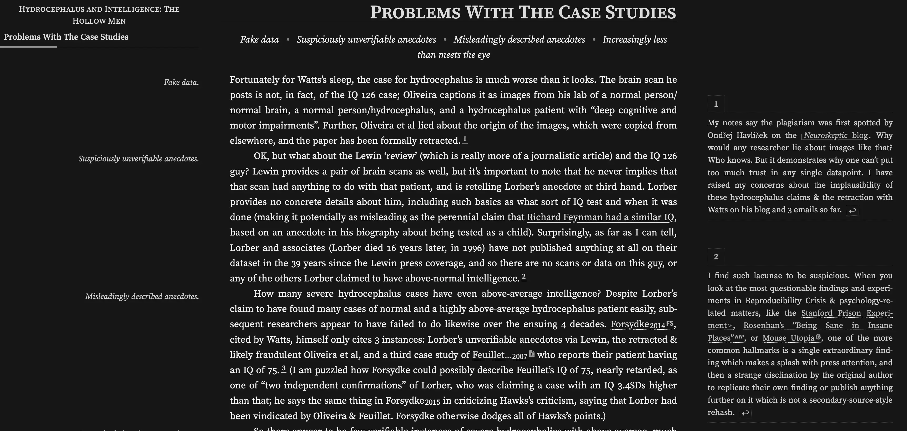
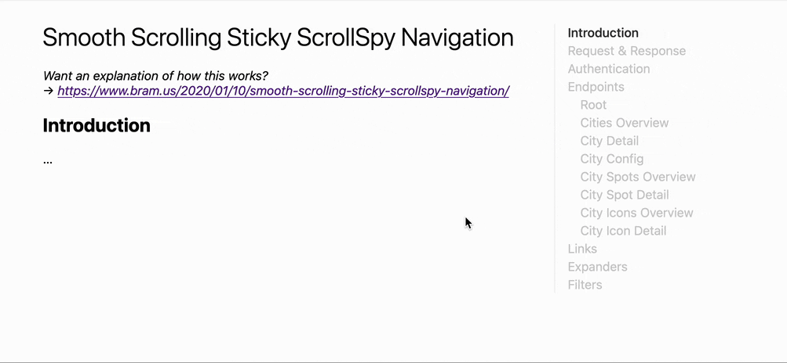
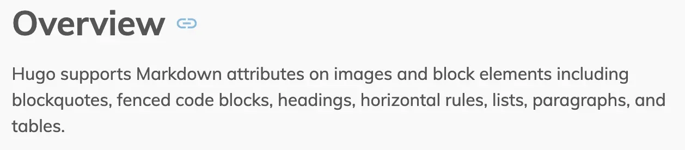
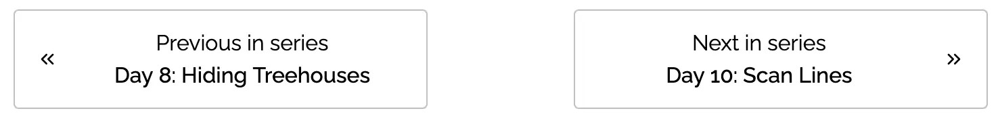
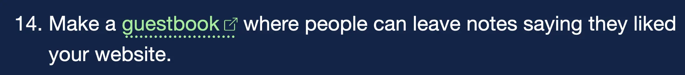

+++
title = "讓部落格更好的微特性"
date = 2024-07-17

[taxonomies]
categories = ["閱讀筆記"]
tags = ["blog"]
+++

創作者：[Daniel](https://danilafe.com/about/)

文章：[Microfeatures I Love in Blogs and Personal Websites](https://danilafe.com/blog/blog_microfeatures/)

* 用 Sidenotes 取代 Footnotes

* 能顯示閱讀進度的目錄

* 讓副標題有連結

* 讓系列文容易跳轉

* 標注對外連結

* 提供 RSS 訂閱
* 用對話圖片輔助表達
* 可溯源的程式碼片段
* 推薦其他好網站
