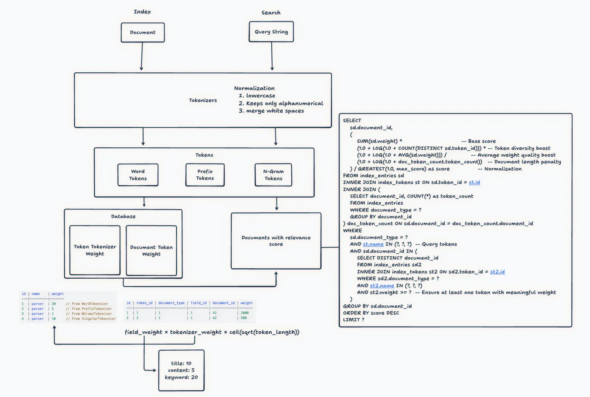

+++
title = "實作一個簡單版的搜尋引擎"
date = 2025-11-29
description = "這篇文章搭配 DB 實作一個簡單版的搜尋引擎，雖然生活應該沒機會需要寫一個搜尋引擎，但或許裡頭有些實作部分能為其他專案帶來一些想法。"

[taxonomies]
categories = [ "閱讀筆記",]
tags = [ "search-engine",]

+++

作者：[Karboosx](https://karboosx.net/)

文章：[Building a Simple Search Engine That Actually Works](https://karboosx.net/post/4eZxhBon/building-a-simple-search-engine-that-actually-works)

這篇文章搭配 DB 實作一個簡單版的搜尋引擎，雖然生活應該沒機會需要寫一個搜尋引擎，但或許裡頭有些實作部分能為其他專案帶來一些想法。

附上自己整理思考用的關係圖：

