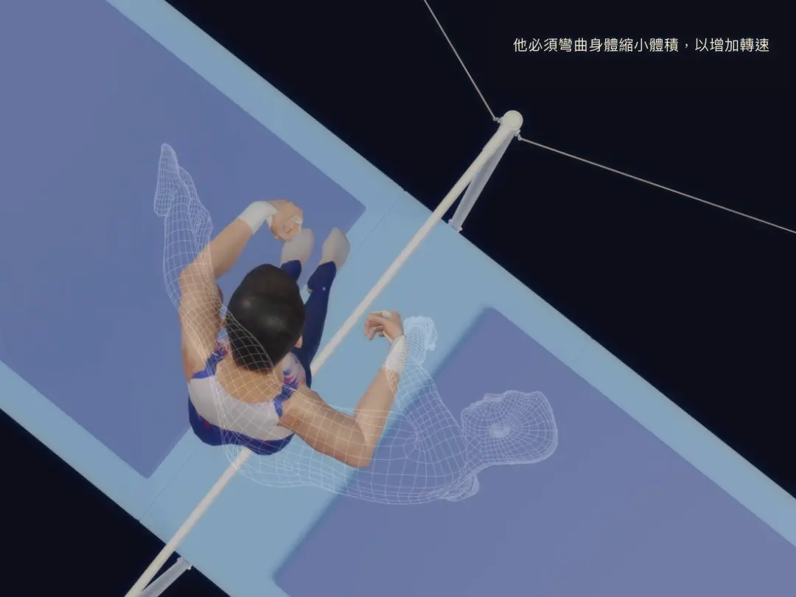
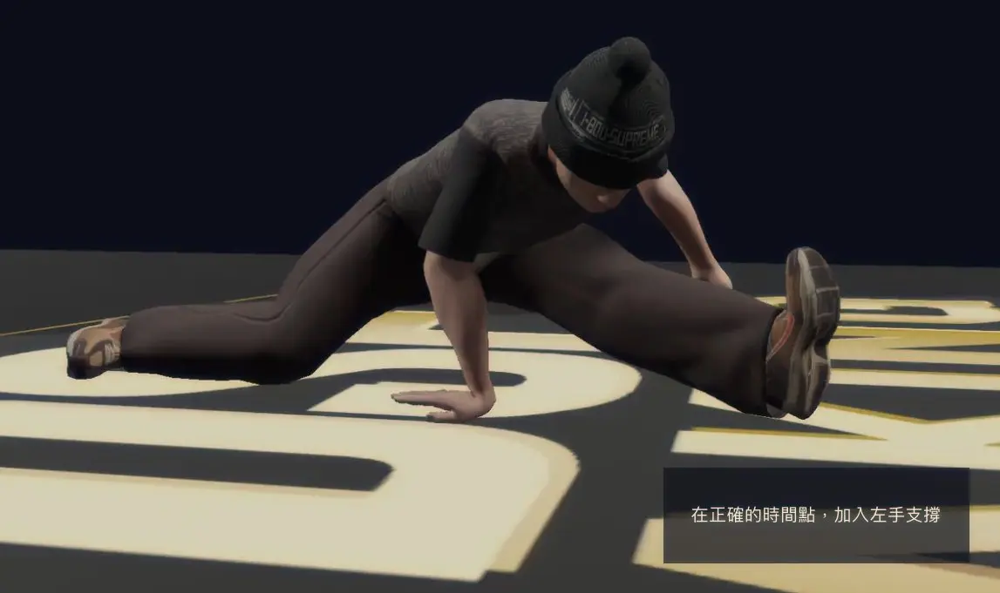

+++
title = "中央社奧運運動 3D 圖解"
date = 2024-07-29

[taxonomies]
categories = ["閱讀筆記"]
tags = []

[extra]
image = "breaking.webp"
+++

創作者：[中央社](https://www.cna.com.tw/)

文章：
* [唐嘉鴻「物理腦」團隊的奧運奪金秘策【3D 圖解】](https://www.cna.com.tw/project/20240726-horizontalbar/)
* [霹靂舞是什麼？怎麼分高下？【3D 圖解】巴黎奧運比賽新寵](https://www.cna.com.tw/project/20240726-breaking/)

中央社在巴黎奧運系列出了針對單槓和霹靂舞項目互動式的報導，透過將動作拆解、標註重點，一步步解釋選手的動作設計理念，提供四年一次的運動觀眾對專業運動表演很棒的切角與認識。

