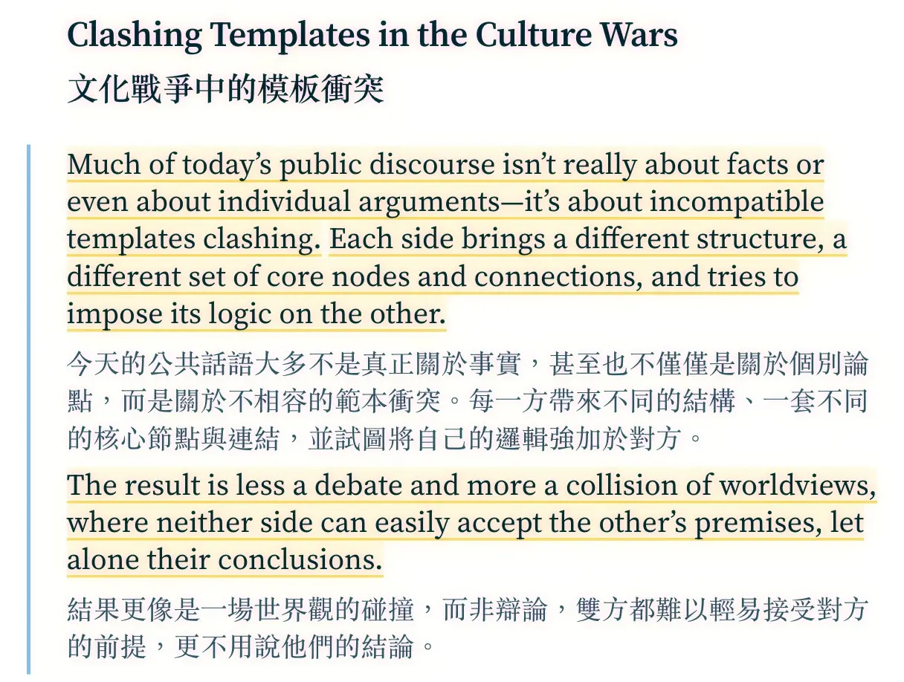
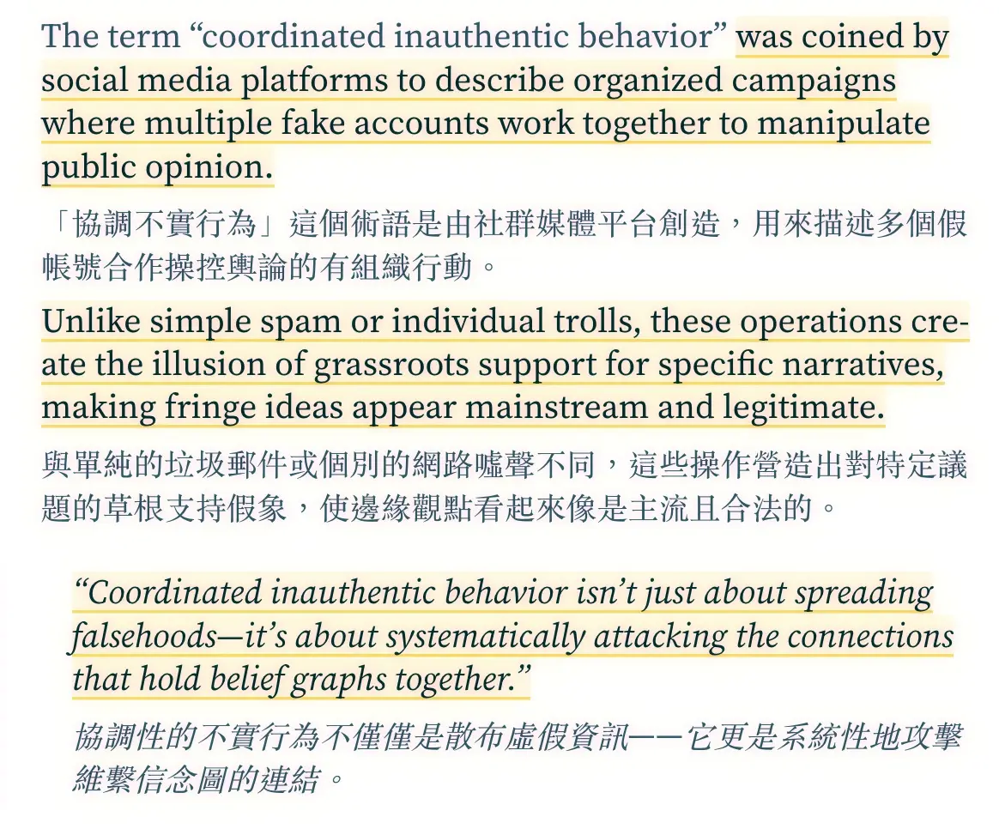
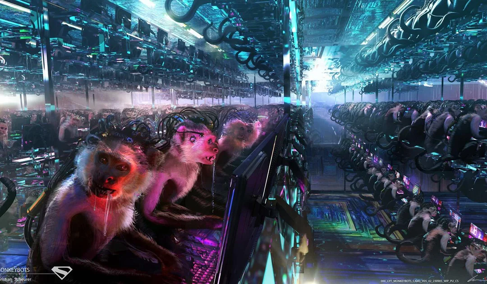
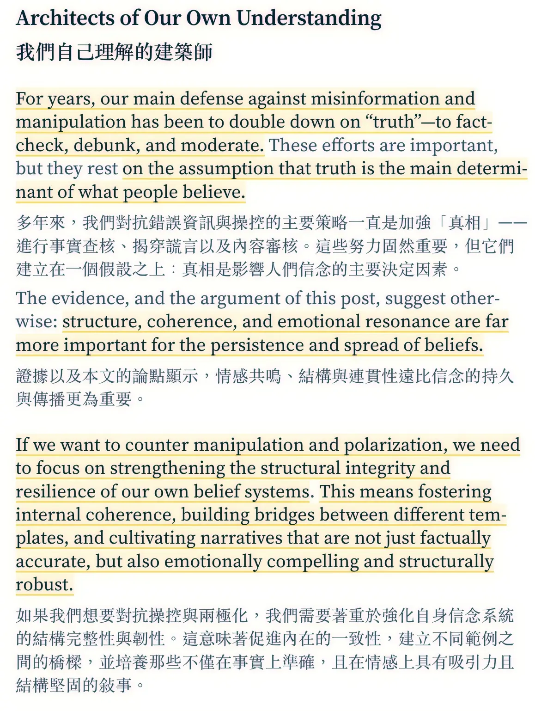

+++
title = "為何事實無法改變文化戰爭中的觀點——結構才是關鍵"
date = 2025-07-27
description = "在資訊戰爭與極化社會中，事實查核與辯駁不足以改變人們的信念。本文探討信念系統的結構性特質，以及如何透過理解「協調性不實行為」來對抗操控與極化。"

[taxonomies]
categories = [ "閱讀筆記",]
tags = []

[extra]
image = "monkeys-manipulation.webp"

+++

創作者：[Vasily](https://vasily.cc/about/)

原文：[Why Facts Don't Change Minds in the Culture Wars—Structure Does](https://vasily.cc/blog/facts-dont-change-minds/)

天啊！好喜歡這篇文章！跟最近讀的《系統思考 Thinking in Systems》和《連結 Nexus》都串起來了。

人類為了避免認知失調，會用動機性推理防禦不符合自己信念的資訊。所以擁有不同價值觀的人完全無法討論，因為不僅僅是論點的交換，而是兩個擁有不同增強迴路的信念系統彼此對抗。

文中也有探討如何針對信念系統作結構性破壞，有趣。

結構性的假訊息可以使邊緣觀點看起來主流且有正當性。

就如《超人 Superman》電影裡做盡好事的超人也擋不住網軍猴子操弄的輿論。

只用事實就想改變別人的觀點並不足夠，如何敘事、強化結構也是重要的一環。

