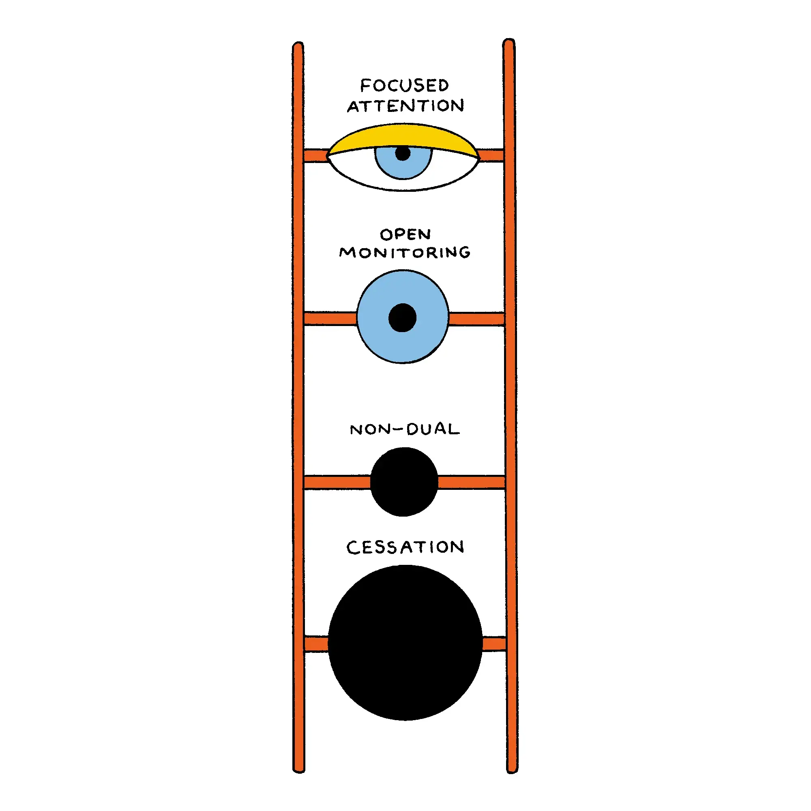

+++
title = "冥想的四個層級"
date = 2025-01-27
description = "探索冥想的四個層級：專注、開放、非二元與止息，解構你的心靈，提升感知與幸福感，打破傳統呼吸技巧的局限。"

[taxonomies]
categories = [ "閱讀筆記",]
tags = [ "meditation",]

[extra]
image = "four-layer-of-meditation.webp"

+++

創作者：[Oshan Jarow](https://www.vox.com/authors/oshan-jarow)

文章：[How Meditation Deconstructs Your Mind](https://www.vox.com/future-perfect/392634/how-meditation-works-new-science-consciousness)

這篇蠻有趣的，用科學化的方式將冥想拆成四個等級：專注式注意力（Focus Attention）、開放式監控（Open-Monitoring）、非二元（Non-Dual）、止息（Cessation）。

而大多以專注於呼吸來提升專注力或減壓的方法只停留在第一個層級，對於改變自我的效果有限。

我們若能精進每一個層級的練習，最終能解構自身從各種經驗得到的預測編碼（Predictive Coding）以重新構築，使我們更能感知世界、更加幸福。
