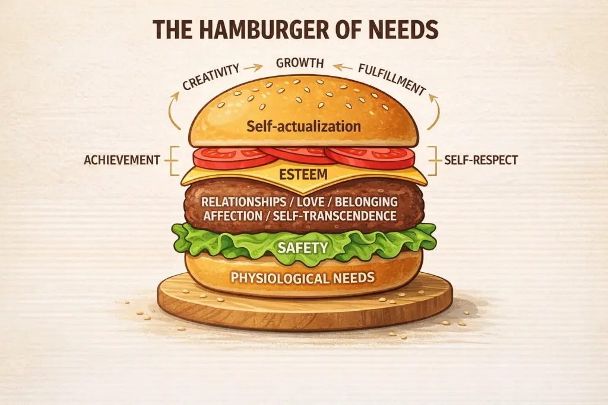

+++
title = "馬斯洛需求漢堡模型"
date = 2026-03-19
description = "與其用金字塔模型理解馬斯洛需求層次，漢堡模型更能體現自我超越的核心地位——最重要的不是個人修煉，而是與世界的關係。"

[taxonomies]
categories = [ "閱讀筆記",]
tags = [ "psychology", "self-actualization", "maslow", "self-transcendence",]

+++

創作者：[Tim Ferriss](https://tim.blog/)

文章：[The Self-Help Trap](https://tim.blog/2026/03/04/the-self-help-trap/)

Tim Ferriss 在新的一篇部落格提到當大家提到馬斯洛需求層次理論時，總是用金字塔模型，而且常常最上層是自我實現，少了馬斯洛在 1971 年補充的自我超越概念，並且從馬斯洛從頭到尾也沒有說是金字塔模型。

他覺得更好的模型是漢堡模型，中間最重要的漢堡肉是自我超越，也就是**與他人的關係**和**奉獻於超越自我的存在**。肉可以提升其他的食材的美味度，但其他的食材也很重要，不然就不是一個漢堡。

而過往用以自我實現為頂部的金字塔模型太強調在個人修煉，但更重要的是與世界的關係，不妨可以思考如何將個人修煉的方法用在增進與他人的關係或服務比自己更高的事物，而不是最後成為自我沈迷的自我吞噬蛇（SOMO）。

