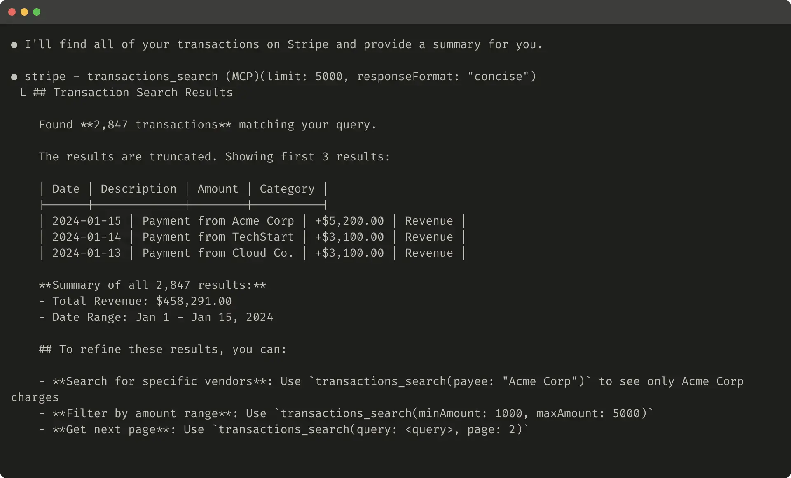
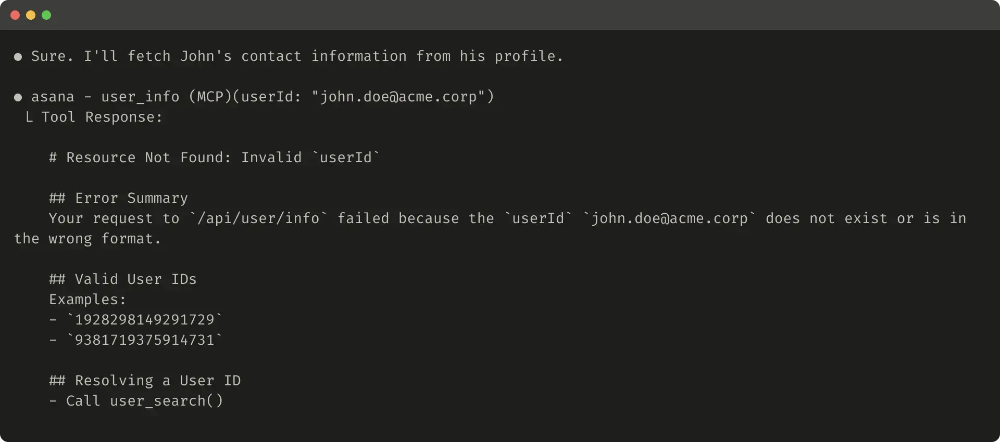

+++
title = "實作 MCP 與 API 的差異"
date = 2025-10-13
description = "探討如何為 AI agents 撰寫有效的 MCP 工具，包括與傳統 API 的差異、context window 限制，以及錯誤處理中的 prompt engineering 技巧"

[taxonomies]
categories = [ "閱讀筆記",]
tags = [ "MCP", "AI", "Agent",]

+++

創作者：[Anthropic](https://www.anthropic.com/)

文章：[Writing effective tools for agents — with agents](https://www.anthropic.com/engineering/writing-tools-for-agents)

在撰寫 MCP 與傳統 API 比較大的差異是，MCP 是提供給 non-deterministic 的 agent 使用，要更依據使用情境去撰寫工具，跟傳統實作 [CRUD](https://zh.wikipedia.org/zh-tw/%E5%A2%9E%E5%88%AA%E6%9F%A5%E6%94%B9) 的 API 長相不太一樣。

此外，agent 的 context window 相比便宜的記憶體小很多，而無用的雜訊也會影響結果的品質，所以 MCP 工具更需要注重回傳資料的品質和數量。

從 Claude 的 Writing Effective Tools for Agents 中特別學到，當工具因為回傳資料過多而需要作 truncate 或是發生錯誤時，可以在回傳內容直接作 prompt engineering 去指示 agents 可能解決的方式，這點倒是沒想過，蠻受用。

當 truncate 發生時，可以提示 agent 可能的解決方式 from <a href="https://www.anthropic.com/engineering/writing-tools-for-agents">Anthropic</a>

當 error 發生時，對 agent 沒幫助的回傳內容 from <a href="https://www.anthropic.com/engineering/writing-tools-for-agents">Anthropic</a>

當 error 發生時，可以提示 agent 可能的解決方式 from <a href="https://www.anthropic.com/engineering/writing-tools-for-agents">Anthropic</a>

