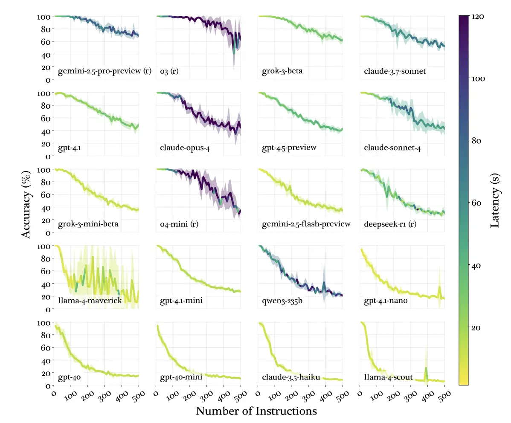

+++
title = "少即是多的 CLAUDE.MD 撰寫原則"
date = 2025-12-16
description = "探討如何撰寫有效的 CLAUDE.MD 設定檔，避免過多指令導致模型表現下降，以及如何提供漸進式的 Context。"

[taxonomies]
categories = [ "閱讀筆記",]
tags = [ "claude-code", "generative-ai",]

+++

作者：[@0xblacklight](https://x.com/0xblacklight)

文章：[Writing a Good CLAUDE.MD](https://www.humanlayer.dev/blog/writing-a-good-claude-md)

CLAUDE.MD 是很好的方式去注入專案相關資訊的方法，但是 Claude Code 為了 LLM 的回答表現考量，會在傳送內容時添加以下內容：

```
<system-reminder>
      IMPORTANT: this context may or may not be relevant to your tasks.
      You should not respond to this context unless it is highly relevant to your task.
</system-reminder>
```

也就是說，如果你的 CLAUDE.MD 包含太多針對少數情境的指令，反而會降低 Claude Code 去使用當中內容的機會，而且是整份設定都忽略，而不只是你新增的部分。


<p class="image-caption">為當指令越多時，模型的表現下降 from <a href="https://www.humanlayer.dev/blog/writing-a-good-claude-md">0xblacklight</a></p>

所以最好只在 CLAUDE.MD 放整個專案（或子資料夾）通用的指令。

一般的原則：
* 前沿的大模型約在 150~200 個指令還運行正常，但 Claude Code 本身的 System Prompt 就包含 50 個指令；模型越小，能支援的指令數量會大幅下降。
* 小於 300 行
* 可以用提供其他檔案的方式，作漸進式的 Context 提供。（類似 Claude Skills 的作法）
