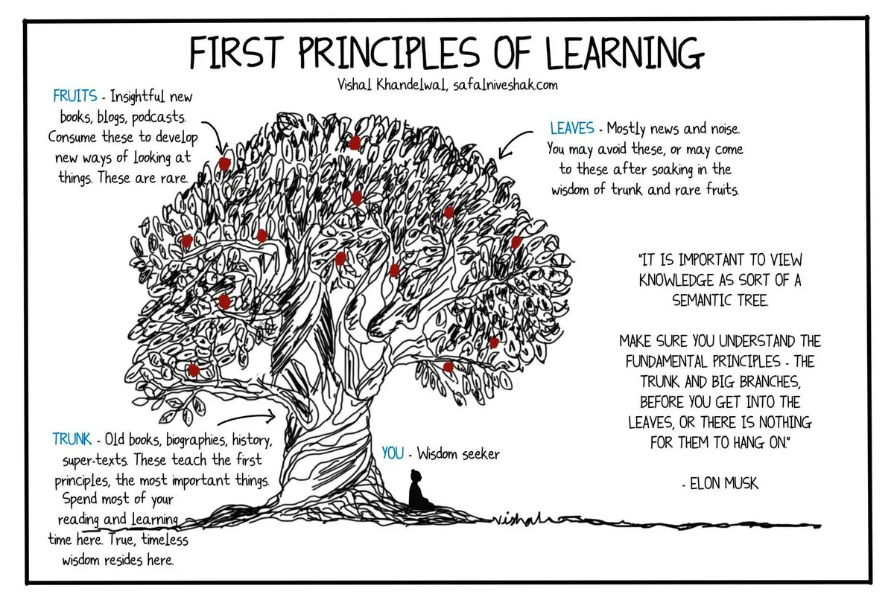

+++
title = "第一原理思考 First Principle Thinking"
date = 2024-02-26
description = "深入探討第一原理思考，打破常規回歸基本，助你解決創新難題。學習最重要的基礎知識，提升你的問題解決能力！"

[taxonomies]
categories = [ "思維模型",]
tags = [ "elon-musk",]

[extra]
image = "first-principle-thinking.webp"

+++

# 目的
回歸至基本原則思考，而不被現況的常規拘束。

# 使用情境
在解決複雜問題與創新難題時，有助於打破常規，回到基本原則重新構建問題解決方案。

# 錯誤使用的風險
過度耗費時間與資源，在時間急迫或資源緊迫的狀態下拖累進度。

# 延伸細節

第一原理（First Principle）指的是不會改變的基礎知識，舉凡人類在不同領域發現的原理，例如物理學的牛頓力學、生物學的進化論、經濟學的供需原理...等等。透過回到最基礎的知識，重新解構現在遇到的難題，分析究竟是原理上的還是「慣例」上的無法解決。幾乎所有自然法則外的規則都是由共同的信念所建構的，有可能受到當時時空背景的限制而無法突破。如果永遠看著慣例，人類將無法進步。

## 找出第一原理的方法

除了學習各領域的基礎知識外，我們也可以藉由「[蘇格拉底式提問法](@/wisdom/methods/socratic-questioning/index.md)」和「[五個為什麼](https://zh.wikipedia.org/zh-tw/%E4%BA%94%E4%B8%AA%E4%B8%BA%E4%BB%80%E4%B9%88)」來探究我們認為的瓶頸是從何而來，是來自原理還是慣例。

## 範例

### Elon Musk 用第一原理思考突破電池價格的限制
{{ youtube(id="NV3sBlRgzTI") }}

Elon Musk 曾經提到過應該把知識看成一棵樹，可以把知識解構成不同部分，例如樹幹、樹枝、葉子和果實。最重要的是在探索更多新資訊（葉子和果實）前確認你理解了最基本的知識（樹幹）。

from safalniveshak.com

