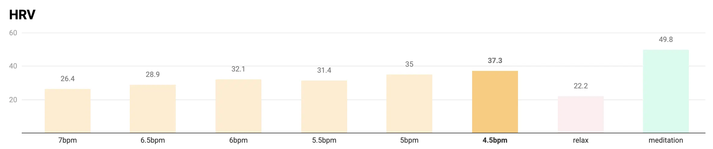

+++
title = "共振呼吸法 Resonant Frequency Breathing"
date = 2023-06-21

[taxonomies]
categories = ["方法"]
tags = ["breath"]

[extra]
+++

共振呼吸法（Resonanat Frequency Breathing），又名諧振式呼吸法（Coherent Breathing）。

# 原理

人體大多數的生理過程都是振盪性（Oscillations），如呼吸、心跳變異率（Heart Rate Variation）、血壓、淋巴循環、新陳代謝、腸道蠕動、...等等。而呼吸是少數我們可以自主控制的，我們可以利用呼吸來調節其他系統。

成人的平均呼吸頻率是 1 分鐘 12 ~ 20 次，不過這樣的呼吸量遠超過需求量六公升。有實驗指出我們可以利用共振呼吸法，達到每分鐘 4.5 ~ 7 次的呼吸頻率，可以達到最高的心跳變異率，使我們的身體更有彈性，可以適應不同強度的生活，也可以提升我們對情緒的調節能力，增加專注，好處多多。可以接近做冥想的效果。

From <a href="https://murphymind.blogspot.com/2020/04/resonance-frequency-breathing-hrv.html">以共振頻率呼吸 (resonance frequency breathing) 進行心跳變異率 (HRV) 生理回饋訓練</a>

# 作用

增加心跳變異率、增加迷走神經的活動，進而帶來控制血壓、舒緩恐慌症、焦慮症、抑鬱症的效果。

<!-- more -->

# 步驟

1. 設定好想要的呼吸頻率 (4.5~7 bpm)，計算出吸氣與吐氣的秒速。以 5.5bpm 為例，每次吸氣和吐氣 5.5 秒。
2. 坐直，放鬆肩膀和腹部，吐氣。
3. 輕輕吸氣 5.5 秒，空氣填滿肺臟底部時，肚子隨之隆起變大。
4. 緊接著輕輕吐氣 5.5 秒，肺臟清空時，肚子縮小變平。每次呼吸都應該感覺像一個圓圈。
5. 重複至少 10 次，愈多愈好。

在 iOS 上有找到介面簡單用好用的 App [iBreath](https://apps.apple.com/us/app/ibreathe-relax-and-breathe/id1296605806)，推薦給大家。

# Reference
- [以共振頻率呼吸 (resonance frequency breathing) 進行心跳變異率 (HRV) 生理回饋訓練](https://murphymind.blogspot.com/2020/04/resonance-frequency-breathing-hrv.html)
- [Resonance frequency breathing](https://www.rosalbacourtney.com/resonance-frequency-breathing/)
- [Effect of Resonance Breathing on Heart Rate Variability and Cognitive Functions in Young Adults: A Randomised Controlled Study](https://www.ncbi.nlm.nih.gov/pmc/articles/PMC8924557/)
- [The Impact of Resonance Frequency Breathing on Measures of Heart Rate Variability, Blood Pressure, and Mood](https://www.ncbi.nlm.nih.gov/pmc/articles/PMC5575449/)
