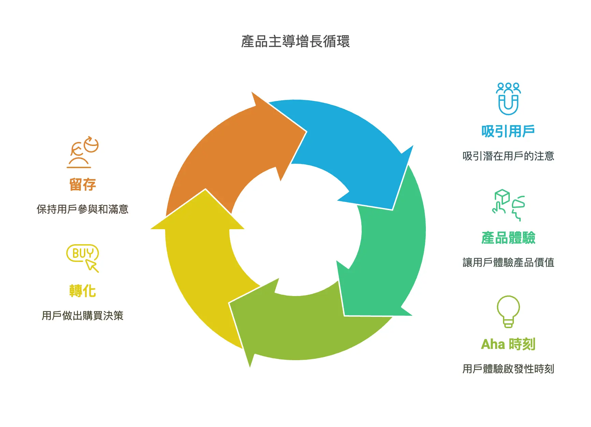

+++
title = "產品主導成長 Product-Lead Growth (PLG)"
date = 2024-03-14
description = "探索產品主導成長策略：藉由高價值、易用性產品自行驅動用戶獲取與留存，減少對傳統銷售依賴，體驗 Freemium 魅力！"

[taxonomies]
categories = [ "策略",]
tags = [ "business-strategy",]

[extra]
image = "product-lead-growth.webp"

+++

是一種商業策略，強調以產品本身作為驅動力，推動用戶的獲取、擴展、轉化和留存。

因此依賴打造高價值且高易用性的產品，讓用戶能夠自行探索與體驗，從而減少對傳統銷售和市場推廣的需求。

常見特徵：
* 免費試用或免費增值（Freemium）模式。
* 產品設計能夠讓使用者自行體會產品核心價值，產生 Aha Moment。
* 透明的定價策略，讓使用者能自行判斷做購買決策。
