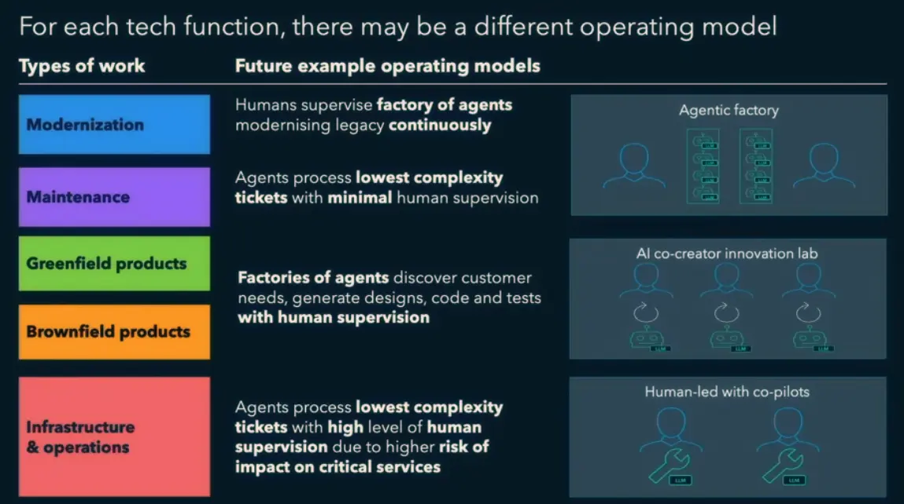
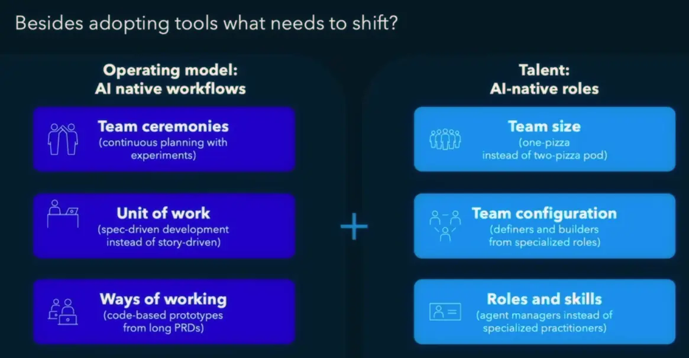
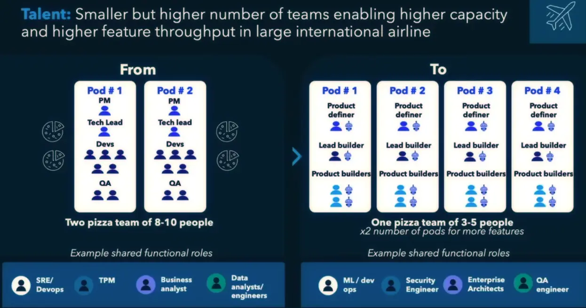

+++
title = "重新思考 AI 時代的開發流程"
date = 2026-01-20
description = "在 AI Coding 能力大幅提升的時代，為何團隊效率的進步卻相對緩慢？探討如何突破舊有流程與角色的限制，建立適應 AI 時代的新工作模式。"

[taxonomies]
categories = ["閱讀筆記"]
tags = ["AI"]

+++

{{ youtube(id="SZStlIhyTCY") }}

# 個人與團隊的效率落差

AI Coding 工具讓程式開發者的能力大幅提升，但在團隊與公司層級的效率相較於之前卻只有微幅上升。

這個現象的根本原因是：**舊有的流程和角色定義成為新時代的瓶頸。**

要真正提升到 AI 時代的新效率，我們需要回頭審視並調整現有的工作流程與角色定義。

# 工具層面：為任務類型挑選合適的 AI Agents 協作模式

針對不同類型的工作，可以採用不同的 AI Agents 協作模式：

* **Agentic Factory**：完全由 AI Agent 主導的生產模式
* **AI Co-Creator Innovation Lab**：AI 作為共同創作者的創新模式
* **Human-Led with Co-Pilots**：人類主導搭配 AI 副駕駛的模式

選擇合適的模式能更有效地發揮 AI Agents 的價值。

# 流程層面：用實驗帶領團隊進行典範轉移

如同在任務層面，可以採用不同的 AI Agents 協作模式。在流程層面，我們也應該審視現有的流程是否造成瓶頸，透過實驗找出新的合作模式，帶領團隊進行典範轉移。

以下是 AI 時代常見的典範轉移案例：

## 從 User Story 到 Spec-driven

PM 進一步與 AI 合作，從傳統的 User Story 推進到 Spec-driven。

User Story 模糊的細節往往造成開發時的不精確，導致重工。透過更明確、可測試的的規格定義，可以大幅減少溝通成本和重工次數。

## 從產品需求文件（Product Requirement Document, PRD）到 Code-based Prototype

傳統冗長的產品需求文件往往耗時且難以傳達完整意圖。

在 AI 輔助下，直接產出 Code-based Prototype。不僅更快速，也能更精確地呈現產品概念，讓團隊更早獲得可運作的回饋。

## 從 Two-pizza Team 到 One-pizza Team

過去強調的 Two-pizza team（約 6-8 人）配置了不同專長的角色。

在 AI 時代，團隊可以精簡為 One-pizza team，由具備 Full-Stack 能力的 **Product Definer** 和 **Product Builder** 組成。AI 填補了過去需要多個專業角色才能完成的工作，讓小團隊也能擁有完整的執行力。

# 反思

AI 工具的進步不只是開發層面的進步，更是組織設計與流程重構的挑戰。

能夠重新思考並調整工作方式的團隊，才能夠真正發揮 AI 帶來的生產力革命。
